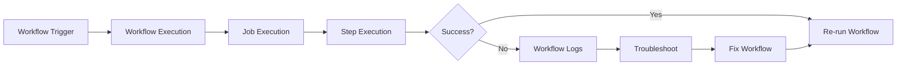
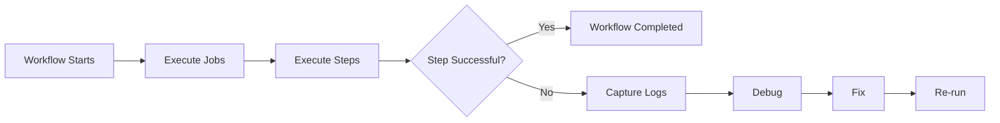
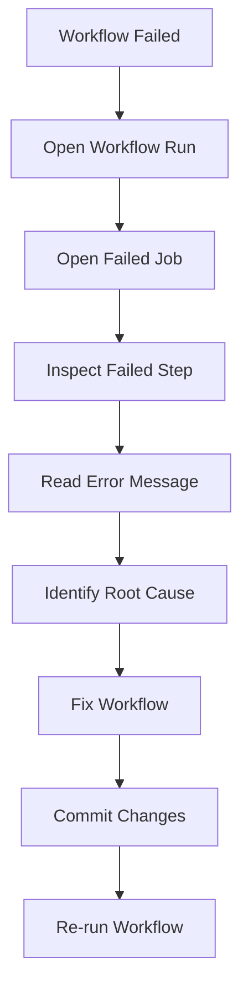
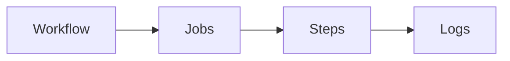
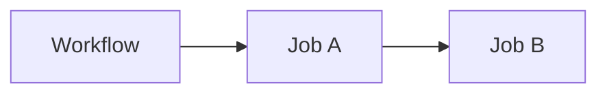
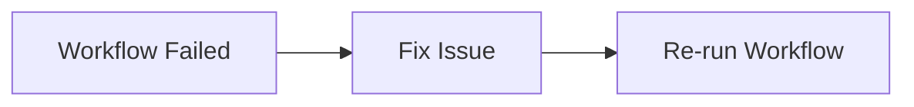

# Monitoring & Troubleshooting

## Overview

Monitoring and troubleshooting are essential skills for maintaining reliable GitHub Actions workflows. GitHub provides built-in tools to monitor workflow execution, inspect logs, identify failures, enable debug logging, and re-run workflows.

Troubleshooting typically involves analyzing:

- Workflow logs
- Job status
- Step execution
- Error messages
- Runner information
- Workflow configuration

> **Interview Tip**
>
> Most GitHub Actions issues can be resolved by reviewing **workflow logs**, identifying the **failed step**, and analyzing the associated error message.

---

## Why It Is Used

Monitoring and troubleshooting help to:

- Identify failed workflows
- Debug build and deployment issues
- Reduce downtime
- Improve CI/CD reliability
- Validate workflow execution
- Speed up issue resolution

---

## Architecture / Working



---

## Key Components

| Component | Purpose |
|-----------|----------|
| Workflow Logs | Execution details |
| Jobs | Logical workflow units |
| Steps | Individual tasks within a job |
| Debug Logging | Detailed execution logs |
| Re-run Workflow | Execute workflow again |
| Workflow Status | Success, Failure, Cancelled, Skipped |

---

## Types (if applicable)

Workflow execution states

| Status | Meaning |
|---------|---------|
| Success | Workflow completed successfully |
| Failure | One or more jobs failed |
| Cancelled | Workflow manually cancelled |
| Skipped | Workflow or job skipped |
| In Progress | Currently executing |
| Queued | Waiting for runner |

---

## Lifecycle / Workflow (if applicable)



---

## Configuration / Syntax (if applicable)

Enable step debugging (Repository Secret)

```text
ACTIONS_STEP_DEBUG=true
```

Enable runner debugging

```text
ACTIONS_RUNNER_DEBUG=true
```

Conditional logging

```yaml
- name: Display Branch
  run: echo "Branch: ${{ github.ref_name }}"
```

Continue execution after failure

```yaml
- name: Run Tests
  run: npm test
  continue-on-error: true
```

---

## Important Commands (if applicable)

Workflow commands

```bash
echo "Workflow Started"

echo "Build Completed"

echo "Deployment Successful"
```

GitHub CLI

```bash
gh run list

gh run view

gh run watch

gh run rerun
```

---

## Important Files (if applicable)

```
.github/
└── workflows/
      build.yml
```

---

## Real-World Use Cases

- Debug failed builds
- Analyze deployment failures
- Investigate runner issues
- Review test failures
- Monitor CI/CD pipelines
- Validate workflow execution

---

## Advantages

- Built-in monitoring
- Detailed execution logs
- Easy workflow re-run
- Job-level visibility
- Step-by-step debugging
- GitHub CLI integration

---

## Limitations

- Logs have retention limits.
- Sensitive values are masked.
- Debug logs may generate large outputs.
- External service failures require additional investigation.

---

## Common Interview Questions (Concept Only)

- How do you troubleshoot a failed GitHub Actions workflow?
- Where are workflow logs located?
- How do you enable debug logging?
- How do you re-run a failed workflow?
- What information is available in workflow logs?
- What is the difference between job failure and step failure?

---

## Common Mistakes

- Ignoring workflow logs
- Not checking the failed step
- Using outdated action versions
- Hardcoding credentials
- Forgetting to enable debug logging
- Assuming every failure is caused by GitHub Actions

---

## Troubleshooting

### General Troubleshooting Process



---

# Workflow Logs

## Overview

Workflow logs contain detailed information about every workflow execution.

Logs include:

- Workflow start time
- Job execution
- Step execution
- Command output
- Errors
- Warnings

---

## Why It Is Used

- Diagnose failures
- Monitor execution
- Review command output
- Verify deployments

---

## Architecture / Working



---

## Key Components

| Component | Description |
|-----------|-------------|
| Job Log | Complete job execution |
| Step Log | Individual task output |
| Error Log | Failure details |
| Warning Log | Non-critical issues |

---

## Real-World Use Cases

- Build troubleshooting
- Deployment verification
- Test result analysis

---

## Common Mistakes

- Looking only at the workflow summary
- Ignoring detailed step logs

---

## Troubleshooting

| Problem | Solution |
|----------|----------|
| Build failed | Inspect failed step log |
| Missing output | Verify executed commands |
| Unexpected behavior | Review previous successful run |

---

## Summary

Workflow logs are the primary source for diagnosing GitHub Actions failures.

---

# Failed Jobs

## Overview

A job fails when one or more required steps fail.

All dependent jobs are skipped unless configured otherwise.

---

## Why It Is Used

Understanding failed jobs helps identify where the workflow stopped.

---

## Architecture / Working



If Job A fails, Job B does not execute (unless configured with `if:` conditions).

---

## Common Causes

- Build failure
- Test failure
- Authentication failure
- Missing dependencies
- Invalid configuration

---

## Troubleshooting

| Problem | Solution |
|----------|----------|
| Job failed | Open job logs |
| Job skipped | Verify dependencies |
| Runner unavailable | Check runner status |

---

## Summary

A failed job stops workflow progression and should be investigated using job logs.

---

# Failed Steps

## Overview

Each job consists of multiple steps.

If a required step fails, the job usually fails.

---

## Why It Is Used

Identifying the failed step narrows troubleshooting to a specific task.

---

## Architecture / Working


---

## Common Causes

- Syntax errors
- Incorrect commands
- Missing files
- Authentication issues
- Runtime errors

---

## Troubleshooting

| Problem | Solution |
|----------|----------|
| Command failed | Verify command syntax |
| Missing file | Check file path |
| Exit code 1 | Review error message |

---

## Summary

Always inspect the first failed step before investigating the rest of the workflow.

---

# Debug Logging

## Overview

Debug logging provides additional execution details to help diagnose workflow issues.

GitHub supports:

- Step debugging
- Runner debugging

---

## Why It Is Used

- Diagnose complex issues
- Inspect workflow execution
- Analyze environment variables
- Review runner behavior

---

## Configuration / Syntax

Enable step debugging

```
ACTIONS_STEP_DEBUG=true
```

Enable runner debugging

```
ACTIONS_RUNNER_DEBUG=true
```

---

## Advantages

- More detailed logs
- Easier troubleshooting
- Better visibility

---

## Limitations

- Larger log files
- Should not remain enabled permanently

---

## Summary

Enable debug logging only when additional troubleshooting information is required.

---

# Re-run Workflows

## Overview

GitHub allows failed workflows or individual jobs to be re-run without creating a new commit.

---

## Why It Is Used

- Verify fixes
- Retry transient failures
- Save development time

---

## Architecture / Working



---

## Types

- Re-run all jobs
- Re-run failed jobs

---

## Advantages

- Faster validation
- No additional commits
- Saves build time

---

## Common Mistakes

- Re-running without fixing the root cause
- Ignoring previous logs

---

## Summary

Re-running workflows is useful after fixing configuration or resolving temporary failures.

---

# Common Workflow Errors

## Overview

Most workflow failures fall into a small set of common categories.

---

## Common Errors

| Error | Cause | Solution |
|---------|--------|----------|
| YAML syntax error | Invalid indentation | Validate YAML |
| Repository not found | Checkout issue | Verify repository name |
| Authentication failed | Invalid token | Check secrets and permissions |
| Action not found | Incorrect action version | Use valid action version |
| Permission denied | Missing workflow permission | Update permissions |
| Command not found | Missing runtime | Install required tools |
| File not found | Incorrect path | Verify file location |
| Cache miss | Incorrect cache key | Review cache configuration |
| Artifact not found | Upload failed | Check artifact name and path |
| Runner unavailable | Busy/offline runner | Retry or use another runner |

---

## Common Mistakes

- Incorrect YAML indentation
- Using deprecated action versions
- Missing checkout step
- Missing runtime setup
- Invalid secrets
- Incorrect file paths
- Wrong cache keys
- Incorrect permissions

---

## Troubleshooting

| Problem | Recommended Action |
|----------|--------------------|
| Workflow not starting | Verify trigger configuration |
| Job queued indefinitely | Check runner availability |
| Authentication failed | Verify secrets and permissions |
| Build failure | Review build logs |
| Deployment failure | Verify deployment credentials |
| Artifact missing | Confirm upload step completed |
| Cache not restored | Check cache key |
| Workflow skipped | Review trigger conditions |

---

## Summary

GitHub Actions troubleshooting focuses on identifying the failed job or step, reviewing workflow logs, analyzing error messages, fixing the root cause, and re-running the workflow.

> **Interview Tip**
>
> A structured troubleshooting approach:
>
> 1. Open the failed workflow.
> 2. Identify the failed job.
> 3. Inspect the failed step.
> 4. Read the complete error message.
> 5. Verify YAML syntax, permissions, secrets, and action versions.
> 6. Fix the issue.
> 7. Re-run the workflow to validate the fix.
