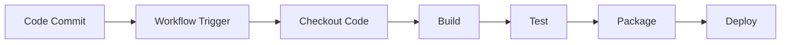
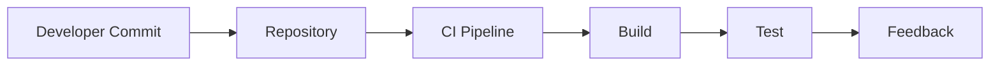
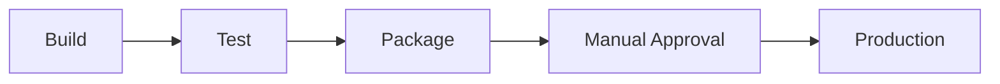
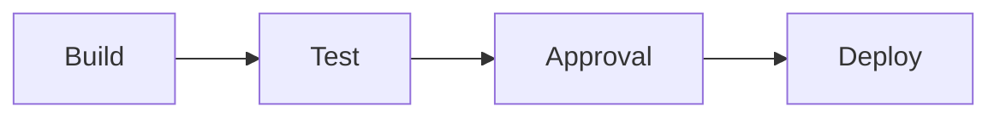
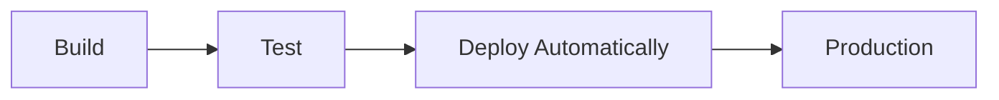
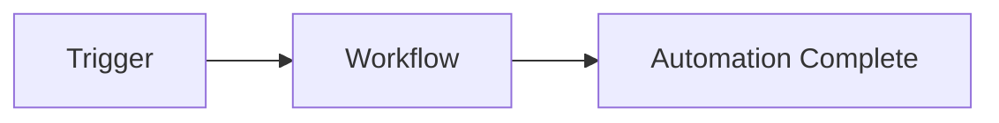
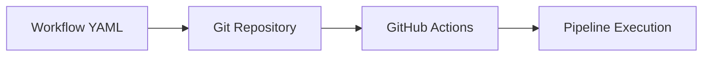

# Essential GitHub Actions Concepts

## Overview

GitHub Actions is GitHub's native CI/CD and automation platform that enables developers to automate software development workflows directly from a GitHub repository.

It allows teams to:

- Build applications
- Run automated tests
- Scan code
- Build Docker images
- Deploy applications
- Automate repository management
- Schedule maintenance tasks

GitHub Actions is based on **Pipeline as Code**, where workflows are defined using YAML files stored inside the repository.

> **Interview Tip**
>
> Every GitHub Actions workflow is a **Pipeline as Code** implementation.

---

## Why It Is Used

GitHub Actions is used to:

- Automate software delivery
- Reduce manual work
- Improve code quality
- Detect issues early
- Standardize deployments
- Support DevOps practices
- Enable Continuous Integration and Continuous Delivery

---

## Architecture / Working


---

## Key Components

| Component | Purpose |
|-----------|----------|
| Workflow | Complete automation pipeline |
| Event | Starts workflow |
| Job | Logical unit of work |
| Step | Individual task |
| Runner | Executes jobs |
| Action | Reusable automation component |
| Repository | Stores workflow files |

---

## Types (if applicable)

Core DevOps concepts covered in GitHub Actions:

- Continuous Integration (CI)
- Continuous Delivery (CD)
- Continuous Deployment
- Workflow Automation
- Pipeline as Code

---

## Lifecycle / Workflow (if applicable)



---

## Configuration / Syntax (if applicable)

Basic workflow example

```yaml
name: CI Pipeline

on:
  push:

jobs:
  build:
    runs-on: ubuntu-latest

    steps:
      - uses: actions/checkout@v4

      - name: Build
        run: echo "Building application"

      - name: Test
        run: echo "Running tests"
```

---

## Important Commands (if applicable)

GitHub CLI

```bash
gh workflow list

gh run list

gh run watch

gh run rerun
```

---

## Important Files (if applicable)

```
.github/
└── workflows/
      ci.yml
```

---

## Real-World Use Cases

- Build automation
- Automated testing
- Docker image creation
- Kubernetes deployments
- Azure deployments
- Release automation
- Security scanning
- Infrastructure automation

---

## Advantages

- Native GitHub integration
- Pipeline as Code
- Version-controlled workflows
- Supports multi-platform builds
- Large marketplace of reusable actions
- Easy automation

---

## Limitations

- YAML complexity increases with large pipelines.
- Workflow execution minutes may be limited based on plan.
- Self-hosted runners require maintenance.
- Third-party actions should be reviewed before use.

---

## Common Interview Questions (Concept Only)

- What is GitHub Actions?
- What is CI/CD?
- What is Pipeline as Code?
- What is workflow automation?
- What is the difference between Continuous Delivery and Continuous Deployment?

---

## Common Mistakes

- Confusing Continuous Delivery with Continuous Deployment
- Hardcoding credentials
- Not storing workflows in `.github/workflows`
- Forgetting version control for workflow changes
- Running unnecessary workflows

---

## Troubleshooting

| Problem | Possible Cause | Solution |
|----------|----------------|----------|
| Workflow not triggered | Incorrect event | Verify trigger configuration |
| Pipeline failed | Build or test failure | Review workflow logs |
| Deployment skipped | Missing approval or permissions | Verify deployment configuration |
| Workflow file ignored | Wrong directory | Place file under `.github/workflows` |

---

## Summary

GitHub Actions automates software development using **Pipeline as Code** and supports modern DevOps practices such as Continuous Integration, Continuous Delivery, Continuous Deployment, and Workflow Automation.

> **Interview Tip**
>
> Remember the relationship:
>
> **Pipeline as Code → GitHub Actions Workflow → Build → Test → Deploy**

---

# Continuous Integration (CI)

## Overview

Continuous Integration (CI) is the practice of automatically building and testing code whenever developers commit changes to a shared repository.

The objective is to detect issues early and ensure that new code integrates correctly with the existing codebase.

> **Interview Tip**
>
> CI focuses on **Build + Test**.

---

## Why It Is Used

CI helps to:

- Detect bugs early
- Validate code automatically
- Reduce integration problems
- Improve software quality
- Accelerate development

---

## Architecture / Working



---

## Key Components

| Component | Purpose |
|-----------|----------|
| Source Code | Application code |
| Build | Compile/package |
| Automated Tests | Validate code |
| Feedback | Notify developers |

---

## Types (if applicable)

- Build Validation
- Unit Testing
- Static Code Analysis

---

## Lifecycle / Workflow (if applicable)


---

## Configuration / Syntax (if applicable)

```yaml
on:
  push:
```

---

## Important Commands (if applicable)

None

---

## Important Files (if applicable)

```
.github/workflows/ci.yml
```

---

## Real-World Use Cases

- Build validation
- Automated testing
- Pull request validation

---

## Advantages

- Early bug detection
- Faster feedback
- Improved code quality

---

## Limitations

- Does not automatically deploy applications
- Depends on good test coverage

---

## Common Interview Questions (Concept Only)

- What is Continuous Integration?
- Why is CI important?
- What happens after a developer commits code?

---

## Common Mistakes

- Skipping automated tests
- Running slow builds unnecessarily

---

## Troubleshooting

- Review build logs
- Check test failures
- Verify dependencies

---

## Summary

Continuous Integration automatically builds and tests every code change before it is merged.

---

# Continuous Delivery (CD)

## Overview

Continuous Delivery (CD) ensures that applications are always in a deployable state after passing automated tests.

Deployment to production still requires **manual approval**.

> **Interview Tip**
>
> Continuous Delivery = **Automatic build and testing + Manual production deployment**

---

## Why It Is Used

- Reduce deployment risk
- Faster releases
- Reliable deployments
- Improve software quality

---

## Architecture / Working



---

## Key Components

| Component | Purpose |
|-----------|----------|
| Build | Create application |
| Tests | Validate application |
| Approval | Human validation |
| Deployment | Release application |

---

## Types (if applicable)

- Manual production deployment
- Automated staging deployment

---

## Lifecycle /Workflow (if applicable)



---

## Configuration / Syntax (if applicable)

Uses environments with manual approval.

---

## Important Commands (if applicable)

None

---

## Important Files (if applicable)

Workflow YAML

---

## Real-World Use Cases

- Enterprise production releases
- Banking applications
- Government systems

---

## Advantages

- Safer deployments
- Human validation
- Better release control

---

## Limitations

- Manual approval slows deployment

---

## Common Interview Questions (Concept Only)

- What is Continuous Delivery?
- Why is manual approval required?

---

## Common Mistakes

- Confusing it with Continuous Deployment

---

## Troubleshooting

- Verify environment approvals
- Check deployment permissions

---

## Summary

Continuous Delivery keeps software deployment-ready while requiring manual approval before production.

---

# Continuous Deployment

## Overview

Continuous Deployment automatically deploys every successful build directly to production without manual approval.

> **Interview Tip**
>
> Continuous Deployment = **Fully Automated Production Deployment**

---

## Why It Is Used

- Faster software delivery
- Reduce manual effort
- Accelerate feedback

---

## Architecture / Working



---

## Key Components

| Component | Purpose |
|-----------|----------|
| Build | Application |
| Tests | Validation |
| Deployment | Automatic release |

---

## Types (if applicable)

Fully automated deployment

---

## Lifecycle / Workflow (if applicable)


---

## Configuration / Syntax (if applicable)

Deployment job after successful tests.

---

## Important Commands (if applicable)

None

---

## Important Files (if applicable)

Workflow YAML

---

## Real-World Use Cases

- SaaS products
- Cloud-native applications
- Microservices

---

## Advantages

- Very fast releases
- No manual intervention
- Continuous software delivery

---

## Limitations

- Strong automated testing is mandatory
- Production issues may propagate quickly

---

## Common Interview Questions (Concept Only)

- What is Continuous Deployment?
- How is it different from Continuous Delivery?

---

## Common Mistakes

- Deploying without sufficient testing
- Missing rollback strategy

---

## Troubleshooting

- Review deployment logs
- Validate test coverage

---

## Summary

Continuous Deployment automatically releases every validated change to production.

---

# Workflow Automation

## Overview

Workflow Automation is the process of automatically executing development tasks in response to repository events.

Examples include:

- Build
- Test
- Deployment
- Security scans
- Notifications
- Issue automation

---

## Why It Is Used

- Reduce manual work
- Increase consistency
- Improve productivity

---

## Architecture / Working


---

## Key Components

- Events
- Workflows
- Jobs
- Steps
- Actions

---

## Types (if applicable)

- Build automation
- Deployment automation
- Repository automation

---

## Lifecycle / Workflow (if applicable)



---

## Configuration / Syntax (if applicable)

```yaml
on:
  push:
```

---

## Important Commands (if applicable)

None

---

## Important Files (if applicable)

```
.github/workflows/
```

---

## Real-World Use Cases

- Automated deployments
- Dependency updates
- Release automation

---

## Advantages

- Saves time
- Standardized execution
- Reduces manual errors

---

## Limitations

- Complex workflows require maintenance

---

## Common Interview Questions (Concept Only)

- What is workflow automation?
- Why automate CI/CD?

---

## Common Mistakes

- Automating unnecessary tasks
- Ignoring workflow optimization

---

## Troubleshooting

- Check workflow triggers
- Validate workflow logic

---

## Summary

Workflow Automation enables consistent, repeatable, and reliable software delivery.

---

# Pipeline as Code

## Overview

Pipeline as Code (PaC) is the practice of defining CI/CD pipelines as version-controlled code instead of configuring them manually through a graphical interface.

In GitHub Actions, workflows are stored as YAML files inside the repository.

> **Interview Tip**
>
> Pipeline as Code provides **version control**, **reviewability**, and **repeatability** for CI/CD pipelines.

---

## Why It Is Used

- Version control
- Collaboration
- Reproducibility
- Code reviews
- Easy rollback
- Infrastructure consistency

---

## Architecture / Working



---

## Key Components

| Component | Purpose |
|-----------|----------|
| YAML | Pipeline definition |
| Git | Version control |
| Workflow | Automation |
| Runner | Pipeline execution |

---

## Types (if applicable)

- Declarative Pipeline
- YAML-based Pipeline

---

## Lifecycle / Workflow (if applicable)


---

## Configuration / Syntax (if applicable)

```yaml
name: CI Pipeline

on:
  push:

jobs:
  build:
    runs-on: ubuntu-latest
```

---

## Important Commands (if applicable)

Git commands

```bash
git add .

git commit -m "Update workflow"

git push
```

---

## Important Files (if applicable)

```
.github/
└── workflows/
      ci.yml
```

---

## Real-World Use Cases

- CI pipelines
- CD pipelines
- Infrastructure automation
- Automated deployments

---

## Advantages

- Version-controlled pipelines
- Easy collaboration
- Consistent execution
- Easy rollback
- Code reviews

---

## Limitations

- YAML syntax errors can break pipelines.
- Complex pipelines require good organization.

---

## Common Interview Questions (Concept Only)

- What is Pipeline as Code?
- Why is Pipeline as Code important?
- Where are GitHub Actions workflows stored?
- What are the advantages of storing pipelines in Git?

---

## Common Mistakes

- Editing workflows directly in production
- Poor workflow organization
- Ignoring code reviews
- Hardcoding secrets

---

## Troubleshooting

| Problem | Solution |
|----------|----------|
| Workflow not detected | Verify `.github/workflows` location |
| YAML parsing error | Validate YAML syntax |
| Pipeline not updated | Commit and push workflow changes |

---

## Summary

Pipeline as Code is the foundation of GitHub Actions, enabling CI/CD pipelines to be stored, versioned, reviewed, and maintained like application code.

> **Interview Tip**
>
> Remember the key differences:
>
> | Concept | Production Deployment |
> |---------|-----------------------|
> | Continuous Integration | ❌ No |
> | Continuous Delivery | ✅ Manual Approval |
> | Continuous Deployment | ✅ Automatic |
>
> **Pipeline as Code** is the implementation approach used to define all of these workflows in GitHub Actions.
