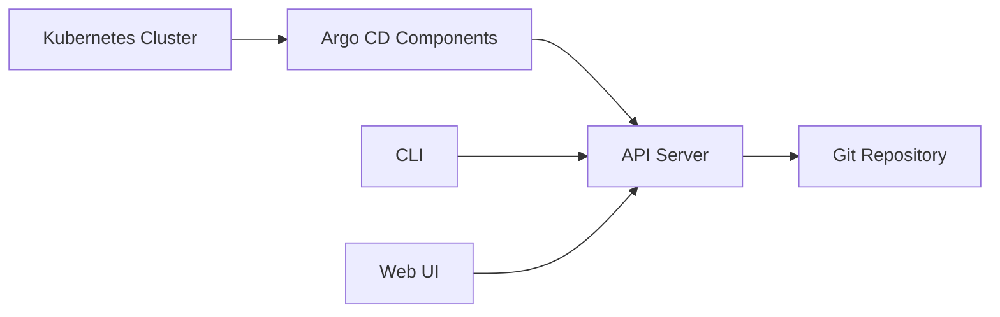
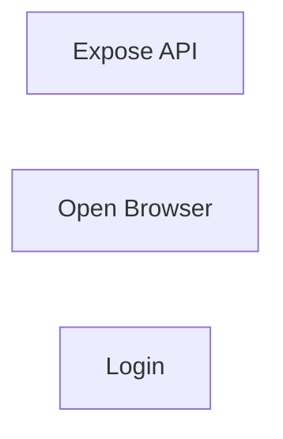
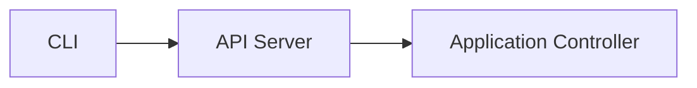
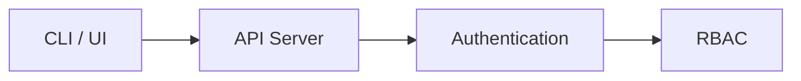

# Installation & Configuration

## Overview

Installing Argo CD involves deploying its components into a Kubernetes cluster, exposing the Argo CD API Server, and configuring access through the Web UI or CLI.

A typical installation includes:

- Installing Argo CD into the Kubernetes cluster
- Accessing the Web UI
- Installing the Argo CD CLI
- Authenticating users
- Registering Git repositories and Kubernetes clusters

> **Interview Tip**
>
> Argo CD itself runs **inside Kubernetes** and manages applications deployed to Kubernetes clusters.

---

## Why It Is Used

Installation and configuration are required to:

- Enable GitOps deployments
- Manage Kubernetes applications
- Connect Git repositories
- Monitor application health
- Perform automated synchronization

---

## Architecture / Working



---

## Key Components

| Component | Purpose |
|-----------|----------|
| Kubernetes Cluster | Hosts Argo CD |
| API Server | CLI & UI communication |
| Web UI | Browser management |
| CLI | Command-line management |
| Repository Server | Reads Git repositories |
| Application Controller | Synchronizes applications |

---

## Types (if applicable)

Installation methods

| Method | Description |
|---------|-------------|
| Official Install Manifest | Most common production installation |
| Helm Chart | Helm-based installation |
| Operator | Kubernetes Operator deployment |

> **Interview Tip**
>
> The **official installation manifest** is the most common interview answer.

---

## Lifecycle / Workflow (if applicable)


---

## Configuration / Syntax (if applicable)

Create the Argo CD namespace

```bash
kubectl create namespace argocd
```

Install Argo CD

```bash
kubectl apply -n argocd \
-f https://raw.githubusercontent.com/argoproj/argo-cd/stable/manifests/install.yaml
```

Verify installation

```bash
kubectl get pods -n argocd
```

---

## Important Commands (if applicable)

```bash
kubectl create namespace argocd

kubectl apply -n argocd -f install.yaml

kubectl get pods -n argocd

kubectl get svc -n argocd

kubectl port-forward svc/argocd-server \
-n argocd 8080:443

argocd login

argocd version
```

---

## Important Files (if applicable)

```
install.yaml

application.yaml

argocd-cm

argocd-rbac-cm
```

---

## Real-World Use Cases

- Installing GitOps platform
- Production Kubernetes deployment
- Multi-cluster application management
- Continuous Delivery automation

---

## Advantages

- Simple installation
- Kubernetes-native
- Supports HA deployment
- Easy upgrades
- CLI and Web UI management

---

## Limitations

- Requires Kubernetes cluster
- Requires Git repository access
- Initial networking configuration may be required

---

## Common Interview Questions (Concept Only)

- How do you install Argo CD?
- Where is Argo CD installed?
- What namespace is commonly used?
- How do you verify installation?
- How do users access Argo CD?

---

## Common Mistakes

- Installing into the wrong namespace
- Forgetting to expose the API Server
- Not verifying pod status
- Using an incompatible CLI version
- Ignoring RBAC configuration

---

## Troubleshooting

| Problem | Possible Cause | Solution |
|----------|----------------|----------|
| Pods not starting | Kubernetes issue | Check pod events and logs |
| Cannot access UI | API Server not exposed | Verify Service or Ingress |
| CLI login fails | Incorrect URL or credentials | Verify API endpoint |
| Installation incomplete | Missing manifests | Reapply installation |
| Components crash | Resource constraints | Check node resources |

---

## Summary

Installing Argo CD involves deploying its Kubernetes components, exposing the API Server, installing the CLI, and authenticating users before managing GitOps applications.

> **Interview Tip**
>
> Typical setup sequence:
>
> **Install → Verify Pods → Expose API Server → Install CLI → Login → Connect Git Repository**

---

# Install Argo CD

## Overview

Argo CD is typically installed into a dedicated Kubernetes namespace using the official installation manifest.

---

## Why It Is Used

Installation deploys all required Argo CD components, including:

- API Server
- Repository Server
- Application Controller
- Redis

---

## Architecture / Working


---

## Key Components

- Namespace
- Deployment
- Services
- ConfigMaps
- Secrets

---

## Types (if applicable)

- Manifest Installation
- Helm Installation

---

## Lifecycle / Workflow (if applicable)


---

## Configuration / Syntax (if applicable)

Create namespace

```bash
kubectl create namespace argocd
```

Install

```bash
kubectl apply -n argocd \
-f https://raw.githubusercontent.com/argoproj/argo-cd/stable/manifests/install.yaml
```

---

## Important Commands (if applicable)

```bash
kubectl get pods -n argocd

kubectl get svc -n argocd
```

---

## Important Files (if applicable)

```
install.yaml
```

---

## Real-World Use Cases

- Production installation
- Development clusters
- Test environments

---

## Advantages

- Fast installation
- Official support

---

## Limitations

- Kubernetes required

---

## Common Interview Questions (Concept Only)

- How do you install Argo CD?
- Which namespace is used?

---

## Common Mistakes

- Forgetting namespace creation

---

## Troubleshooting

- Verify pods

---

## Summary

Most organizations install Argo CD using the official Kubernetes installation manifest.

---

# Access Web UI

## Overview

The Web UI provides a graphical interface for managing applications, monitoring synchronization, viewing health status, and troubleshooting deployments.

---

## Why It Is Used

- Visual management
- Easier monitoring
- Manual synchronization
- Application health monitoring

---

## Architecture / Working


---

## Key Components

- Browser
- API Server
- Authentication

---

## Types (if applicable)

Access methods

- Port Forward
- LoadBalancer
- Ingress

---

## Lifecycle / Workflow (if applicable)



---

## Configuration / Syntax (if applicable)

Port forward

```bash
kubectl port-forward svc/argocd-server \
-n argocd 8080:443
```

Access

```
https://localhost:8080
```

---

## Important Commands (if applicable)

```bash
kubectl port-forward svc/argocd-server \
-n argocd 8080:443
```

---

## Important Files (if applicable)

Service definition

---

## Real-World Use Cases

- Production monitoring
- Manual synchronization
- Viewing deployment history

---

## Advantages

- Easy visualization
- User-friendly

---

## Limitations

- Requires browser access

---

## Common Interview Questions (Concept Only)

- How do you access the Argo CD UI?
- Which service exposes the UI?

---

## Common Mistakes

- Wrong port forwarding
- Invalid certificate warnings ignored incorrectly

---

## Troubleshooting

- Verify Service
- Verify API Server pod

---

## Summary

The Web UI connects to the Argo CD API Server and provides complete application management.

---

# Argo CD CLI

## Overview

The Argo CD CLI allows administrators and DevOps engineers to manage applications directly from the command line.

---

## Why It Is Used

- Automation
- CI/CD integration
- Troubleshooting
- Manual synchronization

---

## Architecture / Working



---

## Key Components

- CLI binary
- API communication
- Authentication

---

## Types (if applicable)

Supported platforms

- Linux
- Windows
- macOS

---

## Lifecycle / Workflow (if applicable)


---

## Configuration / Syntax (if applicable)

Check version

```bash
argocd version
```

---

## Important Commands (if applicable)

```bash
argocd version

argocd login

argocd app list

argocd app get

argocd app sync

argocd cluster list

argocd repo list
```

---

## Important Files (if applicable)

None

---

## Real-World Use Cases

- Automation
- Troubleshooting
- CI/CD scripts

---

## Advantages

- Fast automation
- Script-friendly

---

## Limitations

- Requires authentication

---

## Common Interview Questions (Concept Only)

- Why use the CLI?
- What operations can it perform?

---

## Common Mistakes

- CLI version mismatch

---

## Troubleshooting

- Verify API connectivity

---

## Summary

The CLI provides full management capabilities for Argo CD without using the Web UI.

---

# Login & Authentication

## Overview

Before using the CLI or Web UI, users must authenticate with the Argo CD API Server.

Authentication is typically performed using the **admin** account during initial setup or through enterprise identity providers such as LDAP, SSO, or OAuth.

---

## Why It Is Used

Authentication ensures:

- Secure access
- Role-Based Access Control (RBAC)
- User authorization
- Auditability

---

## Architecture / Working



---

## Key Components

| Component | Purpose |
|-----------|----------|
| API Server | Authenticates users |
| Admin Account | Initial login |
| RBAC | Authorization |
| Authentication Provider | Identity management |

---

## Types (if applicable)

Authentication methods

| Method | Description |
|---------|-------------|
| Admin User | Default account |
| LDAP | Enterprise authentication |
| OAuth | External identity providers |
| SSO | Single Sign-On |

---

## Lifecycle / Workflow (if applicable)


---

## Configuration / Syntax (if applicable)

Retrieve the initial admin password

```bash
kubectl -n argocd get secret argocd-initial-admin-secret \
-o jsonpath="{.data.password}" | base64 -d
```

Login using the CLI

```bash
argocd login localhost:8080
```

---

## Important Commands (if applicable)

```bash
argocd login

argocd account get-user-info

argocd logout
```

---

## Important Files (if applicable)

```
argocd-secret

argocd-rbac-cm
```

---

## Real-World Use Cases

- Administrator login
- RBAC configuration
- Enterprise SSO integration
- Secure GitOps operations

---

## Advantages

- Secure authentication
- RBAC support
- Enterprise identity integration

---

## Limitations

- Default admin account should be secured or disabled after setup
- External authentication requires additional configuration

---

## Common Interview Questions (Concept Only)

- How do you retrieve the initial admin password?
- How do you log in using the CLI?
- Which authentication methods does Argo CD support?
- What is the purpose of RBAC in Argo CD?

---

## Common Mistakes

- Leaving the default admin password unchanged
- Exposing the API Server without authentication
- Assigning excessive user permissions
- Forgetting to configure RBAC

---

## Troubleshooting

| Problem | Possible Cause | Solution |
|----------|----------------|----------|
| Login failed | Incorrect credentials | Verify username and password |
| CLI cannot connect | API Server unavailable | Check service and port forwarding |
| Permission denied | RBAC restrictions | Verify user roles |
| Password unavailable | Secret missing | Verify `argocd-initial-admin-secret` exists |

---

## Summary

Authentication in Argo CD secures access to the API Server through the Web UI or CLI. During initial installation, the default **admin** account is commonly used, after which organizations typically configure RBAC and integrate external identity providers for production environments.

> **Interview Tip**
>
> Remember the initial setup flow:
>
> **Install Argo CD → Retrieve Initial Admin Password → Expose API Server → Login (CLI/UI) → Configure RBAC → Connect Git Repository**
