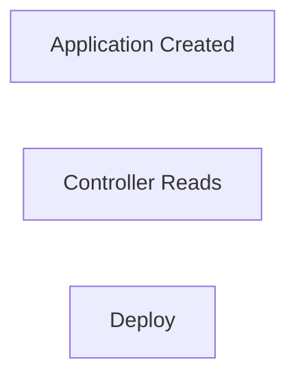
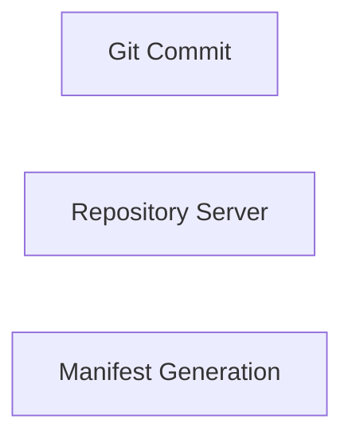
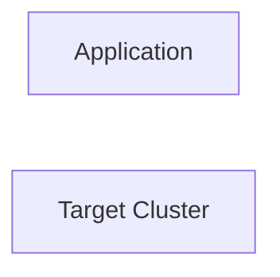
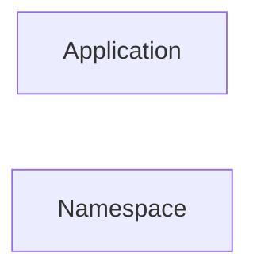
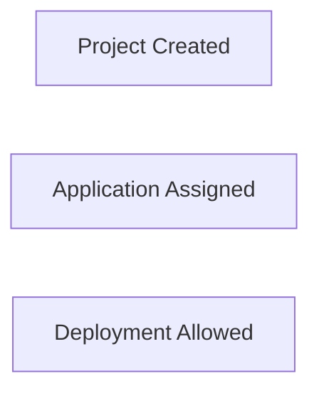

# Applications

## Overview

In Argo CD, an **Application** is the primary resource used to define and manage Kubernetes deployments. It tells Argo CD:

- **Where** the application code is stored (Git repository)
- **What** to deploy (manifests, Helm chart, Kustomize)
- **Where** to deploy (Kubernetes cluster and namespace)
- **How** to synchronize the application

An Argo CD Application acts as the bridge between a Git repository and a Kubernetes cluster.

> **Interview Tip**
>
> **Everything Argo CD deploys is represented by an Application resource.**

---

## Why It Is Used

Applications help to:

- Automate Kubernetes deployments
- Implement GitOps workflows
- Manage multiple environments
- Track deployment status
- Enable automatic synchronization
- Simplify rollbacks

---

## Architecture / Working


---

## Key Components

| Component | Purpose |
|-----------|----------|
| Application | Defines deployment configuration |
| Source Repository | Git repository containing manifests |
| Destination Cluster | Target Kubernetes cluster |
| Destination Namespace | Namespace where resources are deployed |
| Project | Groups applications and applies security policies |
| Sync Policy | Defines deployment behavior |

---

## Types (if applicable)

Application synchronization modes

| Mode | Description |
|------|-------------|
| Manual Sync | Deployment triggered manually |
| Automatic Sync | Deployment occurs automatically after Git changes |

---

## Lifecycle / Workflow (if applicable)


---

## Configuration / Syntax (if applicable)

Example Application

```yaml
apiVersion: argoproj.io/v1alpha1
kind: Application

metadata:
  name: nginx-app

spec:
  project: default

  source:
    repoURL: https://github.com/example/demo.git
    targetRevision: main
    path: manifests

  destination:
    server: https://kubernetes.default.svc
    namespace: production

  syncPolicy:
    automated: {}
```

---

## Important Commands (if applicable)

```bash
argocd app create

argocd app list

argocd app get

argocd app sync

argocd app delete

argocd app diff
```

---

## Important Files (if applicable)

```
application.yaml

deployment.yaml

service.yaml

kustomization.yaml

Chart.yaml
```

---

## Real-World Use Cases

- Production application deployment
- Multi-environment deployments
- GitOps automation
- Kubernetes application management
- Continuous Delivery

---

## Advantages

- Git-driven deployments
- Easy rollback
- Continuous synchronization
- Supports Helm and Kustomize
- Multi-cluster deployment
- Declarative configuration

---

## Limitations

- Kubernetes only
- Git repository must remain available
- Requires properly structured manifests

---

## Common Interview Questions (Concept Only)

- What is an Argo CD Application?
- What information does an Application contain?
- What happens when an Application is OutOfSync?
- Can one Argo CD instance manage multiple applications?
- Where is the Application resource stored?

---

## Common Mistakes

- Incorrect repository path
- Wrong target revision
- Invalid namespace
- Deploying to the wrong cluster
- Forgetting project assignment

---

## Troubleshooting

| Problem | Possible Cause | Solution |
|----------|----------------|----------|
| Application not deploying | Invalid repository path | Verify `path` value |
| OutOfSync status | Cluster differs from Git | Perform synchronization |
| Sync failed | Invalid manifests | Validate YAML |
| Destination unavailable | Cluster not registered | Verify cluster configuration |
| Namespace missing | Namespace not created | Create namespace or enable auto-creation |

---

## Summary

The Application resource is the heart of Argo CD. It defines the source, destination, synchronization behavior, and project association required to deploy applications into Kubernetes.

> **Interview Tip**
>
> Every Application answers five questions:
>
> - What to deploy?
> - Where is the code?
> - Which cluster?
> - Which namespace?
> - Which project?

---

# Application Resource

## Overview

The **Application** resource is a Kubernetes Custom Resource Definition (CRD) introduced by Argo CD.

It contains all deployment information required to synchronize an application.

---

## Why It Is Used

It specifies:

- Source repository
- Destination cluster
- Namespace
- Synchronization policy
- Project

---

## Architecture / Working


---

## Key Components

| Field | Purpose |
|--------|----------|
| metadata | Application name |
| source | Git repository details |
| destination | Deployment target |
| project | Project association |
| syncPolicy | Deployment behavior |

---

## Types (if applicable)

Application resources support:

- Git repositories
- Helm repositories
- Kustomize repositories

---

## Lifecycle / Workflow (if applicable)



---

## Configuration / Syntax (if applicable)

```yaml
kind: Application
```

---

## Important Commands (if applicable)

```bash
argocd app create

argocd app get
```

---

## Important Files (if applicable)

```
application.yaml
```

---

## Real-World Use Cases

- Deploy microservices
- Manage production applications

---

## Advantages

- Declarative
- GitOps compatible

---

## Limitations

- Kubernetes only

---

## Common Interview Questions (Concept Only)

- What is an Application resource?
- Is it a Kubernetes CRD?

---

## Common Mistakes

- Incorrect YAML structure

---

## Troubleshooting

- Validate Application YAML

---

## Summary

An Application resource defines how Argo CD deploys and manages Kubernetes applications.

---

# Source Repository

## Overview

The Source Repository is the Git repository (or Helm repository) that stores the application's desired state.

Argo CD continuously monitors this repository.

---

## Why It Is Used

It provides:

- Kubernetes manifests
- Helm charts
- Kustomize configurations

---

## Architecture / Working


---

## Key Components

| Field | Description |
|--------|-------------|
| repoURL | Repository URL |
| targetRevision | Git branch or tag |
| path | Manifest location |

---

## Types (if applicable)

Supported repositories

- Git
- Helm
- OCI Helm Registry

---

## Lifecycle / Workflow (if applicable)



---

## Configuration / Syntax (if applicable)

```yaml
source:
  repoURL: https://github.com/example/demo.git
  targetRevision: main
  path: manifests
```

---

## Important Commands (if applicable)

```bash
argocd repo list

argocd repo add
```

---

## Important Files (if applicable)

```
deployment.yaml

service.yaml

Chart.yaml
```

---

## Real-World Use Cases

- GitHub repositories
- Azure DevOps Git
- GitLab repositories

---

## Advantages

- Version controlled
- Easy rollback

---

## Limitations

- Repository availability required

---

## Common Interview Questions (Concept Only)

- What is the Source Repository?
- Which repository types are supported?

---

## Common Mistakes

- Wrong repository URL
- Wrong branch

---

## Troubleshooting

- Verify Git credentials

---

## Summary

The Source Repository stores the desired application configuration that Argo CD deploys.

---

# Destination Cluster

## Overview

The Destination Cluster specifies **which Kubernetes cluster** receives the deployment.

Argo CD supports both:

- In-cluster deployments
- External Kubernetes clusters

---

## Why It Is Used

- Multi-cluster deployments
- Environment separation
- Centralized GitOps management

---

## Architecture / Working


---

## Key Components

| Field | Purpose |
|--------|----------|
| server | Kubernetes API endpoint |

---

## Types (if applicable)

- Local cluster
- Remote cluster

---

## Lifecycle / Workflow (if applicable)



---

## Configuration / Syntax (if applicable)

```yaml
destination:
  server: https://kubernetes.default.svc
```

---

## Important Commands (if applicable)

```bash
argocd cluster list

argocd cluster add
```

---

## Important Files (if applicable)

None

---

## Real-World Use Cases

- Development cluster
- Staging cluster
- Production cluster

---

## Advantages

- Multi-cluster management

---

## Limitations

- Cluster must be registered

---

## Common Interview Questions (Concept Only)

- What is Destination Cluster?
- Can Argo CD manage multiple clusters?

---

## Common Mistakes

- Incorrect API endpoint

---

## Troubleshooting

- Verify registered cluster

---

## Summary

The Destination Cluster identifies where Argo CD deploys Kubernetes resources.

---

# Destination Namespace

## Overview

The Destination Namespace defines **where inside the Kubernetes cluster** the application resources will be deployed.

---

## Why It Is Used

Namespaces help:

- Separate environments
- Isolate applications
- Improve security
- Simplify resource management

---

## Architecture / Working


---

## Key Components

| Field | Purpose |
|--------|----------|
| namespace | Target namespace |

---

## Types (if applicable)

Common namespaces

- default
- dev
- test
- staging
- production

---

## Lifecycle / Workflow (if applicable)



---

## Configuration / Syntax (if applicable)

```yaml
destination:
  namespace: production
```

---

## Important Commands (if applicable)

```bash
kubectl get namespaces

kubectl create namespace production
```

---

## Important Files (if applicable)

Namespace manifest

---

## Real-World Use Cases

- Environment isolation
- Multi-tenant Kubernetes

---

## Advantages

- Resource isolation

---

## Limitations

- Namespace must exist unless auto-created

---

## Common Interview Questions (Concept Only)

- Why specify a destination namespace?
- Can multiple applications share one namespace?

---

## Common Mistakes

- Deploying to the wrong namespace

---

## Troubleshooting

- Verify namespace exists

---

## Summary

The Destination Namespace determines where Kubernetes resources are created inside the target cluster.

---

# Project Association

## Overview

Projects provide **logical grouping and security boundaries** for Argo CD applications.

Projects define:

- Allowed repositories
- Allowed clusters
- Allowed namespaces
- Resource permissions

> **Interview Tip**
>
> Projects are primarily used for **RBAC and access control**.

---

## Why It Is Used

Projects help:

- Organize applications
- Enforce security policies
- Restrict deployments
- Control repository access

---

## Architecture / Working


---

## Key Components

| Component | Purpose |
|-----------|----------|
| Project | Logical grouping |
| Repository Rules | Allowed Git repositories |
| Cluster Rules | Allowed clusters |
| Namespace Rules | Allowed namespaces |
| RBAC | Access control |

---

## Types (if applicable)

Common projects

- default
- development
- production
- shared-services

---

## Lifecycle / Workflow (if applicable)



---

## Configuration / Syntax (if applicable)

```yaml
spec:
  project: production
```

---

## Important Commands (if applicable)

```bash
argocd proj list

argocd proj get
```

---

## Important Files (if applicable)

```
AppProject.yaml
```

---

## Real-World Use Cases

- Enterprise RBAC
- Environment isolation
- Team-based deployments

---

## Advantages

- Better security
- Centralized permissions
- Easier application organization

---

## Limitations

- Requires proper planning
- Misconfigured rules may block deployments

---

## Common Interview Questions (Concept Only)

- What is an Argo CD Project?
- Why are Projects used?
- Can a Project restrict repositories?
- Can Projects restrict namespaces?

---

## Common Mistakes

- Assigning the wrong project
- Overly permissive project policies
- Forgetting repository restrictions

---

## Troubleshooting

| Problem | Solution |
|----------|----------|
| Application cannot deploy | Verify project permissions |
| Repository denied | Check allowed repositories |
| Namespace blocked | Verify namespace rules |
| Cluster rejected | Verify project cluster restrictions |

---

## Summary

Projects are security and organizational units in Argo CD that define which repositories, clusters, namespaces, and resources an Application is allowed to use.

> **Interview Tip**
>
> Remember the five key fields of an Argo CD Application:
>
> | Field | Purpose |
> |-------|----------|
> | Source Repository | Where the manifests are stored |
> | Target Revision | Branch, tag, or commit to deploy |
> | Destination Cluster | Which Kubernetes cluster to deploy to |
> | Destination Namespace | Which namespace receives the resources |
> | Project | Defines security policies and deployment boundaries |
>
> **One-line Interview Answer:**  
> **An Argo CD Application is a Kubernetes CRD that defines what to deploy, where to deploy it, and how it should be synchronized using GitOps.**
