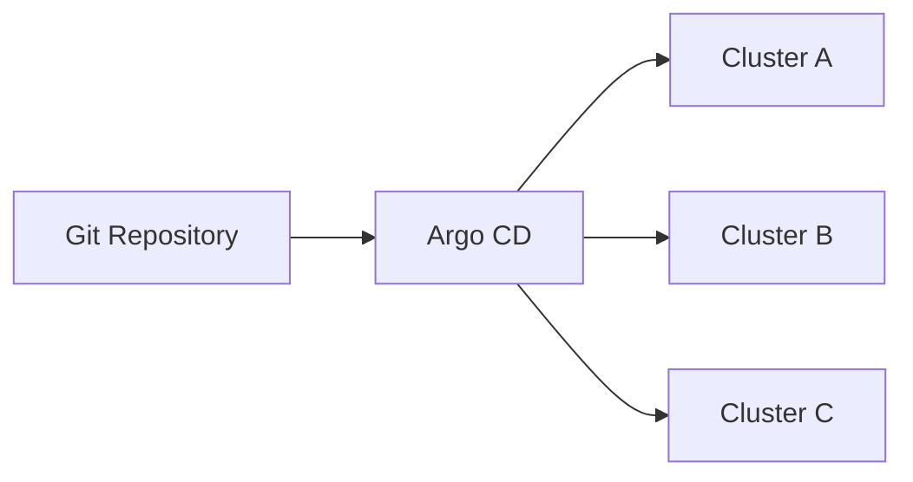
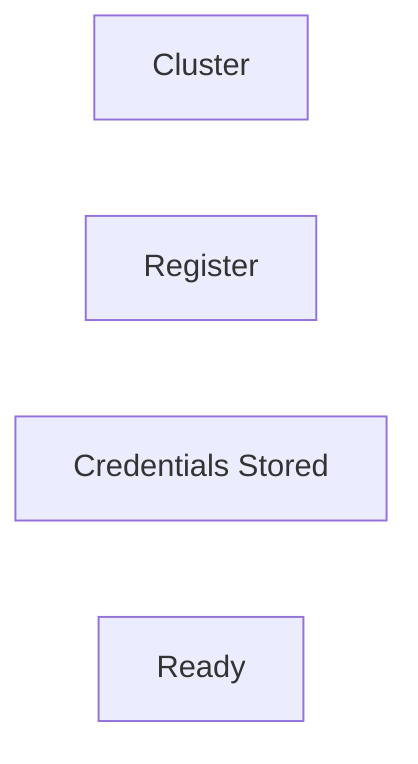
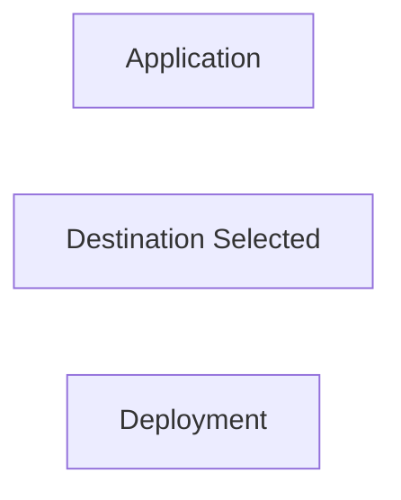

# Multi-Cluster Management

## Overview

Multi-Cluster Management in Argo CD allows a single Argo CD instance to manage and deploy applications across **multiple Kubernetes clusters** from a centralized location.

Instead of installing Argo CD in every cluster, one Argo CD instance (management cluster) can securely connect to and manage many target clusters.

> **Interview Tip**
>
> Argo CD stores target cluster information as Kubernetes Secrets in the Argo CD namespace.

---

## Why It Is Used

Multi-Cluster Management helps to:

- Centrally manage multiple Kubernetes clusters
- Deploy applications to different environments
- Support hybrid and multi-cloud deployments
- Simplify GitOps operations
- Reduce operational overhead
- Enable centralized monitoring and application management

---

## Architecture / Working



---

## Key Components

| Component | Purpose |
|-----------|----------|
| Argo CD Server | Central GitOps controller |
| Git Repository | Source of truth |
| Registered Clusters | Deployment targets |
| Kubernetes API Server | Applies manifests |
| Cluster Credentials | Authentication to target clusters |
| Application | Specifies target cluster |

---

## Types (if applicable)

Common deployment models

| Model | Description |
|--------|-------------|
| Single Cluster | One Argo CD manages one cluster |
| Multi-Cluster | One Argo CD manages many clusters |
| Hybrid Cloud | On-premises + Cloud clusters |
| Multi-Cloud | AWS, Azure, GCP clusters |

---

## Lifecycle / Workflow (if applicable)


---

## Configuration / Syntax (if applicable)

Application targeting a cluster

```yaml
spec:
  destination:
    server: https://cluster-api.example.com
    namespace: production
```

---

## Important Commands (if applicable)

```bash
argocd cluster add

argocd cluster list

argocd cluster get

argocd cluster rm

argocd app create

argocd app sync
```

---

## Important Files (if applicable)

```
application.yaml

cluster-secret.yaml
```

---

## Real-World Use Cases

- Development, QA, and Production clusters
- Multi-region Kubernetes deployments
- Hybrid cloud environments
- Disaster recovery clusters
- Enterprise Kubernetes management
- Multi-tenant platforms

---

## Advantages

- Centralized cluster management
- Single GitOps platform
- Supports multi-cloud deployments
- Simplified operations
- Better scalability
- Reduced management overhead

---

## Limitations

- Central Argo CD becomes a critical component
- Network connectivity required between Argo CD and target clusters
- Credential management becomes important
- RBAC configuration can become complex

---

## Common Interview Questions (Concept Only)

- What is Multi-Cluster Management?
- Can one Argo CD manage multiple clusters?
- How does Argo CD connect to another cluster?
- Where are cluster credentials stored?
- How is the target cluster selected?

---

## Common Mistakes

- Forgetting to register the cluster
- Using incorrect API server URL
- Missing RBAC permissions
- Expired authentication credentials
- Network connectivity issues

---

## Troubleshooting

| Problem | Possible Cause | Solution |
|----------|----------------|----------|
| Cluster Offline | API server unreachable | Verify network connectivity |
| Authentication failed | Invalid credentials | Re-register the cluster |
| Application not deploying | Wrong destination server | Verify application configuration |
| Permission denied | Insufficient RBAC | Update cluster permissions |
| Cluster not listed | Registration failed | Add the cluster again |

---

## Summary

Multi-Cluster Management enables a single Argo CD instance to manage applications across multiple Kubernetes clusters using centralized GitOps workflows.

> **Interview Tip**
>
> One Argo CD → Multiple Kubernetes Clusters

---

# Register Clusters

## Overview

Before Argo CD can deploy applications to a Kubernetes cluster, the cluster must be **registered** with Argo CD.

During registration, Argo CD stores the cluster's API endpoint and authentication credentials.

---

## Why It Is Used

Cluster registration allows Argo CD to:

- Access Kubernetes APIs
- Deploy applications
- Monitor cluster resources
- Synchronize application state

---

## Architecture / Working


---

## Key Components

| Component | Purpose |
|-----------|----------|
| Cluster API | Kubernetes endpoint |
| Credentials | Authentication |
| Cluster Secret | Stores connection details |

---

## Types (if applicable)

Registration methods

- CLI
- Kubernetes Secret
- Automation scripts

---

## Lifecycle / Workflow (if applicable)



---

## Configuration / Syntax (if applicable)

Register cluster

```bash
argocd cluster add <kube-context>
```

---

## Important Commands (if applicable)

```bash
argocd cluster add

argocd cluster list

argocd cluster get

argocd cluster rm
```

---

## Important Files (if applicable)

```
cluster-secret.yaml
```

---

## Real-World Use Cases

- Add production cluster
- Add staging cluster
- Add AKS cluster
- Add EKS cluster

---

## Advantages

- Easy cluster onboarding
- Centralized management

---

## Limitations

- Requires cluster administrator access during registration

---

## Common Interview Questions (Concept Only)

- How do you register a cluster?
- What command registers a cluster?

---

## Common Mistakes

- Using the wrong kubeconfig context
- Missing cluster permissions

---

## Troubleshooting

- Verify kubeconfig
- Check cluster connectivity

---

## Summary

Cluster registration enables Argo CD to communicate with and manage a Kubernetes cluster.

---

# Target Cluster

## Overview

The Target Cluster is the Kubernetes cluster where an Argo CD Application is deployed.

Each application specifies its destination cluster in the Application manifest.

---

## Why It Is Used

Target Clusters allow:

- Multi-cluster deployments
- Environment separation
- Centralized GitOps
- Hybrid cloud deployments

---

## Architecture / Working


---

## Key Components

| Component | Purpose |
|-----------|----------|
| Destination Server | Kubernetes API endpoint |
| Namespace | Deployment location |
| Cluster | Target environment |

---

## Types (if applicable)

Common targets

- Local cluster
- Remote cluster
- Production cluster
- Development cluster

---

## Lifecycle / Workflow (if applicable)



---

## Configuration / Syntax (if applicable)

Example

```yaml
destination:
  server: https://kubernetes.default.svc
  namespace: production
```

---

## Important Commands (if applicable)

```bash
argocd app get

argocd cluster list
```

---

## Important Files (if applicable)

```
application.yaml
```

---

## Real-World Use Cases

- Deploy to AKS
- Deploy to EKS
- Deploy to GKE
- Deploy to on-premises Kubernetes

---

## Advantages

- Flexible deployment targets
- Multi-cloud support

---

## Limitations

- Requires registered clusters

---

## Common Interview Questions (Concept Only)

- What is a Target Cluster?
- How is the target cluster selected?

---

## Common Mistakes

- Incorrect destination server
- Wrong namespace

---

## Troubleshooting

- Verify destination configuration
- Confirm cluster registration

---

## Summary

The Target Cluster defines where an application will be deployed.

---

# Cluster Credentials

## Overview

Cluster Credentials are the authentication details Argo CD uses to securely communicate with a registered Kubernetes cluster.

These credentials are stored as Kubernetes Secrets in the `argocd` namespace.

> **Interview Tip**
>
> Argo CD **does not store kubeconfig files directly**. It extracts the required connection details and stores them as Kubernetes Secrets.

---

## Why It Is Used

Cluster Credentials allow Argo CD to:

- Authenticate to Kubernetes
- Deploy resources
- Read cluster state
- Monitor application health
- Perform synchronization

---

## Architecture / Working


---

## Key Components

| Component | Purpose |
|-----------|----------|
| API Server URL | Cluster endpoint |
| Token | Authentication |
| Certificate | Secure communication |
| Kubernetes Secret | Stores credentials |

---

## Types (if applicable)

Common authentication methods

| Method | Description |
|---------|-------------|
| Service Account Token | Most common |
| Client Certificate | Certificate-based authentication |
| Bearer Token | API authentication |
| Cloud IAM Integration | Cloud-native authentication (AKS, EKS, GKE) |

---

## Lifecycle / Workflow (if applicable)


---

## Configuration / Syntax (if applicable)

Cluster registration

```bash
argocd cluster add <kube-context>
```

---

## Important Commands (if applicable)

```bash
argocd cluster add

argocd cluster list

kubectl get secrets -n argocd
```

---

## Important Files (if applicable)

```
cluster-secret.yaml
```

---

## Real-World Use Cases

- Secure production deployments
- Multi-cloud GitOps
- Enterprise Kubernetes platforms
- Disaster recovery clusters

---

## Advantages

- Secure authentication
- Centralized credential management
- Supports multiple authentication methods
- Enables remote cluster management

---

## Limitations

- Credential expiration may interrupt deployments
- Secret management is critical
- Requires proper RBAC configuration

---

## Common Interview Questions (Concept Only)

- Where does Argo CD store cluster credentials?
- How does Argo CD authenticate to a remote cluster?
- Does Argo CD use kubeconfig after cluster registration?
- Which authentication methods are supported?

---

## Common Mistakes

- Using expired tokens
- Granting excessive permissions
- Deleting cluster secrets
- Not rotating credentials periodically

---

## Troubleshooting

| Problem | Solution |
|----------|----------|
| Authentication failed | Verify cluster credentials |
| Cluster Offline | Check API server connectivity |
| Permission denied | Review Kubernetes RBAC |
| Secret missing | Re-register the cluster |
| Token expired | Update authentication credentials |

---

## Summary

Cluster Credentials provide secure authentication between Argo CD and Kubernetes clusters. They are stored as Kubernetes Secrets and allow Argo CD to deploy, synchronize, and monitor applications across multiple clusters.

> **Interview Tip (Very Important)**
>
> **Multi-Cluster Deployment Flow**
>
> Git Repository → Argo CD → Registered Cluster → Kubernetes API → Application Deployment
>
> **Key Interview Points**
>
> | Concept | Description |
> |---------|-------------|
> | Register Cluster | Adds a Kubernetes cluster to Argo CD management |
> | Target Cluster | Destination cluster where applications are deployed |
> | Cluster Credentials | Authentication details stored as Kubernetes Secrets |
> | Multi-Cluster | One Argo CD instance manages multiple Kubernetes clusters |
>
> **One-line Interview Answer:**  
> **Argo CD supports centralized GitOps by registering multiple Kubernetes clusters, securely storing their credentials as Kubernetes Secrets, and deploying applications to the appropriate target cluster defined in the Application resource.**
