# Monitoring & Troubleshooting

## Overview

Monitoring and troubleshooting are essential parts of managing Argo CD in production. Argo CD provides multiple ways to monitor application status, detect deployment issues, and troubleshoot synchronization problems through the Web UI, CLI, Kubernetes Events, and Logs.

The most common issues encountered in production include:

- Application Sync Failures
- Repository Connection Issues
- Kubernetes Resource Errors
- Health Status Problems
- Authentication Issues
- Network Connectivity Problems

> **Interview Tip**
>
> In most interviews, you should explain troubleshooting in this order:
>
> **Application → Repository → Cluster → Kubernetes Resources → Logs**

---

## Why It Is Used

Monitoring helps to:

- Detect deployment failures
- Monitor application health
- Identify configuration drift
- Troubleshoot synchronization issues
- Verify GitOps deployments
- Reduce application downtime
- Improve deployment reliability

---

## Architecture / Working

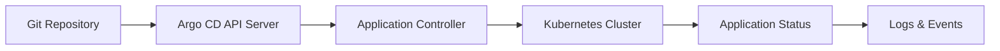

---

## Key Components

| Component | Purpose |
|-----------|----------|
| Application Status | Shows deployment state |
| Events | Resource lifecycle events |
| Logs | Error diagnosis |
| Health Status | Application health |
| Sync Status | Git vs Cluster comparison |
| Repository Status | Git connectivity |
| Kubernetes Events | Cluster resource issues |

---

## Types (if applicable)

Common monitoring methods

| Method | Purpose |
|---------|----------|
| Web UI | Visual monitoring |
| CLI | Command-line monitoring |
| Logs | Debug failures |
| Kubernetes Events | Resource issues |
| Metrics | Prometheus monitoring |

---

## Lifecycle / Workflow (if applicable)

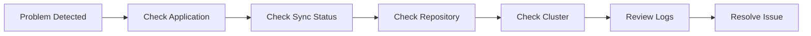

---

## Configuration / Syntax (if applicable)

Common CLI commands

```bash
argocd app get myapp

argocd app logs myapp

argocd app history myapp

kubectl get events

kubectl logs
```

---

## Important Commands (if applicable)

```bash
argocd app list

argocd app get

argocd app history

argocd app logs

argocd app sync

argocd app wait

kubectl get events

kubectl describe pod

kubectl logs
```

---

## Important Files (if applicable)

```
application.yaml

argocd-cm

argocd-rbac-cm

argocd-secret
```

---

## Real-World Use Cases

- Production deployment monitoring
- Failed deployment investigation
- Git synchronization troubleshooting
- Cluster resource debugging
- Incident response

---

## Advantages

- Fast issue detection
- Multiple troubleshooting tools
- Detailed deployment history
- Easy root cause analysis
- GitOps visibility

---

## Limitations

- Requires Kubernetes knowledge
- Multiple components may need investigation
- External repository failures affect deployments

---

## Common Interview Questions (Concept Only)

- How do you troubleshoot an OutOfSync application?
- Where do you check Argo CD logs?
- How do you identify repository connection problems?
- How do you debug a failed synchronization?
- Which command displays application details?
- How do you troubleshoot a degraded application?
- How do Kubernetes Events help in troubleshooting?

---

## Common Mistakes

- Checking only the UI without reviewing logs
- Ignoring Kubernetes Events
- Forgetting to verify Git repository accessibility
- Not checking Application Controller logs
- Assuming Sync Success means the application is healthy
- Ignoring namespace permission issues

---

## Troubleshooting

### Step-by-Step Troubleshooting Flow

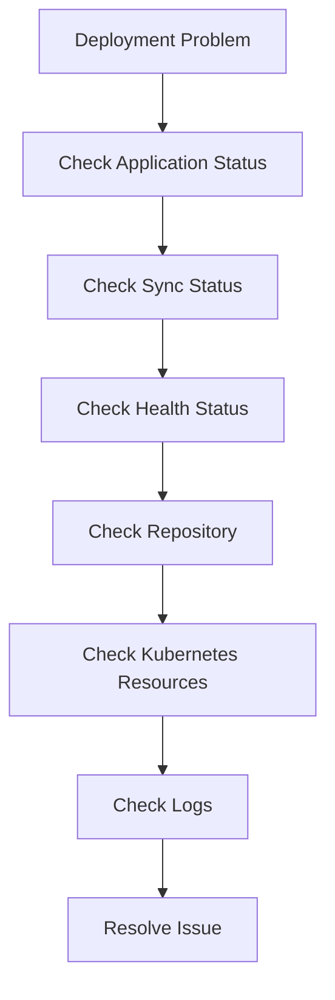

---

## Summary

Monitoring and troubleshooting in Argo CD focus on ensuring that the Kubernetes cluster always matches the desired Git state. Most production issues can be diagnosed by checking the application status, synchronization state, repository connectivity, Kubernetes resources, and controller logs.

> **Interview Tip**
>
> Always troubleshoot in this order:
>
> **Application → Sync Status → Repository → Kubernetes Resources → Logs**

---

# Application Events

## Overview

Application Events record important actions performed on an application during its lifecycle.

Events provide valuable information for debugging deployment problems.

---

## Why It Is Used

Events help to:

- Track deployments
- Detect failures
- Monitor synchronization
- Identify configuration issues

---

## Architecture / Working

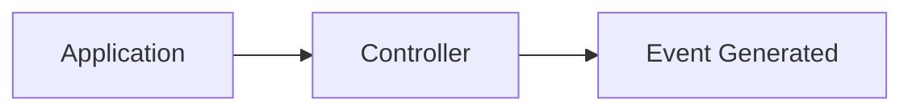

---

## Key Components

| Component | Description |
|-----------|-------------|
| Event Type | Normal or Warning |
| Timestamp | Event time |
| Resource | Affected object |
| Message | Event details |

---

## Types (if applicable)

- Normal
- Warning

---

## Lifecycle / Workflow (if applicable)

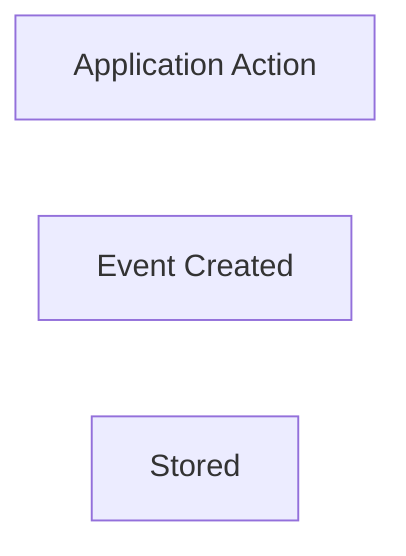

---

## Configuration / Syntax (if applicable)

```bash
kubectl get events

kubectl describe application <name>
```

---

## Important Commands (if applicable)

```bash
kubectl get events

kubectl describe
```

---

## Important Files (if applicable)

Application resource

---

## Real-World Use Cases

- Deployment failures
- Pod scheduling issues
- Resource creation tracking

---

## Advantages

- Easy debugging
- Timestamped history

---

## Limitations

- Events expire after some time

---

## Common Interview Questions (Concept Only)

- What are Application Events?
- Why are Events useful?

---

## Common Mistakes

- Ignoring Warning events

---

## Troubleshooting

- Review recent Events
- Identify Warning messages

---

## Summary

Application Events provide chronological information about deployment activities.

---

# Sync Failures

## Overview

A Sync Failure occurs when Argo CD cannot successfully apply the desired Git state to the Kubernetes cluster.

---

## Why It Is Used

Understanding sync failures helps quickly restore deployments.

---

## Architecture / Working

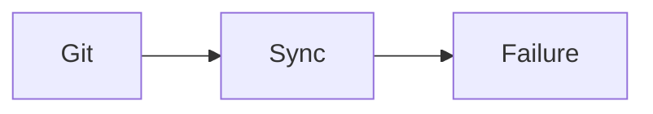

---

## Key Components

| Component | Description |
|-----------|-------------|
| Git Manifest | Desired configuration |
| Kubernetes API | Applies resources |
| Error | Failure message |

---

## Types (if applicable)

Common causes

- Invalid YAML
- Missing namespace
- RBAC issues
- Resource conflict

---

## Lifecycle / Workflow (if applicable)

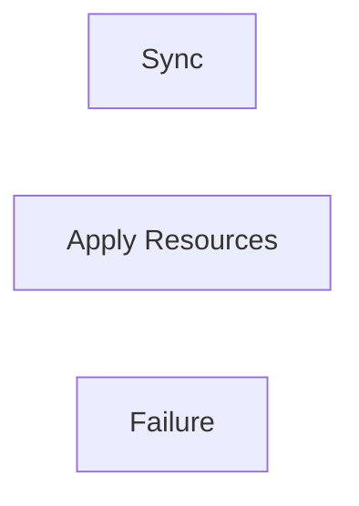

---

## Configuration / Syntax (if applicable)

```bash
argocd app sync myapp
```

---

## Important Commands (if applicable)

```bash
argocd app sync

argocd app history

argocd app get
```

---

## Important Files (if applicable)

```
application.yaml
```

---

## Real-World Use Cases

- Invalid Kubernetes manifests
- Deployment conflicts

---

## Advantages

- Detailed error reporting

---

## Limitations

- Requires manifest debugging

---

## Common Interview Questions (Concept Only)

- What causes Sync Failures?
- How do you debug Sync Failures?

---

## Common Mistakes

- Ignoring sync history

---

## Troubleshooting

| Problem | Solution |
|----------|----------|
| Invalid YAML | Validate manifests |
| Namespace missing | Create namespace |
| Permission denied | Verify RBAC |
| API error | Review Kubernetes Events |

---

## Summary

Sync failures indicate that Argo CD could not reconcile Git with Kubernetes.

---

# Repository Connection Issues

## Overview

Repository Connection Issues occur when Argo CD cannot access the configured Git repository.

---

## Why It Is Used

Repository connectivity is required for GitOps synchronization.

---

## Architecture / Working

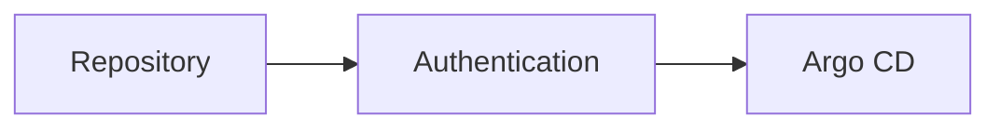

---

## Key Components

| Component | Purpose |
|-----------|----------|
| Repository URL | Git location |
| Credentials | Authentication |
| Network | Connectivity |

---

## Types (if applicable)

Common issues

- Authentication failure
- Invalid repository URL
- Network timeout
- Expired credentials

---

## Lifecycle / Workflow (if applicable)

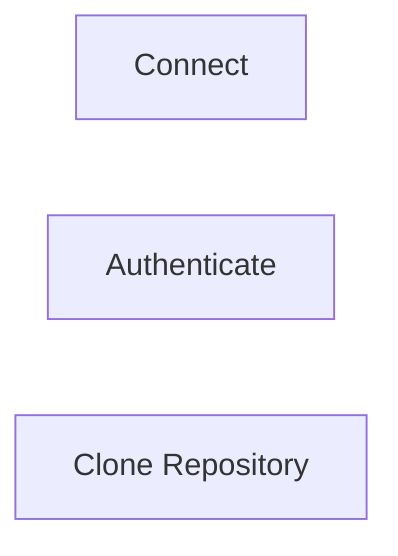

---

## Configuration / Syntax (if applicable)

```bash
argocd repo list
```

---

## Important Commands (if applicable)

```bash
argocd repo list

argocd repo add
```

---

## Important Files (if applicable)

Repository Secret

---

## Real-World Use Cases

- GitHub authentication
- Azure Repos
- GitLab

---

## Advantages

- Secure Git access

---

## Limitations

- Depends on network availability

---

## Common Interview Questions (Concept Only)

- Why can't Argo CD access a repository?
- Which authentication methods are supported?

---

## Common Mistakes

- Expired PAT
- Wrong SSH key

---

## Troubleshooting

| Problem | Solution |
|----------|----------|
| Authentication failed | Verify credentials |
| Repository unreachable | Check network |
| Invalid URL | Verify repository path |

---

## Summary

Repository connectivity problems prevent Argo CD from reading Git manifests.

---

# Kubernetes Resource Errors

## Overview

These errors occur when Kubernetes cannot successfully create, update, or manage application resources.

---

## Why It Is Used

Understanding Kubernetes errors helps identify deployment failures.

---

## Architecture / Working

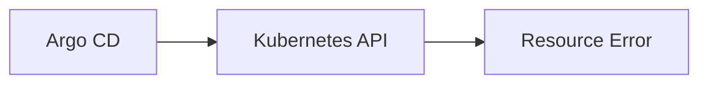

---

## Key Components

| Component | Purpose |
|-----------|----------|
| API Server | Applies resources |
| Namespace | Deployment location |
| Resource | Deployment object |

---

## Types (if applicable)

- Deployment errors
- Service errors
- Pod failures
- Namespace missing

---

## Lifecycle / Workflow (if applicable)

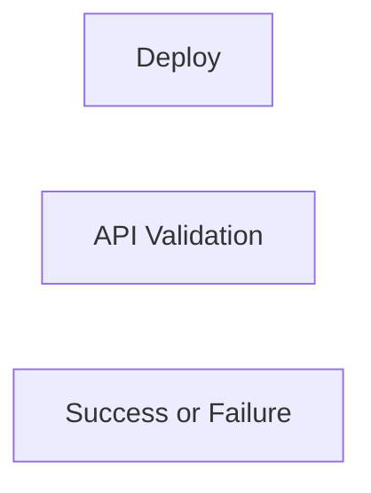

---

## Configuration / Syntax (if applicable)

```bash
kubectl describe pod

kubectl get events
```

---

## Important Commands (if applicable)

```bash
kubectl get events

kubectl describe

kubectl logs
```

---

## Important Files (if applicable)

Kubernetes manifests

---

## Real-World Use Cases

- CrashLoopBackOff
- ImagePullBackOff
- Failed scheduling

---

## Advantages

- Detailed Kubernetes diagnostics

---

## Limitations

- Requires Kubernetes troubleshooting skills

---

## Common Interview Questions (Concept Only)

- What causes Kubernetes deployment failures?
- Which command displays Pod Events?

---

## Common Mistakes

- Ignoring Kubernetes Events

---

## Troubleshooting

- Review Pod Events
- Describe failed resources

---

## Summary

Most deployment failures originate from Kubernetes resource problems.

---

# Logs

## Overview

Logs are the primary source for diagnosing Argo CD and Kubernetes problems.

---

## Why It Is Used

Logs provide detailed error messages for troubleshooting.

---

## Architecture / Working

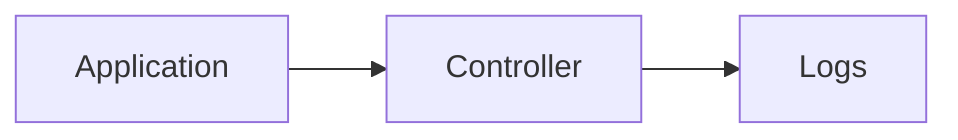

---

## Key Components

| Component | Purpose |
|-----------|----------|
| Controller Logs | Sync operations |
| Server Logs | API requests |
| Repo Server Logs | Git operations |

---

## Types (if applicable)

- Server logs
- Controller logs
- Repository logs

---

## Lifecycle / Workflow (if applicable)

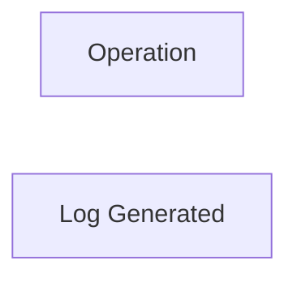

---

## Configuration / Syntax (if applicable)

```bash
kubectl logs deployment/argocd-application-controller -n argocd
```

---

## Important Commands (if applicable)

```bash
kubectl logs

argocd app logs
```

---

## Important Files (if applicable)

Kubernetes log stream

---

## Real-World Use Cases

- Debug synchronization
- Investigate API failures

---

## Advantages

- Detailed diagnostics

---

## Limitations

- Large log volume

---

## Common Interview Questions (Concept Only)

- Which logs are most important?
- Where are controller logs stored?

---

## Common Mistakes

- Looking at the wrong component logs

---

## Troubleshooting

- Review controller logs first
- Review repo-server logs for Git issues

---

## Summary

Logs are the primary troubleshooting tool in Argo CD.

---

# Health Status

## Overview

Health Status indicates the operational condition of an application after deployment.

Health and Sync Status are different concepts.

---

## Why It Is Used

Health Status helps determine whether an application is functioning correctly.

---

## Architecture / Working

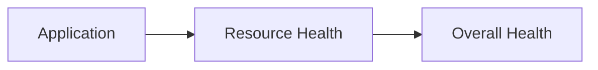

---

## Key Components

| Status | Meaning |
|----------|----------|
| Healthy | Resources operating correctly |
| Progressing | Deployment in progress |
| Degraded | Resource problems detected |
| Missing | Required resources missing |
| Unknown | Health cannot be determined |

---

## Types (if applicable)

- Healthy
- Progressing
- Degraded
- Missing
- Unknown

---

## Lifecycle / Workflow (if applicable)

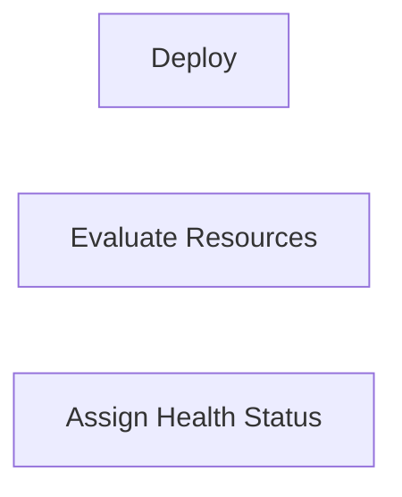

---

## Configuration / Syntax (if applicable)

```bash
argocd app get myapp
```

---

## Important Commands (if applicable)

```bash
argocd app get

argocd app wait
```

---

## Important Files (if applicable)

Application resource

---

## Real-World Use Cases

- Deployment validation
- Production monitoring

---

## Advantages

- Immediate deployment visibility
- Easy health monitoring

---

## Limitations

- Healthy does not always mean the application is fully functional

---

## Common Interview Questions (Concept Only)

- Difference between Sync Status and Health Status?
- What does Degraded mean?
- What causes Progressing status?

---

## Common Mistakes

- Confusing Sync with Health
- Ignoring degraded resources

---

## Troubleshooting

| Health Status | Action |
|---------------|--------|
| Healthy | No action needed |
| Progressing | Wait for rollout |
| Degraded | Review Events and Logs |
| Missing | Verify manifests |
| Unknown | Check controller logs |

---

## Summary

Health Status reflects the operational state of deployed Kubernetes resources, while Sync Status indicates whether the live cluster matches the desired Git state.

> **Interview Tip (Very Important)**

### Recommended Troubleshooting Order

| Step | Check |
|------|-------|
| 1 | Application Status |
| 2 | Sync Status |
| 3 | Health Status |
| 4 | Repository Connectivity |
| 5 | Kubernetes Events |
| 6 | Pod Status |
| 7 | Controller Logs |
| 8 | Repository Server Logs |

### Common Production Commands

```bash
argocd app get myapp

argocd app history myapp

argocd app sync myapp

kubectl get events

kubectl describe pod <pod-name>

kubectl logs <pod-name>

kubectl logs deployment/argocd-application-controller -n argocd
```

### One-line Interview Answer

**Argo CD troubleshooting involves checking application status, synchronization state, health status, repository connectivity, Kubernetes events, and controller logs to identify and resolve GitOps deployment issues efficiently.**
