# Essential Argo CD Concepts

## Overview

Argo CD is a **declarative GitOps Continuous Delivery (CD)** tool for Kubernetes. It continuously monitors Git repositories and ensures that the Kubernetes cluster always matches the desired configuration stored in Git.

The core concepts every DevOps engineer should understand are:

- GitOps Workflow
- Continuous Delivery
- Kubernetes Manifests
- Drift Detection
- Self-Healing
- Automated Synchronization

> **Interview Tip**
>
> These concepts form the foundation of Argo CD and are among the most frequently asked interview topics.

---

## Why It Is Used

Argo CD helps organizations to:

- Automate Kubernetes deployments
- Maintain Git as the single source of truth
- Detect configuration drift
- Automatically recover from unauthorized changes
- Reduce deployment errors
- Improve deployment consistency
- Enable GitOps workflows

---

## Architecture / Working

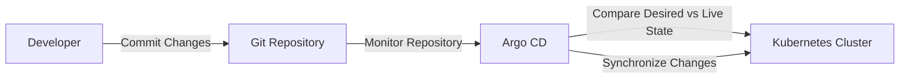

---

## Key Components

| Component | Purpose |
|-----------|----------|
| Git Repository | Stores desired state |
| Kubernetes Cluster | Live infrastructure |
| Argo CD API Server | User interaction |
| Application Controller | Reconciliation engine |
| Repository Server | Retrieves manifests |
| Redis | Caching |

---

## Types (if applicable)

Deployment Modes

| Mode | Description |
|------|-------------|
| Manual Sync | User initiates synchronization |
| Automatic Sync | Argo CD synchronizes automatically |

---

## Lifecycle / Workflow (if applicable)

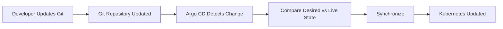

---

## Configuration / Syntax (if applicable)

Example synchronization policy

```yaml
spec:
  syncPolicy:
    automated:
      prune: true
      selfHeal: true
```

---

## Important Commands (if applicable)

```bash
argocd app create

argocd app sync

argocd app get

argocd app list

argocd app history

argocd app wait
```

---

## Important Files (if applicable)

```
application.yaml

deployment.yaml

service.yaml

kustomization.yaml

Chart.yaml

values.yaml
```

---

## Real-World Use Cases

- Production Kubernetes deployments
- GitOps-based infrastructure
- Multi-environment deployments
- Disaster recovery
- Automated rollback
- Kubernetes configuration management

---

## Advantages

- Declarative deployments
- Version-controlled infrastructure
- Easy rollback
- Automatic synchronization
- Drift detection
- Self-healing
- Reduced manual operations

---

## Limitations

- Kubernetes-only deployment platform
- Requires Git repository management
- Initial learning curve
- Depends on repository availability

---

## Common Interview Questions (Concept Only)

- What is GitOps?
- Why is Git considered the source of truth?
- What is Continuous Delivery?
- What is Drift Detection?
- What is Self-Healing?
- What is Automated Synchronization?
- Difference between Manual Sync and Auto Sync?
- What happens when someone manually changes a Kubernetes resource?
- How does Argo CD detect configuration drift?
- What is the role of Kubernetes manifests?

---

## Common Mistakes

- Editing Kubernetes resources manually
- Disabling synchronization unintentionally
- Forgetting to commit configuration changes to Git
- Confusing Continuous Delivery with Continuous Deployment
- Ignoring OutOfSync applications
- Storing production configuration outside Git

---

## Troubleshooting

| Problem | Possible Cause | Solution |
|----------|----------------|----------|
| Application OutOfSync | Git and cluster differ | Run synchronization |
| Changes not deployed | Auto Sync disabled | Enable Automated Sync |
| Drift detected | Manual cluster changes | Re-sync application |
| Deployment failed | Invalid manifests | Validate YAML files |
| Application Degraded | Kubernetes resource issue | Check Events and Logs |

---

## Summary

Argo CD continuously compares the desired state stored in Git with the live Kubernetes cluster and automatically reconciles differences through synchronization. GitOps, Drift Detection, Self-Healing, and Automated Synchronization are the fundamental concepts that make Argo CD a reliable Continuous Delivery platform for Kubernetes.

> **Interview Tip**
>
> Remember this flow:
>
> **Git → Argo CD → Compare → Detect Drift → Sync → Kubernetes**

---

# GitOps Workflow

## Overview

GitOps is an operational model where **Git repositories act as the single source of truth** for infrastructure and application configurations.

Instead of manually deploying applications, changes are committed to Git, and Argo CD automatically applies them to Kubernetes.

---

## Why It Is Used

GitOps provides:

- Version control
- Deployment automation
- Easy rollback
- Audit trail
- Consistency across environments

---

## Architecture / Working

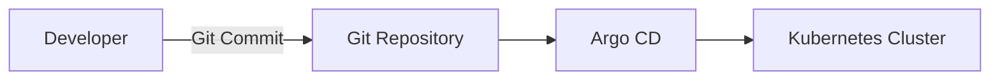

---

## Key Components

| Component | Purpose |
|-----------|----------|
| Git | Source of truth |
| Kubernetes | Deployment platform |
| Argo CD | GitOps controller |

---

## Types (if applicable)

- Pull-Based GitOps (Argo CD)
- Push-Based Deployment (Traditional CI/CD)

---

## Lifecycle / Workflow (if applicable)

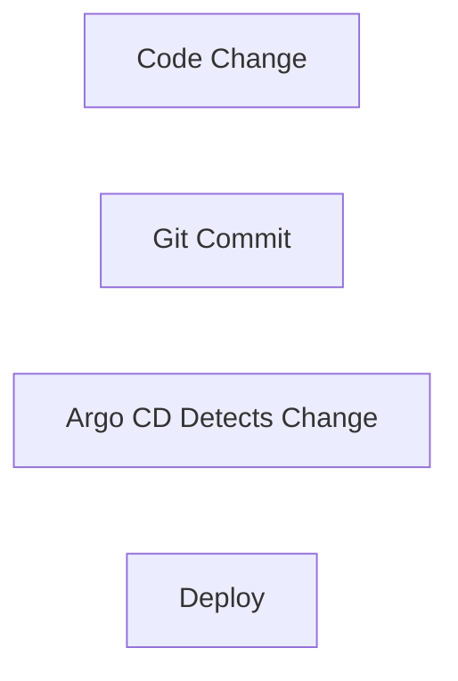

---

## Configuration / Syntax (if applicable)

Git repository configured in Application.

---

## Important Commands (if applicable)

```bash
argocd app sync

argocd app get
```

---

## Important Files (if applicable)

```
application.yaml
```

---

## Real-World Use Cases

- Kubernetes deployments
- Infrastructure automation
- Production GitOps

---

## Advantages

- Easy rollback
- Auditable changes
- Automated deployments

---

## Limitations

- Git availability required

---

## Common Interview Questions (Concept Only)

- What is GitOps?
- Why is Git the source of truth?

---

## Common Mistakes

- Making manual cluster changes

---

## Troubleshooting

- Verify repository synchronization

---

## Summary

GitOps enables automated deployments directly from Git.

---

# Continuous Delivery

## Overview

Continuous Delivery (CD) automatically prepares applications for deployment while allowing manual approval before production deployment.

Argo CD implements Continuous Delivery using GitOps principles.

---

## Why It Is Used

Continuous Delivery provides:

- Faster releases
- Reliable deployments
- Reduced deployment errors
- Automated testing integration

---

## Architecture / Working

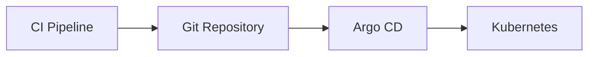

---

## Key Components

| Component | Purpose |
|-----------|----------|
| CI Pipeline | Builds application |
| Git | Stores manifests |
| Argo CD | Deploys changes |

---

## Types (if applicable)

- Manual Approval
- Fully Automated

---

## Lifecycle / Workflow (if applicable)

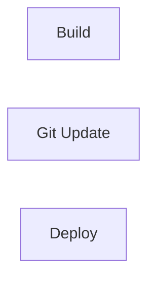

---

## Configuration / Syntax (if applicable)

```yaml
syncPolicy:
  automated:
```

---

## Important Commands (if applicable)

```bash
argocd app sync
```

---

## Important Files (if applicable)

Application manifest

---

## Real-World Use Cases

- Production deployment pipelines

---

## Advantages

- Reliable deployments
- Repeatable releases

---

## Limitations

- Depends on Git updates

---

## Common Interview Questions (Concept Only)

- Difference between Continuous Delivery and Continuous Deployment?

---

## Common Mistakes

- Confusing CD with CI

---

## Troubleshooting

- Verify synchronization status

---

## Summary

Continuous Delivery automates deployments while allowing controlled releases.

---

# Kubernetes Manifests

## Overview

Kubernetes manifests are YAML files describing the desired Kubernetes resources.

Argo CD deploys applications by reading these manifests from Git.

---

## Why It Is Used

Manifests define:

- Deployments
- Services
- ConfigMaps
- Secrets
- Ingress
- StatefulSets

---

## Architecture / Working

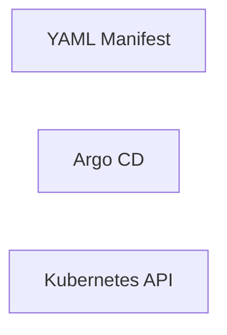

---

## Key Components

| Resource | Purpose |
|-----------|----------|
| Deployment | Application |
| Service | Networking |
| ConfigMap | Configuration |
| Secret | Sensitive data |

---

## Types (if applicable)

- Raw YAML
- Helm
- Kustomize

---

## Lifecycle / Workflow (if applicable)

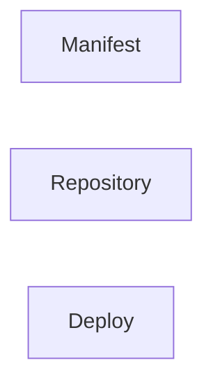

---

## Configuration / Syntax (if applicable)

```yaml
kind: Deployment
```

---

## Important Commands (if applicable)

```bash
kubectl apply
```

---

## Important Files (if applicable)

```
deployment.yaml

service.yaml

ingress.yaml
```

---

## Real-World Use Cases

- Kubernetes deployments

---

## Advantages

- Declarative
- Version controlled

---

## Limitations

- YAML syntax errors

---

## Common Interview Questions (Concept Only)

- What are Kubernetes manifests?

---

## Common Mistakes

- Invalid YAML syntax

---

## Troubleshooting

- Validate manifests

---

## Summary

Manifests define the desired Kubernetes state stored in Git.

---

# Drift Detection

## Overview

Drift Detection identifies differences between the desired state stored in Git and the actual Kubernetes cluster.

---

## Why It Is Used

Drift Detection helps:

- Prevent configuration drift
- Detect manual changes
- Maintain consistency

---

## Architecture / Working

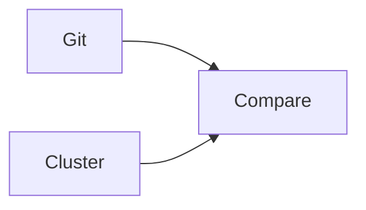

---

## Key Components

| Component | Purpose |
|-----------|----------|
| Desired State | Git |
| Live State | Cluster |
| Comparison Engine | Detect drift |

---

## Types (if applicable)

- Configuration Drift
- Resource Drift

---

## Lifecycle / Workflow (if applicable)

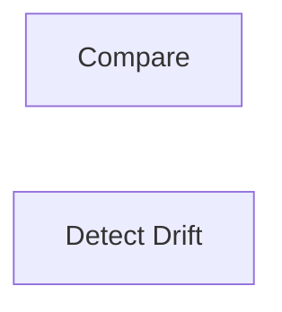

---

## Configuration / Syntax (if applicable)

Automatic comparison.

---

## Important Commands (if applicable)

```bash
argocd app diff

argocd app get
```

---

## Important Files (if applicable)

Application resource

---

## Real-World Use Cases

- Unauthorized changes
- Configuration validation

---

## Advantages

- Detects manual changes

---

## Limitations

- Requires synchronization

---

## Common Interview Questions (Concept Only)

- What is Drift Detection?

---

## Common Mistakes

- Editing cluster directly

---

## Troubleshooting

- Review differences

---

## Summary

Drift Detection ensures Kubernetes matches Git.

---

# Self-Healing

## Overview

Self-Healing automatically restores Kubernetes resources if someone manually modifies or deletes them.

---

## Why It Is Used

Self-Healing ensures:

- Automatic recovery
- Consistent environments
- Reduced operational effort

---

## Architecture / Working

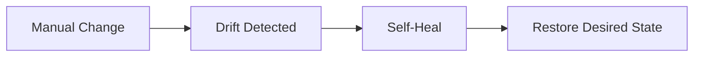

---

## Key Components

| Component | Purpose |
|-----------|----------|
| Drift Detection | Detect changes |
| Automated Sync | Restore resources |

---

## Types (if applicable)

Enabled or Disabled

---

## Lifecycle / Workflow (if applicable)

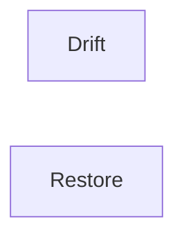

---

## Configuration / Syntax (if applicable)

```yaml
selfHeal: true
```

---

## Important Commands (if applicable)

```bash
argocd app sync
```

---

## Important Files (if applicable)

Application manifest

---

## Real-World Use Cases

- Recover deleted Deployments
- Restore ConfigMaps

---

## Advantages

- Automatic recovery

---

## Limitations

- Must be enabled

---

## Common Interview Questions (Concept Only)

- What is Self-Healing?

---

## Common Mistakes

- Assuming Auto Sync enables Self-Heal by default

---

## Troubleshooting

- Verify sync policy

---

## Summary

Self-Healing restores the desired Git state automatically.

---

# Automated Synchronization

## Overview

Automated Synchronization allows Argo CD to deploy Git changes without manual intervention.

---

## Why It Is Used

Auto Sync enables:

- Continuous deployment
- Faster releases
- Reduced manual work

---

## Architecture / Working

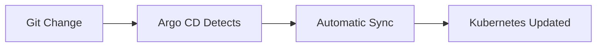

---

## Key Components

| Component | Purpose |
|-----------|----------|
| Git | Desired state |
| Sync Engine | Deploy changes |
| Kubernetes | Live environment |

---

## Types (if applicable)

- Manual Sync
- Automatic Sync

---

## Lifecycle / Workflow (if applicable)

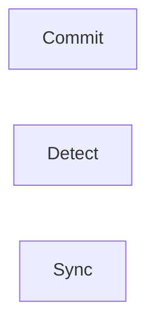

---

## Configuration / Syntax (if applicable)

```yaml
syncPolicy:
  automated:
    prune: true
    selfHeal: true
```

---

## Important Commands (if applicable)

```bash
argocd app sync

argocd app set
```

---

## Important Files (if applicable)

Application manifest

---

## Real-World Use Cases

- Production GitOps
- Continuous deployment

---

## Advantages

- Fully automated deployments
- Reduced human error

---

## Limitations

- Incorrect Git changes deploy automatically

---

## Common Interview Questions (Concept Only)

- What is Auto Sync?
- Difference between Manual and Automatic Sync?

---

## Common Mistakes

- Enabling Auto Sync without testing

---

## Troubleshooting

| Problem | Solution |
|----------|----------|
| Changes not deployed | Verify Auto Sync is enabled |
| Drift remains | Check Self-Heal configuration |

---

## Summary

Automated Synchronization continuously applies Git changes to Kubernetes without manual intervention.

> **Interview Tip (Very Important)**

### Core GitOps Flow

```text
Developer
    │
    ▼
Git Repository (Desired State)
    │
    ▼
Argo CD
    │
Compare Desired vs Live State
    │
    ▼
Detect Drift
    │
    ▼
Auto Sync / Manual Sync
    │
    ▼
Kubernetes Cluster
```

### Frequently Asked Interview Differences

| Concept | Meaning |
|---------|---------|
| GitOps | Git is the single source of truth |
| Continuous Delivery | Automated deployment with optional approval |
| Drift Detection | Identifies differences between Git and cluster |
| Self-Healing | Automatically restores desired state |
| Automated Sync | Automatically deploys Git changes |
| Kubernetes Manifests | YAML definitions of Kubernetes resources |

### One-line Interview Answer

**Argo CD implements GitOps by continuously comparing Kubernetes with the desired state stored in Git, detecting configuration drift, and automatically synchronizing or self-healing resources to maintain the expected cluster state.**
