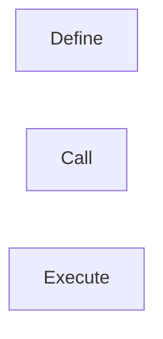
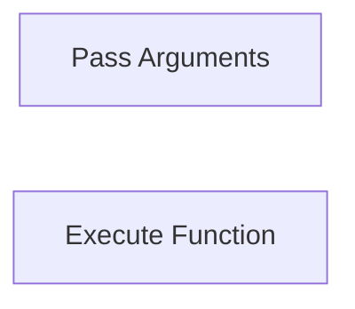
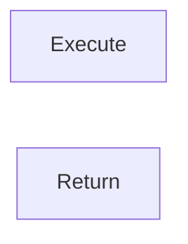
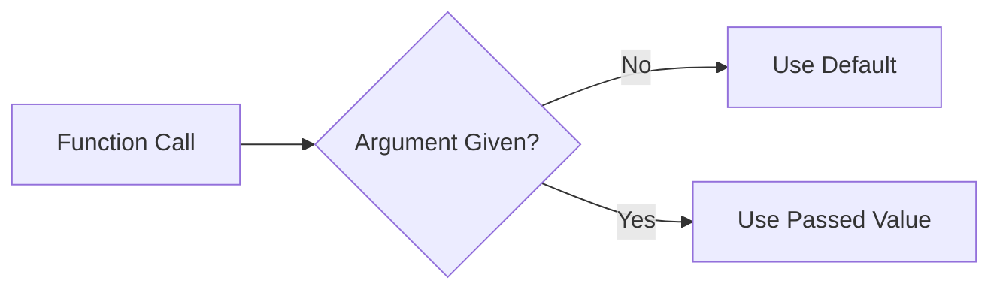
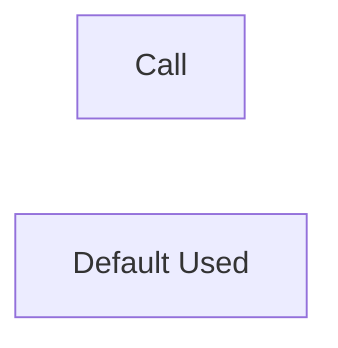
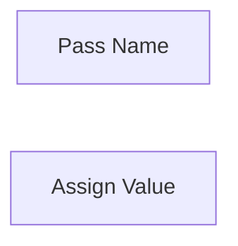
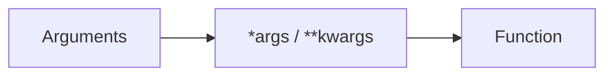
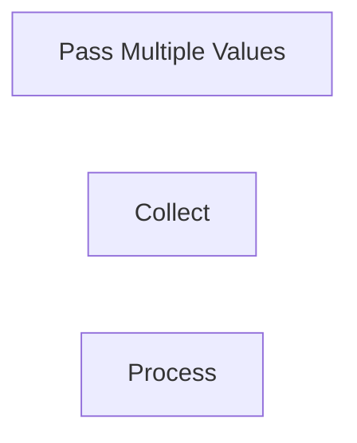

# Functions

## Overview

Functions are reusable blocks of code designed to perform a specific task. They improve code organization, reduce duplication, and make programs easier to maintain.

In DevOps, functions are commonly used to automate repetitive operations such as:

- Creating cloud resources
- Deploying applications
- Monitoring servers
- Processing log files
- Managing Kubernetes resources
- Executing API requests

> **Interview Tip**
>
> Functions are one of the most frequently used Python features in DevOps automation. Interviewers often ask about function arguments, return values, and the difference between positional and keyword arguments.

---

## Why It Is Used

Functions help to:

- Reuse code
- Improve readability
- Simplify maintenance
- Reduce code duplication
- Modularize applications
- Improve testing
- Increase scalability

---

## Architecture / Working


---

## Key Components

| Component | Purpose |
|-----------|----------|
| def | Defines a function |
| Function Name | Identifier |
| Parameters | Accept input values |
| Function Body | Contains executable code |
| return | Sends output back to caller |

---

## Types (if applicable)

Functions can be:

- Built-in Functions
- User-defined Functions
- Functions with Arguments
- Functions with Return Values
- Anonymous Functions (Lambda)

> Lambda functions are useful but are covered separately.

---

## Lifecycle / Workflow (if applicable)


---

## Configuration / Syntax (if applicable)

Basic function

```python
def greet():
    print("Hello DevOps")
```

Calling function

```python
greet()
```

---

## Important Commands (if applicable)

Not Applicable

---

## Important Files (if applicable)

```
automation.py

deploy.py

backup.py

monitor.py

utils.py
```

---

## Real-World Use Cases

- Create Azure VM
- Start EC2 instance
- Deploy Kubernetes application
- Check server health
- Read configuration files
- Send Slack notifications

---

## Advantages

- Reusable
- Modular
- Easy debugging
- Better maintainability
- Improved readability

---

## Limitations

- Excessive nesting reduces readability
- Too many parameters complicate function usage
- Improper design can create dependencies

---

## Common Interview Questions (Concept Only)

- What is a function?
- Why are functions used?
- Difference between parameter and argument?
- What is the return statement?
- Can a function return multiple values?
- Difference between positional and keyword arguments?
- What are default arguments?
- What are variable-length arguments?

---

## Common Mistakes

- Forgetting parentheses while calling functions
- Missing return statement
- Modifying mutable arguments unexpectedly
- Using too many function parameters
- Incorrect indentation

---

## Troubleshooting

| Problem | Possible Cause | Solution |
|----------|----------------|----------|
| Function not found | Defined after call | Define before calling |
| None returned | Missing return statement | Use `return` |
| Missing argument | Required parameter not passed | Pass correct arguments |
| TypeError | Incorrect number of arguments | Verify function definition |
| NameError | Incorrect function name | Check spelling |

---

## Summary

Functions improve automation by organizing reusable logic into independent blocks, making DevOps scripts cleaner, easier to maintain, and more scalable.

> **Interview Tip**
>
> Every production automation script should be divided into reusable functions instead of writing all code inside a single block.

---

# Function Definition

## Overview

A function is defined using the `def` keyword followed by the function name and parentheses.

---

## Why It Is Used

Function definitions organize code into reusable units.

---

## Architecture / Working


---

## Key Components

| Component | Description |
|-----------|-------------|
| def | Function keyword |
| Name | Function identifier |
| Parameters | Optional inputs |
| Body | Executable statements |
| return | Optional output |

---

## Types (if applicable)

- Function without parameters
- Function with parameters

---

## Lifecycle / Workflow (if applicable)



---

## Configuration / Syntax (if applicable)

```python
def hello():
    print("Hello")
```

---

## Important Commands (if applicable)

Not Applicable

---

## Important Files (if applicable)

Python scripts

---

## Real-World Use Cases

- Server health check
- Restart services
- Backup database

---

## Advantages

- Reusable code

---

## Limitations

- Poor naming reduces readability

---

## Common Interview Questions (Concept Only)

- How do you define a function?

---

## Common Mistakes

- Forgetting colon (`:`)

---

## Troubleshooting

- Verify indentation

---

## Summary

Function definitions create reusable blocks of Python code.

---

# Arguments

## Overview

Arguments are values passed to a function during execution.

Parameters are variables defined in the function definition.

```python
def add(a, b):      # Parameters
    return a + b

add(5, 10)          # Arguments
```

> **Interview Tip**
>
> **Parameters** are declared in the function definition, while **arguments** are supplied during the function call.

---

## Why It Is Used

Arguments allow functions to process different inputs.

---

## Architecture / Working


---

## Key Components

| Component | Description |
|-----------|-------------|
| Parameters | Variables in function definition |
| Arguments | Actual values passed |

---

## Types (if applicable)

- Positional
- Keyword
- Default
- Variable-length

---

## Lifecycle / Workflow (if applicable)



---

## Configuration / Syntax (if applicable)

```python
def deploy(server):
    print(server)

deploy("web01")
```

---

## Important Commands (if applicable)

Not Applicable

---

## Important Files (if applicable)

Python scripts

---

## Real-World Use Cases

- Pass server names
- Pass IP addresses
- Pass API URLs

---

## Advantages

- Flexible

---

## Limitations

- Incorrect ordering causes errors

---

## Common Interview Questions (Concept Only)

- Difference between parameters and arguments?

---

## Common Mistakes

- Incorrect argument order

---

## Troubleshooting

- Verify function signature

---

## Summary

Arguments allow one function to work with different input values.

---

# Return Values

## Overview

The `return` statement sends data back to the caller.

---

## Why It Is Used

Functions return processed results instead of printing them directly.

---

## Architecture / Working


---

## Key Components

| Component | Purpose |
|-----------|----------|
| return | Returns output |

---

## Types (if applicable)

- Single value
- Multiple values

---

## Lifecycle / Workflow (if applicable)



---

## Configuration / Syntax (if applicable)

```python
def square(x):
    return x * x
```

---

## Important Commands (if applicable)

Not Applicable

---

## Important Files (if applicable)

Python scripts

---

## Real-World Use Cases

- Return API responses
- Return health status
- Return deployment result

---

## Advantages

- Reusable output

---

## Limitations

- Missing return gives `None`

---

## Common Interview Questions (Concept Only)

- What happens if return is omitted?

---

## Common Mistakes

- Printing instead of returning

---

## Troubleshooting

- Check returned value

---

## Summary

`return` allows functions to provide results to the caller.

---

# Default Arguments

## Overview

Default arguments provide predefined values if no argument is supplied.

---

## Why It Is Used

Reduce required input values.

---

## Architecture / Working



---

## Key Components

| Component | Purpose |
|-----------|----------|
| Default Value | Used when no argument is passed |

---

## Types (if applicable)

Single default value

---

## Lifecycle / Workflow (if applicable)



---

## Configuration / Syntax (if applicable)

```python
def deploy(env="dev"):
    print(env)
```

---

## Important Commands (if applicable)

Not Applicable

---

## Important Files (if applicable)

Python scripts

---

## Real-World Use Cases

- Default deployment environment
- Default region

---

## Advantages

- Cleaner function calls

---

## Limitations

- Mutable defaults should be avoided

---

## Common Interview Questions (Concept Only)

- What are default arguments?

---

## Common Mistakes

- Using mutable objects as defaults

---

## Troubleshooting

- Verify default values

---

## Summary

Default arguments simplify function usage by providing predefined values.

---

# Keyword Arguments

## Overview

Keyword arguments specify parameter names during function calls.

---

## Why It Is Used

Improves readability and removes dependency on argument order.

---

## Architecture / Working


---

## Key Components

| Component | Purpose |
|-----------|----------|
| Parameter Name | Identifies value |

---

## Types (if applicable)

Named arguments

---

## Lifecycle / Workflow (if applicable)



---

## Configuration / Syntax (if applicable)

```python
def create_vm(name, region):

    print(name)
    print(region)

create_vm(region="East US", name="web01")
```

---

## Important Commands (if applicable)

Not Applicable

---

## Important Files (if applicable)

Python scripts

---

## Real-World Use Cases

- Cloud deployments
- API requests

---

## Advantages

- Readable
- Flexible ordering

---

## Limitations

- Slightly longer syntax

---

## Common Interview Questions (Concept Only)

- Difference between positional and keyword arguments?

---

## Common Mistakes

- Mixing positional after keyword arguments

---

## Troubleshooting

- Verify parameter names

---

## Summary

Keyword arguments improve code readability and flexibility.

---

# Variable-Length Arguments

## Overview

Variable-length arguments allow functions to accept any number of arguments.

Python provides:

- `*args`
- `**kwargs`

---

## Why It Is Used

Useful when the number of inputs is unknown.

---

## Architecture / Working



---

## Key Components

| Syntax | Purpose |
|---------|----------|
| *args | Multiple positional arguments |
| **kwargs | Multiple keyword arguments |

---

## Types (if applicable)

### *args

```python
def numbers(*args):

    print(args)
```

---

### **kwargs

```python
def details(**kwargs):

    print(kwargs)
```

---

## Lifecycle / Workflow (if applicable)



---

## Configuration / Syntax (if applicable)

Example

```python
def deploy(*servers):

    for server in servers:
        print(server)
```

---

## Important Commands (if applicable)

Not Applicable

---

## Important Files (if applicable)

Python scripts

---

## Real-World Use Cases

- Multiple servers
- Dynamic cloud resources
- Flexible APIs

---

## Advantages

- Highly flexible

---

## Limitations

- Excessive usage reduces readability

---

## Common Interview Questions (Concept Only)

- Difference between *args and **kwargs?
- When should *args be used?
- What is kwargs?

---

## Common Mistakes

- Confusing *args with **kwargs

---

## Troubleshooting

- Verify argument types

---

## Summary

Variable-length arguments allow functions to accept a flexible number of positional or keyword arguments, making them ideal for reusable automation utilities.

> **Interview Tip (Very Important)**

### Function Argument Types

| Type | Example |
|------|---------|
| Positional | `deploy("web01")` |
| Keyword | `deploy(server="web01")` |
| Default | `deploy(env="dev")` |
| Variable Positional | `*args` |
| Variable Keyword | `**kwargs` |

### Frequently Asked Interview Differences

| Concept | Description |
|---------|-------------|
| Parameter | Variable in function definition |
| Argument | Actual value passed to function |
| return | Sends value back to caller |
| print() | Displays output only |
| *args | Accepts multiple positional arguments |
| **kwargs | Accepts multiple keyword arguments |

### One-line Interview Answer

**Python functions are reusable blocks of code that improve modularity and maintainability by accepting inputs through parameters, processing logic, and optionally returning results. Features such as default arguments, keyword arguments, and variable-length arguments (`*args`, `**kwargs`) make functions highly flexible for DevOps automation scripts.**
