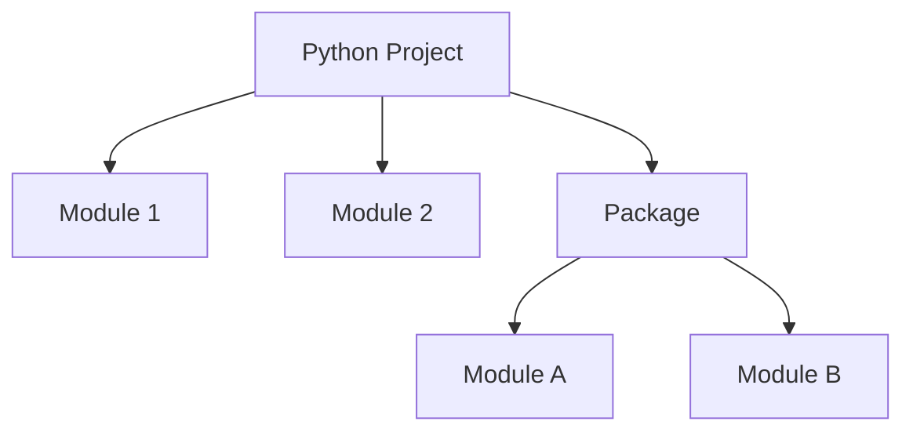
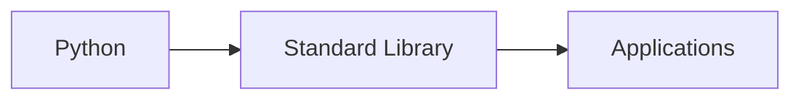
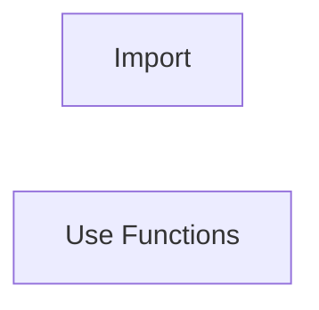
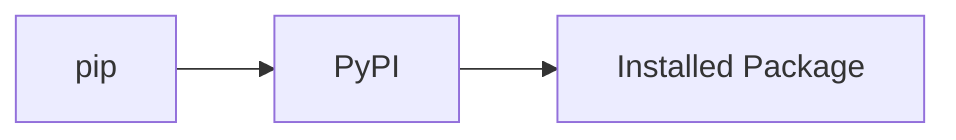
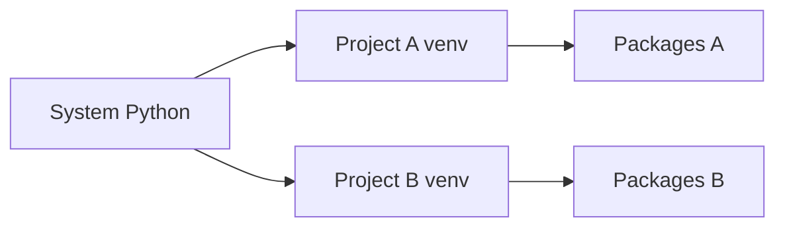

# Modules & Packages

## Overview

Modules and Packages allow Python code to be organized, reused, and maintained efficiently.

A **Module** is a single Python file (`.py`) containing functions, classes, or variables.

A **Package** is a directory containing multiple related modules (and typically an `__init__.py` file).

For DevOps engineers, modules and packages are essential for building reusable automation scripts, interacting with cloud SDKs, and managing project dependencies.

Common examples include:

- `os`
- `sys`
- `subprocess`
- `json`
- `requests`
- `boto3`
- `azure-identity`
- `kubernetes`

> **Interview Tip**
>
> **Module = One Python file**
>
> **Package = Collection of related modules**

---

## Why It Is Used

Modules and packages help to:

- Reuse code
- Organize projects
- Reduce duplication
- Improve maintainability
- Install third-party libraries
- Build scalable automation tools

---

## Architecture / Working



---

## Key Components

| Component | Description |
|-----------|-------------|
| Module | Single Python file |
| Package | Collection of modules |
| Import | Load module |
| Standard Library | Built-in modules |
| pip | Package manager |
| Virtual Environment | Isolated Python environment |

---

## Types (if applicable)

Python supports:

- Built-in Modules
- User-defined Modules
- Third-party Packages

---

## Lifecycle / Workflow (if applicable)


---

## Configuration / Syntax (if applicable)

Import entire module

```python
import os
```

Import specific function

```python
from math import sqrt
```

Import with alias

```python
import numpy as np
```

---

## Important Commands (if applicable)

```python
import

from

pip install

python -m venv

pip list

pip freeze
```

---

## Important Files (if applicable)

```
requirements.txt

__init__.py

main.py

utils.py

venv/
```

---

## Real-World Use Cases

- Cloud automation
- API development
- Kubernetes scripting
- Log analysis
- Deployment automation
- Infrastructure management

---

## Advantages

- Reusable code
- Cleaner projects
- Easier maintenance
- Large ecosystem
- Faster development

---

## Limitations

- Dependency conflicts
- Version compatibility
- External packages require installation

---

## Common Interview Questions (Concept Only)

- What is a module?
- What is a package?
- Difference between module and package?
- Why use virtual environments?
- What is pip?
- Difference between import and from import?

---

## Common Mistakes

- Installing packages globally
- Circular imports
- Forgetting virtual environments
- Missing requirements.txt
- Importing unused modules

---

## Troubleshooting

| Problem | Cause | Solution |
|----------|-------|----------|
| ModuleNotFoundError | Package not installed | Install using pip |
| ImportError | Wrong import | Verify module name |
| Version conflict | Dependency mismatch | Use virtual environment |
| Package not found | Wrong interpreter | Activate venv |
| AttributeError | Incorrect module usage | Check documentation |

---

## Summary

Modules and packages organize Python code into reusable components. Combined with `pip` and virtual environments, they form the foundation of modern Python application and DevOps development.

> **Interview Tip**
>
> Always use a **virtual environment** for Python projects to isolate dependencies and avoid version conflicts.

---

# Import Modules

## Overview

The `import` statement allows one Python file to use functions, classes, and variables defined in another module.

---

## Why It Is Used

Used to:

- Reuse code
- Access built-in modules
- Use third-party libraries
- Organize projects

---

## Architecture / Working


---

## Key Components

| Syntax | Description |
|--------|-------------|
| `import module` | Import module |
| `from module import function` | Import specific function |
| `import module as alias` | Import with alias |

---

## Types (if applicable)

Import module

```python
import os
```

Import function

```python
from math import sqrt
```

Alias

```python
import pandas as pd
```

---

## Lifecycle / Workflow (if applicable)


---

## Configuration / Syntax (if applicable)

```python
import json

print(json.dumps({"name": "DevOps"}))
```

---

## Important Commands (if applicable)

```python
import

from

as
```

---

## Important Files (if applicable)

```
main.py

utils.py
```

---

## Real-World Use Cases

- Import cloud SDKs
- Import automation modules
- Import utility functions

---

## Advantages

- Code reuse
- Cleaner projects

---

## Limitations

- Incorrect imports cause errors

---

## Common Interview Questions (Concept Only)

- Difference between `import` and `from import`?
- Why use aliases?

---

## Common Mistakes

- Circular imports
- Importing unnecessary modules

---

## Troubleshooting

- Verify module installation
- Check spelling

---

## Summary

Import statements enable modular and reusable Python applications.

---

# Standard Library

## Overview

The Python Standard Library is a collection of built-in modules that come pre-installed with Python.

No additional installation is required.

---

## Why It Is Used

Provides ready-to-use functionality for:

- Operating system interaction
- File handling
- JSON processing
- Date and time
- Networking
- Regular expressions

---

## Architecture / Working



---

## Key Components

Frequently used modules:

| Module | Purpose |
|---------|----------|
| os | Operating system |
| sys | System functions |
| subprocess | Execute commands |
| json | JSON handling |
| pathlib | File paths |
| datetime | Date & Time |
| shutil | File operations |
| logging | Logging |
| re | Regular expressions |

---

## Types (if applicable)

Example

```python
import os

print(os.getcwd())
```

---

## Lifecycle / Workflow (if applicable)



---

## Configuration / Syntax (if applicable)

```python
import datetime

print(datetime.datetime.now())
```

---

## Important Commands (if applicable)

```python
import
```

---

## Important Files (if applicable)

Python scripts

---

## Real-World Use Cases

- Execute shell commands
- Process JSON
- File management
- Logging

---

## Advantages

- No installation
- Stable
- Cross-platform

---

## Limitations

- Limited to built-in functionality

---

## Common Interview Questions (Concept Only)

- What is the Standard Library?
- Name commonly used modules.

---

## Common Mistakes

- Installing built-in modules with pip

---

## Troubleshooting

- Verify correct module name

---

## Summary

The Standard Library provides powerful built-in modules for everyday Python programming and DevOps automation.

---

# pip

## Overview

`pip` is Python's package manager.

It downloads, installs, upgrades, and removes third-party packages from the Python Package Index (PyPI).

> **Interview Tip**
>
> `pip` stands for **Preferred Installer Program**.

---

## Why It Is Used

Used to:

- Install packages
- Upgrade packages
- Remove packages
- Manage dependencies

---

## Architecture / Working



---

## Key Components

| Command | Purpose |
|---------|----------|
| install | Install package |
| uninstall | Remove package |
| list | Installed packages |
| freeze | Export dependencies |
| show | Package details |

---

## Types (if applicable)

Install package

```bash
pip install requests
```

Upgrade

```bash
pip install --upgrade requests
```

Remove

```bash
pip uninstall requests
```

---

## Lifecycle / Workflow (if applicable)


---

## Configuration / Syntax (if applicable)

```bash
pip install boto3

pip install kubernetes
```

---

## Important Commands (if applicable)

```bash
pip install

pip uninstall

pip list

pip freeze

pip show
```

---

## Important Files (if applicable)

```
requirements.txt
```

---

## Real-World Use Cases

- Install Azure SDK
- Install AWS SDK
- Install Kubernetes client
- Install Requests

---

## Advantages

- Easy dependency management
- Large package ecosystem

---

## Limitations

- Version conflicts
- Global installation issues

---

## Common Interview Questions (Concept Only)

- What is pip?
- What is requirements.txt?

---

## Common Mistakes

- Installing globally
- Ignoring dependency versions

---

## Troubleshooting

- Upgrade pip
- Use virtual environments

---

## Summary

pip manages third-party packages and is an essential tool for Python development.

---

# Virtual Environments (venv)

## Overview

A Virtual Environment creates an isolated Python environment for a project.

Each project maintains its own:

- Python packages
- Package versions
- Dependencies

without affecting the system-wide Python installation.

> **Interview Tip**
>
> Virtual environments solve dependency conflicts between different Python projects.

---

## Why It Is Used

Used to:

- Isolate dependencies
- Avoid version conflicts
- Improve reproducibility
- Support multiple projects

---

## Architecture / Working



---

## Key Components

| Component | Description |
|-----------|-------------|
| venv | Virtual Environment |
| activate | Enable environment |
| deactivate | Exit environment |
| requirements.txt | Dependency list |

---

## Types (if applicable)

Create environment

```bash
python -m venv venv
```

Activate (Linux/macOS)

```bash
source venv/bin/activate
```

Activate (Windows)

```cmd
venv\Scripts\activate
```

Deactivate

```bash
deactivate
```

---

## Lifecycle / Workflow (if applicable)


---

## Configuration / Syntax (if applicable)

Create

```bash
python -m venv venv
```

Activate

```bash
source venv/bin/activate
```

---

## Important Commands (if applicable)

```bash
python -m venv

source venv/bin/activate

deactivate

pip freeze

pip install -r requirements.txt
```

---

## Important Files (if applicable)

```
venv/

requirements.txt

pyvenv.cfg
```

---

## Real-World Use Cases

- Cloud automation
- API development
- Infrastructure scripts
- DevOps tools
- CI/CD pipelines

---

## Advantages

- Dependency isolation
- Cleaner development
- Easier deployment
- Prevents version conflicts

---

## Limitations

- Extra disk space
- Must activate before use

---

## Common Interview Questions (Concept Only)

- What is a virtual environment?
- Why use virtual environments?
- Difference between global Python and venv?
- How do you activate a virtual environment?
- What is requirements.txt?

---

## Common Mistakes

- Forgetting to activate venv
- Installing packages globally
- Not updating requirements.txt

---

## Troubleshooting

- Verify correct Python interpreter
- Activate venv before installing packages
- Use `pip freeze > requirements.txt` to export dependencies

---

## Summary

Virtual environments isolate project dependencies, making Python applications portable, maintainable, and free from package conflicts.

> **Interview Tip (Very Important)**

### Common Standard Library Modules

| Module | Purpose |
|---------|----------|
| os | OS operations |
| sys | System information |
| subprocess | Execute shell commands |
| json | JSON processing |
| pathlib | File paths |
| shutil | File operations |
| logging | Logging |
| datetime | Date & Time |
| re | Regular expressions |

### Common pip Commands

| Command | Purpose |
|---------|----------|
| `pip install package` | Install package |
| `pip uninstall package` | Remove package |
| `pip list` | List installed packages |
| `pip freeze` | Export dependencies |
| `pip show package` | Package information |

### Common venv Commands

| Command | Purpose |
|---------|----------|
| `python -m venv venv` | Create environment |
| `source venv/bin/activate` | Activate (Linux/macOS) |
| `venv\Scripts\activate` | Activate (Windows) |
| `deactivate` | Exit environment |

### Frequently Asked Interview Differences

| Concept | Description |
|---------|-------------|
| Module | Single Python file |
| Package | Collection of modules |
| Standard Library | Built-in modules |
| pip | Package manager |
| venv | Isolated Python environment |

### One-line Interview Answer

**Python modules and packages organize reusable code, the Standard Library provides built-in functionality, `pip` manages third-party dependencies, and virtual environments (`venv`) isolate project-specific packages to ensure reliable, conflict-free DevOps automation and application development.**
