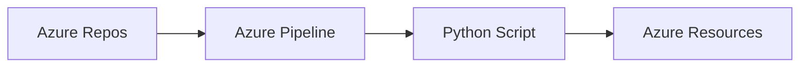
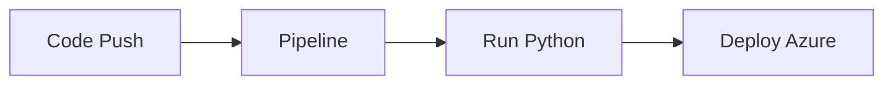

# CI/CD Integration

## Overview

Continuous Integration and Continuous Delivery/Deployment (CI/CD) automate the process of building, testing, and deploying applications. Python is widely used in CI/CD pipelines to perform custom automation tasks such as validation, testing, deployment, infrastructure provisioning, and notifications.

Python integrates with popular CI/CD platforms through SDKs, REST APIs, CLI tools, and pipeline scripts.

Common CI/CD platforms:

- Jenkins
- GitHub Actions
- Azure DevOps

> **Interview Tip**
>
> Python is commonly used to automate tasks that are difficult to achieve using shell scripts alone, such as interacting with APIs, processing JSON/YAML files, generating reports, and managing cloud resources.

---

## Why It Is Used

Python is used in CI/CD pipelines to:

- Run automation scripts
- Validate configuration files
- Execute unit tests
- Deploy applications
- Provision infrastructure
- Trigger cloud operations
- Send notifications
- Generate reports
- Manage Docker and Kubernetes deployments

---

## Architecture / Working


---

## Key Components

| Component | Purpose |
|-----------|----------|
| Repository | Source code |
| Pipeline | Executes workflow |
| Python Script | Automation logic |
| Build Agent | Runs jobs |
| Deployment Target | Production or staging |

---

## Types (if applicable)

Common integrations:

- Jenkins
- GitHub Actions
- Azure DevOps

---

## Lifecycle / Workflow (if applicable)


---

## Configuration / Syntax (if applicable)

Typical pipeline flow

```text
Checkout Code
↓

Install Python
↓

Install Dependencies
↓

Run Python Script
↓

Execute Tests
↓

Deploy
```

---

## Important Commands (if applicable)

```bash
python script.py

pip install -r requirements.txt

pytest

flake8
```

---

## Important Files (if applicable)

```
requirements.txt

Jenkinsfile

.github/workflows/

azure-pipelines.yml

script.py

pytest.ini
```

---

## Real-World Use Cases

- Build automation
- Infrastructure provisioning
- Kubernetes deployment
- Docker image creation
- Configuration validation
- API testing
- Security scanning
- Automated reporting

---

## Advantages

- Easy integration
- Platform-independent
- Large ecosystem
- Excellent cloud support
- Reusable automation

---

## Limitations

- Dependency management
- Requires Python runtime
- Longer execution for complex scripts

---

## Common Interview Questions (Concept Only)

- Why is Python widely used in CI/CD?
- How does Python integrate with Jenkins?
- How is Python used in GitHub Actions?
- How can Python automate Azure DevOps pipelines?

---

## Common Mistakes

- Hardcoding credentials
- Ignoring exit codes
- Missing dependency installation
- Not using virtual environments
- Poor exception handling

---

## Troubleshooting

| Problem | Cause | Solution |
|----------|-------|----------|
| Script not found | Wrong path | Verify workspace |
| ModuleNotFoundError | Dependencies missing | Install packages |
| Permission denied | File permissions | Update permissions |
| Pipeline failed | Script error | Review logs |
| Authentication failed | Invalid credentials | Verify secrets |

---

## Summary

Python plays a critical role in CI/CD pipelines by automating build, test, deployment, and infrastructure tasks across multiple DevOps platforms.

> **Interview Tip**
>
> Python is often used alongside Jenkins, GitHub Actions, and Azure DevOps to automate tasks that are difficult or cumbersome with shell scripting alone.

---

# Jenkins Integration

## Overview

Jenkins is one of the most popular CI/CD tools. Python scripts can be executed from Jenkins jobs or pipelines to automate builds, deployments, testing, cloud operations, and infrastructure management.

Python scripts are typically called from a **Jenkins Pipeline (Jenkinsfile)**.

---

## Why It Is Used

Python helps Jenkins to:

- Deploy applications
- Run automated tests
- Provision cloud resources
- Execute infrastructure automation
- Generate reports
- Manage Docker and Kubernetes

---

## Architecture / Working


---

## Key Components

| Component | Purpose |
|-----------|----------|
| Jenkinsfile | Pipeline definition |
| Agent | Executes jobs |
| Workspace | Source code |
| Python | Automation |
| Plugins | Extend functionality |

---

## Types (if applicable)

- Freestyle Project
- Pipeline
- Multibranch Pipeline

---

## Lifecycle / Workflow (if applicable)


---

## Configuration / Syntax (if applicable)

Run a Python script in Jenkins

```bash
python deploy.py
```

---

## Important Commands (if applicable)

```bash
python

pip

pytest
```

---

## Important Files (if applicable)

```
Jenkinsfile

requirements.txt

deploy.py
```

---

## Real-World Use Cases

- Infrastructure automation
- Build automation
- Cloud deployment
- Automated testing
- Kubernetes deployment

---

## Advantages

- Flexible
- Plugin ecosystem
- Easy scripting

---

## Limitations

- Plugin maintenance
- Server management required

---

## Common Interview Questions (Concept Only)

- How does Jenkins execute Python scripts?
- Why use Python inside Jenkins?

---

## Common Mistakes

- Missing Python installation
- Missing dependencies

---

## Troubleshooting

- Verify Python path
- Check Jenkins workspace

---

## Summary

Jenkins integrates with Python to automate almost every stage of a CI/CD pipeline.

---

# GitHub Actions Integration

## Overview

GitHub Actions is GitHub's native CI/CD platform. Python scripts can be executed within workflows to automate testing, deployment, infrastructure provisioning, and cloud operations.

---

## Why It Is Used

Used to:

- Run tests
- Build applications
- Deploy infrastructure
- Manage cloud resources
- Execute automation scripts

---

## Architecture / Working


---

## Key Components

| Component | Purpose |
|-----------|----------|
| Workflow | Pipeline definition |
| Runner | Executes jobs |
| Actions | Reusable tasks |
| Python | Automation |

---

## Types (if applicable)

- GitHub-hosted runners
- Self-hosted runners

---

## Lifecycle / Workflow (if applicable)


---

## Configuration / Syntax (if applicable)

Typical workflow

```text
Checkout Repository
↓

Setup Python
↓

Install Dependencies
↓

Run Python Script
```

---

## Important Commands (if applicable)

```bash
python script.py

pip install -r requirements.txt
```

---

## Important Files (if applicable)

```
.github/workflows/main.yml

requirements.txt
```

---

## Real-World Use Cases

- CI automation
- Infrastructure deployment
- Docker builds
- Kubernetes deployment
- Cloud automation

---

## Advantages

- Built into GitHub
- Easy configuration
- Scalable

---

## Limitations

- Usage limits on hosted runners

---

## Common Interview Questions (Concept Only)

- How do Python scripts run in GitHub Actions?
- Why install dependencies in workflows?

---

## Common Mistakes

- Forgetting to install packages
- Missing Python version configuration

---

## Troubleshooting

- Review workflow logs

---

## Summary

GitHub Actions executes Python automation as part of CI/CD workflows using runners.

---

# Azure DevOps Integration

## Overview

Azure DevOps Pipelines support Python for build automation, testing, deployments, and Azure resource management.

Python integrates with Azure DevOps using:

- Azure CLI
- Azure SDK
- REST APIs
- Pipeline tasks

---

## Why It Is Used

Used to:

- Provision Azure resources
- Deploy applications
- Run tests
- Automate cloud operations
- Execute infrastructure automation

---

## Architecture / Working



---

## Key Components

| Component | Purpose |
|-----------|----------|
| Pipeline | CI/CD workflow |
| Agent | Executes jobs |
| Service Connection | Azure authentication |
| Python | Automation |

---

## Types (if applicable)

- Microsoft-hosted agent
- Self-hosted agent

---

## Lifecycle / Workflow (if applicable)



---

## Configuration / Syntax (if applicable)

Typical flow

```text
Checkout Code
↓

Install Python
↓

Install Requirements
↓

Run Python Script
↓

Deploy
```

---

## Important Commands (if applicable)

```bash
python deploy.py

pip install -r requirements.txt
```

---

## Important Files (if applicable)

```
azure-pipelines.yml

requirements.txt

deploy.py
```

---

## Real-World Use Cases

- Azure VM automation
- AKS deployment
- ARM/Bicep validation
- Infrastructure provisioning
- Cloud monitoring

---

## Advantages

- Native Azure integration
- Enterprise security
- Built-in Azure authentication

---

## Limitations

- Azure service connections required

---

## Common Interview Questions (Concept Only)

- How does Azure DevOps execute Python scripts?
- What is a Microsoft-hosted agent?
- What is a Service Connection?

---

## Common Mistakes

- Incorrect Azure authentication
- Missing dependencies

---

## Troubleshooting

- Verify service connection
- Review pipeline logs

---

## Summary

Azure DevOps integrates Python with cloud automation, deployments, testing, and infrastructure management.

---

# Interview Quick Revision

## CI/CD Platforms

| Platform | Pipeline File |
|-----------|---------------|
| Jenkins | `Jenkinsfile` |
| GitHub Actions | `.github/workflows/*.yml` |
| Azure DevOps | `azure-pipelines.yml` |

---

## Common Pipeline Steps

```text
Checkout Code
↓

Install Python

↓

Install Dependencies

↓

Run Python Script

↓

Execute Tests

↓

Deploy Application
```

---

## Frequently Used Commands

| Command | Purpose |
|----------|----------|
| `python script.py` | Execute Python script |
| `pip install -r requirements.txt` | Install dependencies |
| `pytest` | Run tests |
| `flake8` | Code linting |

---

## Production Best Practices

- Store secrets in the CI/CD platform's secret management system (Jenkins Credentials, GitHub Secrets, Azure Key Vault/Variable Groups).
- Use virtual environments or isolated build agents.
- Pin Python package versions in `requirements.txt`.
- Handle exceptions and return appropriate exit codes.
- Log automation steps for easier debugging.
- Keep automation scripts modular and reusable.
- Avoid hardcoding credentials or environment-specific values.
- Use infrastructure-as-code (Terraform, Bicep, ARM) alongside Python automation where appropriate.

---

## One-line Interview Answer

**Python integrates seamlessly with Jenkins, GitHub Actions, and Azure DevOps to automate CI/CD pipelines, enabling build automation, testing, cloud provisioning, infrastructure management, and application deployments through reusable and maintainable scripts.**
