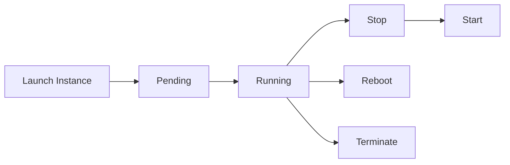
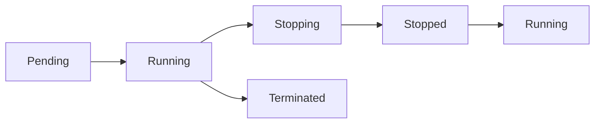
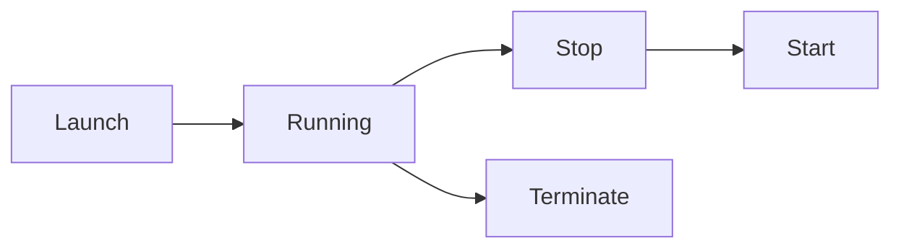
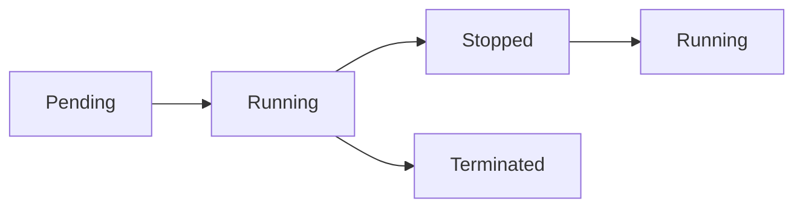

# Amazon EC2

## Overview

Amazon Elastic Compute Cloud (Amazon EC2) is a web service that provides secure, resizable virtual servers in the AWS Cloud. It allows you to launch Linux and Windows virtual machines on demand without purchasing or maintaining physical hardware.

EC2 is one of the **core AWS services** and is heavily used for hosting web applications, APIs, databases, CI/CD tools, and enterprise workloads.

> **Interview Tip**
>
> EC2 is one of the **most frequently asked AWS interview topics**. Be comfortable explaining **Instance Types, AMIs, EBS, Security Groups, Key Pairs, Elastic IPs, User Data, and the Instance Lifecycle**.

---

## Why It Is Used

Amazon EC2 is used to:

- Host web applications
- Run application servers
- Deploy microservices
- Run CI/CD tools (Jenkins, GitLab)
- Host container platforms
- Run batch processing jobs
- Create development and testing environments
- Scale applications on demand

---

## Architecture / Working


---

## Key Components

| Component | Purpose |
|-----------|----------|
| EC2 Instance | Virtual machine |
| AMI | Operating system and application template |
| Instance Type | CPU, Memory, Network configuration |
| EBS Volume | Persistent storage |
| Security Group | Virtual firewall |
| Key Pair | Secure SSH/RDP authentication |
| Elastic IP | Static public IPv4 address |
| User Data | Startup automation script |

---

## Types (if applicable)

### EC2 Instance Families

| Family | Purpose |
|---------|----------|
| General Purpose (T, M) | Balanced workloads |
| Compute Optimized (C) | CPU-intensive applications |
| Memory Optimized (R, X) | Large databases, caching |
| Storage Optimized (I, D) | High-performance storage |
| Accelerated Computing (P, G, F) | GPU, AI, Machine Learning |

---

## Lifecycle / Workflow



---

## Configuration / Syntax (if applicable)

Typical EC2 launch steps:

1. Select AMI
2. Choose Instance Type
3. Configure Network
4. Attach Storage
5. Configure Security Group
6. Select Key Pair
7. Launch Instance

---

## Important Commands (if applicable)

```bash
aws ec2 describe-instances

aws ec2 start-instances

aws ec2 stop-instances

aws ec2 reboot-instances

aws ec2 terminate-instances

aws ec2 describe-images

aws ec2 describe-security-groups

aws ec2 describe-volumes
```

---

## Important Files (if applicable)

Linux

```
~/.ssh/my-key.pem
```

Windows

```
Private Key (.pem)

Administrator Password
```

---

## Real-World Use Cases

- Web servers
- Application servers
- Jenkins server
- GitLab server
- Kubernetes worker nodes
- Bastion host
- VPN server
- Monitoring servers
- Database servers

---

## Advantages

- Highly scalable
- Multiple operating systems
- Flexible pricing
- Wide range of instance types
- Global availability
- Easy automation
- Supports Auto Scaling

---

## Limitations

- Requires operating system management
- Customer responsible for patching
- Costs increase if resources are oversized
- Requires proper security configuration

---

## Common Interview Questions (Concept Only)

- What is Amazon EC2?
- What is an AMI?
- Difference between EBS and Instance Store?
- Difference between Stop and Terminate?
- What is a Security Group?
- What is User Data?
- What is an Elastic IP?
- What are EC2 Instance Types?
- Can an Elastic IP survive instance reboot?
- Can you change an EC2 instance type?

---

## Common Mistakes

- Using the root user for SSH
- Opening Security Groups to `0.0.0.0/0`
- Forgetting to terminate unused instances
- Hardcoding credentials
- Losing the Key Pair
- Assuming Stop deletes the instance

---

## Troubleshooting

| Problem | Cause | Solution |
|----------|-------|----------|
| SSH connection failed | Security Group or Key Pair issue | Verify port 22 and correct private key |
| Instance unreachable | Wrong subnet or routing | Check VPC networking |
| Application not starting | User Data failed | Review cloud-init logs |
| Storage missing | EBS not attached | Attach and mount EBS volume |
| Public IP changed | Instance restarted | Use Elastic IP |

---

## Summary

Amazon EC2 provides scalable virtual servers in AWS. Understanding Instance Types, AMIs, EBS, Security Groups, Key Pairs, Elastic IPs, User Data, and Instance Lifecycle is essential for AWS administration and DevOps roles.

---

# EC2 Instance Types

## Overview

Instance Types define the hardware configuration of an EC2 instance, including CPU, memory, storage, and networking.

---

## Why It Is Used

- Match workload requirements
- Optimize cost
- Improve performance

---

## Architecture / Working


---

## Key Components

- vCPU
- RAM
- Storage
- Network Performance

---

## Types (if applicable)

| Family | Use Case |
|---------|----------|
| T | Burstable workloads |
| M | General purpose |
| C | Compute intensive |
| R | Memory intensive |
| I | Storage intensive |
| G/P | GPU workloads |

---

## Lifecycle / Workflow (if applicable)


---

## Configuration / Syntax (if applicable)

Selected during EC2 creation.

---

## Important Commands (if applicable)

```bash
aws ec2 describe-instance-types
```

---

## Important Files (if applicable)

None.

---

## Real-World Use Cases

- Web servers
- Databases
- AI workloads

---

## Advantages

- Optimized hardware

---

## Limitations

- Wrong sizing increases costs

---

## Common Interview Questions (Concept Only)

- What are EC2 Instance Types?
- Difference between T3 and C5?

---

## Common Mistakes

- Overprovisioning

---

## Troubleshooting

Monitor CPU and memory utilization.

---

## Summary

Choose the instance family based on workload characteristics.

---

# AMIs

## Overview

An Amazon Machine Image (AMI) is a preconfigured template used to launch EC2 instances.

It contains:

- Operating System
- Installed software
- Configuration
- Launch permissions

---

## Why It Is Used

- Faster deployments
- Standardized servers
- Backup server configurations

---

## Architecture / Working


---

## Key Components

- Operating System
- Applications
- Configuration

---

## Types (if applicable)

- AWS Managed
- Marketplace
- Custom AMI

---

## Lifecycle / Workflow


---

## Configuration / Syntax (if applicable)

Selected during launch.

---

## Important Commands (if applicable)

```bash
aws ec2 describe-images
```

---

## Important Files (if applicable)

None.

---

## Real-World Use Cases

- Golden images
- Standard application servers

---

## Advantages

- Rapid provisioning

---

## Limitations

- Must update periodically

---

## Common Interview Questions (Concept Only)

- What is an AMI?
- Types of AMIs?

---

## Common Mistakes

- Using outdated AMIs

---

## Troubleshooting

Update AMIs regularly.

---

## Summary

AMIs provide reusable server templates.

---

# EBS Volumes

## Overview

Amazon Elastic Block Store (EBS) provides persistent block storage for EC2 instances.

---

## Why It Is Used

- Persistent storage
- Boot volumes
- Database storage

---

## Architecture / Working


---

## Key Components

- Volume
- Snapshot

---

## Types (if applicable)

| Type | Use Case |
|------|----------|
| gp3 | General purpose SSD |
| io2 | High IOPS |
| st1 | Throughput optimized HDD |
| sc1 | Cold HDD |

---

## Lifecycle / Workflow


---

## Configuration / Syntax (if applicable)

Attached during launch or later.

---

## Important Commands (if applicable)

```bash
aws ec2 describe-volumes
```

---

## Important Files (if applicable)

Linux

```
/dev/xvda

/dev/nvme*
```

---

## Real-World Use Cases

- Database disks
- Application storage

---

## Advantages

- Persistent
- Snapshot support

---

## Limitations

- AZ-specific

---

## Common Interview Questions (Concept Only)

- Difference between EBS and Instance Store?

---

## Common Mistakes

- Deleting EBS accidentally

---

## Troubleshooting

Verify attachment and mounting.

---

## Summary

EBS provides durable storage for EC2.

---

# Key Pairs

## Overview

Key Pairs are used to securely authenticate to EC2 instances.

---

## Why It Is Used

- Secure SSH access
- Passwordless authentication

---

## Architecture / Working


---

## Key Components

- Public Key
- Private Key

---

## Types (if applicable)

- RSA
- ED25519

---

## Lifecycle / Workflow


---

## Configuration / Syntax (if applicable)

Specified during launch.

---

## Important Commands (if applicable)

```bash
chmod 400 my-key.pem

ssh -i my-key.pem ec2-user@public-ip
```

---

## Important Files (if applicable)

```
my-key.pem
```

---

## Real-World Use Cases

- Linux administration

---

## Advantages

- Secure login

---

## Limitations

- Lost private key cannot be recovered

---

## Common Interview Questions (Concept Only)

- What is a Key Pair?

---

## Common Mistakes

- Losing private key

---

## Troubleshooting

Verify file permissions.

---

## Summary

Key Pairs enable secure EC2 authentication.

---

# Security Groups

## Overview

Security Groups act as virtual firewalls controlling inbound and outbound traffic.

---

## Why It Is Used

- Network security
- Access control

---

## Architecture / Working


---

## Key Components

- Inbound Rules
- Outbound Rules

---

## Types (if applicable)

- Instance-level firewall

---

## Lifecycle / Workflow


---

## Configuration / Syntax (if applicable)

Rules specify protocol, port, and source.

---

## Important Commands (if applicable)

```bash
aws ec2 describe-security-groups
```

---

## Important Files (if applicable)

None.

---

## Real-World Use Cases

- Web server ports
- SSH access

---

## Advantages

- Stateful firewall

---

## Limitations

- Cannot deny traffic explicitly

---

## Common Interview Questions (Concept Only)

- Difference between Security Group and NACL?

---

## Common Mistakes

- Opening SSH to the world

---

## Troubleshooting

Verify inbound rules.

---

## Summary

Security Groups secure EC2 instances by filtering network traffic.

---

# Elastic IP

## Overview

Elastic IP is a static public IPv4 address that remains associated with your AWS account until released.

---

## Why It Is Used

- Static IP
- DNS stability

---

## Architecture / Working


---

## Key Components

- Static IPv4

---

## Types (if applicable)

- Public static IP

---

## Lifecycle / Workflow


---

## Configuration / Syntax (if applicable)

Allocated separately.

---

## Important Commands (if applicable)

```bash
aws ec2 allocate-address
```

---

## Important Files (if applicable)

None.

---

## Real-World Use Cases

- Bastion Host
- Web servers

---

## Advantages

- Static address

---

## Limitations

- Charged when unused

---

## Common Interview Questions (Concept Only)

- What is Elastic IP?

---

## Common Mistakes

- Forgetting to release unused EIPs

---

## Troubleshooting

Verify association.

---

## Summary

Elastic IP provides a persistent public IP address.

---

# User Data

## Overview

User Data is a startup script executed automatically when an EC2 instance launches.

---

## Why It Is Used

- Install software
- Configure servers
- Automate deployments

---

## Architecture / Working


---

## Key Components

- Shell Script
- cloud-init

---

## Types (if applicable)

- Bash
- PowerShell

---

## Lifecycle / Workflow


---

## Configuration / Syntax (if applicable)

Provided during launch.

---

## Important Commands (if applicable)

Linux log:

```bash
cat /var/log/cloud-init-output.log
```

---

## Important Files (if applicable)

```
/var/log/cloud-init.log

/var/log/cloud-init-output.log
```

---

## Real-World Use Cases

- Install Apache
- Install Docker
- Configure applications

---

## Advantages

- Automated provisioning

---

## Limitations

- Runs only during first boot by default

---

## Common Interview Questions (Concept Only)

- What is User Data?

---

## Common Mistakes

- Assuming it runs every reboot

---

## Troubleshooting

Review cloud-init logs.

---

## Summary

User Data automates EC2 initialization.

---

# Instance Lifecycle

## Overview

Every EC2 instance moves through several lifecycle states.

---

## Why It Is Used

- Manage compute resources
- Control billing
- Support maintenance

---

## Architecture / Working



---

## Key Components

| State | Description |
|--------|-------------|
| Pending | Launching |
| Running | Operational |
| Stopping | Shutting down |
| Stopped | Powered off |
| Terminated | Deleted |

---

## Types (if applicable)

- Running
- Stopped
- Terminated

---

## Lifecycle / Workflow



---

## Configuration / Syntax (if applicable)

Managed through the AWS Console, CLI, or SDK.

---

## Important Commands (if applicable)

```bash
aws ec2 stop-instances

aws ec2 start-instances

aws ec2 reboot-instances

aws ec2 terminate-instances
```

---

## Important Files (if applicable)

None.

---

## Real-World Use Cases

- Maintenance
- Cost optimization

---

## Advantages

- Flexible management

---

## Limitations

- Terminated instances cannot be recovered

---

## Common Interview Questions (Concept Only)

- Difference between Stop, Reboot, and Terminate?
- Does stopping an instance delete EBS?

---

## Common Mistakes

- Confusing Stop with Terminate

---

## Troubleshooting

Verify current instance state before performing operations.

---

## Summary

Understanding the EC2 lifecycle is essential for managing availability, maintenance, and costs.

---

# Interview Quick Revision

## EC2 Launch Workflow


---

## EC2 Storage

| Storage | Persistent | Attached To |
|---------|------------|-------------|
| EBS | ✅ Yes | One EC2 instance (within the same AZ) |
| Instance Store | ❌ No | Physical host |

---

## Security Group vs NACL

| Security Group | NACL |
|---------------|------|
| Stateful | Stateless |
| Instance level | Subnet level |
| Allow rules only | Allow and Deny rules |

---

## EC2 Lifecycle



---

## AWS EC2 Best Practices

- Use IAM Roles instead of Access Keys.
- Enable detailed monitoring for production workloads when needed.
- Keep AMIs updated with security patches.
- Use Security Groups following the principle of least privilege.
- Store application data on EBS, not the root filesystem alone.
- Use Elastic IPs only when a static public IP is required.
- Automate server initialization with User Data.
- Regularly create EBS snapshots for backup.
- Choose the correct instance family based on workload.
- Terminate unused instances to reduce costs.

---

## One-line Interview Answer

**Amazon EC2 is AWS's scalable virtual machine service that enables on-demand compute resources using AMIs, Instance Types, EBS storage, Security Groups, Key Pairs, Elastic IPs, and User Data, while supporting secure, highly available, and production-ready cloud workloads.**
