# Monitoring & Logging

## Overview

Monitoring and logging are essential AWS services used to observe application performance, infrastructure health, user activity, and security events.

The primary AWS monitoring services are:

- **Amazon CloudWatch** – Monitors AWS resources, applications, and collects metrics and logs.
- **AWS CloudTrail** – Records AWS API activity for auditing and security.

Together, these services help organizations detect issues, troubleshoot problems, monitor performance, and maintain compliance.

> **Interview Tip**
>
> This is one of the most frequently asked AWS topics. Be comfortable explaining:
>
> - CloudWatch vs CloudTrail
> - Metrics vs Logs
> - CloudWatch Alarms
> - Dashboards
> - CloudTrail Event History

---

# Amazon CloudWatch

## Overview

Amazon CloudWatch is AWS's monitoring and observability service.

It collects:

- Metrics
- Logs
- Events
- Alarms

CloudWatch provides real-time visibility into AWS resources and applications.

---

## Why It Is Used

CloudWatch helps to:

- Monitor infrastructure
- Monitor application performance
- Detect failures
- Trigger alerts
- Automate actions
- Troubleshoot issues

---

## Architecture / Working

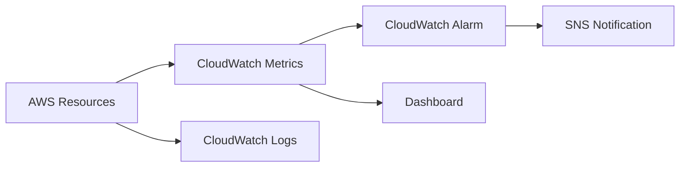

---

## Key Components

| Component | Purpose |
|-----------|----------|
| Metrics | Performance data |
| Logs | Application and system logs |
| Alarms | Notifications based on thresholds |
| Dashboards | Visual monitoring |
| Events/EventBridge | Event-driven automation |

---

## Types (if applicable)

CloudWatch data types:

- Metrics
- Logs
- Events
- Dashboards
- Alarms

---

## Lifecycle / Workflow

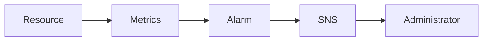

---

## Configuration / Syntax (if applicable)

Typical workflow:

1. Enable monitoring
2. Collect metrics
3. Create alarms
4. Configure SNS notifications
5. Monitor dashboards

---

## Important Commands (if applicable)

```bash
aws cloudwatch list-metrics

aws cloudwatch describe-alarms

aws logs describe-log-groups
```

---

## Important Files (if applicable)

None.

---

## Real-World Use Cases

- EC2 monitoring
- Auto Scaling
- CPU monitoring
- Memory monitoring (custom)
- Application monitoring
- Kubernetes monitoring
- Billing alerts

---

## Advantages

- Fully managed
- Real-time monitoring
- Native AWS integration
- Alerting
- Dashboards

---

## Limitations

- Memory utilization is not collected by default for EC2
- Custom metrics incur additional charges
- Log retention must be configured

---

## Common Interview Questions (Concept Only)

- What is CloudWatch?
- What does CloudWatch monitor?
- Difference between Metrics and Logs?
- What are CloudWatch Alarms?
- Can CloudWatch restart EC2 instances?
- Difference between CloudWatch and CloudTrail?

---

## Common Mistakes

- Not configuring alarm thresholds
- Forgetting log retention settings
- Assuming EC2 memory metrics are available by default
- Not enabling detailed monitoring when required

---

## Troubleshooting

| Problem | Solution |
|----------|----------|
| No metrics | Verify resource monitoring is enabled |
| Alarm not triggering | Verify threshold and evaluation period |
| Missing logs | Check CloudWatch Agent configuration |
| No notifications | Verify SNS subscription |

---

## Summary

Amazon CloudWatch continuously monitors AWS resources, applications, and infrastructure using metrics, logs, alarms, and dashboards.

---

# Metrics

## Overview

Metrics are numerical performance measurements collected over time.

Examples:

- CPU Utilization
- Network In
- Network Out
- Disk Read
- Disk Write
- Request Count

---

## Why It Is Used

Metrics help monitor:

- Performance
- Capacity
- Availability
- Resource utilization

---

## Architecture / Working

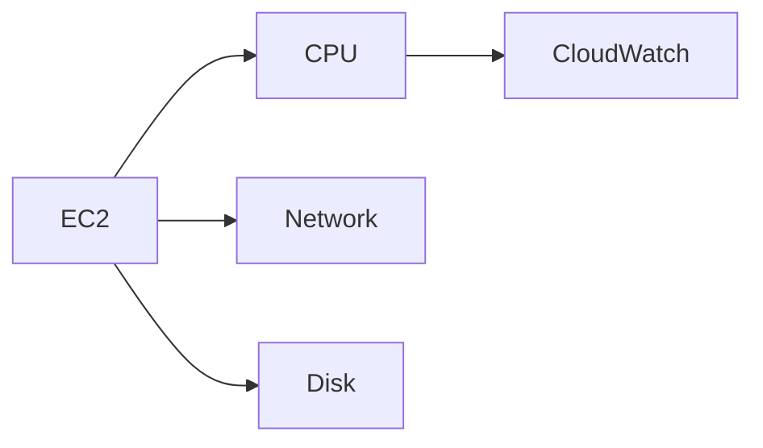

---

## Key Components

- Namespace
- Metric
- Dimension
- Statistic
- Period

---

## Types (if applicable)

- AWS Metrics
- Custom Metrics

---

## Lifecycle / Workflow

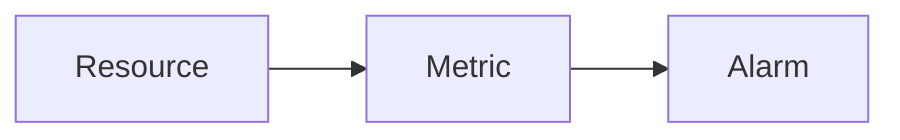

---

## Configuration / Syntax (if applicable)

Collected automatically for most AWS services.

---

## Important Commands (if applicable)

```bash
aws cloudwatch list-metrics
```

---

## Important Files (if applicable)

None.

---

## Real-World Use Cases

- CPU alerts
- Storage monitoring
- Auto Scaling

---

## Advantages

- Lightweight
- Real-time

---

## Limitations

- Limited default EC2 metrics

---

## Common Interview Questions (Concept Only)

- What are CloudWatch Metrics?
- What is a Custom Metric?

---

## Common Mistakes

- Confusing metrics with logs

---

## Troubleshooting

Verify metric namespace.

---

## Summary

Metrics provide numerical insights into AWS resource performance.

---

# Logs

## Overview

CloudWatch Logs stores application and system logs centrally.

Logs can come from:

- EC2
- Lambda
- ECS
- EKS
- CloudTrail
- Applications

---

## Why It Is Used

- Debugging
- Auditing
- Troubleshooting
- Security analysis

---

## Architecture / Working

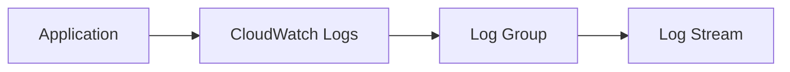

---

## Key Components

- Log Group
- Log Stream
- Log Events

---

## Types (if applicable)

- Application Logs
- System Logs
- Audit Logs

---

## Lifecycle / Workflow

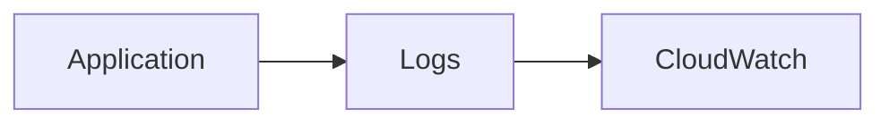

---

## Configuration / Syntax (if applicable)

Usually requires CloudWatch Agent for EC2.

---

## Important Commands (if applicable)

```bash
aws logs describe-log-groups
```

---

## Important Files (if applicable)

None.

---

## Real-World Use Cases

- Apache logs
- Nginx logs
- Kubernetes logs
- Application debugging

---

## Advantages

- Centralized logging
- Searchable

---

## Limitations

- Storage cost

---

## Common Interview Questions (Concept Only)

- What are Log Groups?
- What are Log Streams?

---

## Common Mistakes

- Forgetting log retention

---

## Troubleshooting

Verify CloudWatch Agent.

---

## Summary

CloudWatch Logs centralizes application and infrastructure logging.

---

# Alarms

## Overview

CloudWatch Alarms monitor metrics and perform actions when thresholds are crossed.

Actions include:

- SNS notification
- EC2 recovery
- Auto Scaling
- Lambda invocation

---

## Why It Is Used

- Alerting
- Automation
- High availability

---

## Architecture / Working

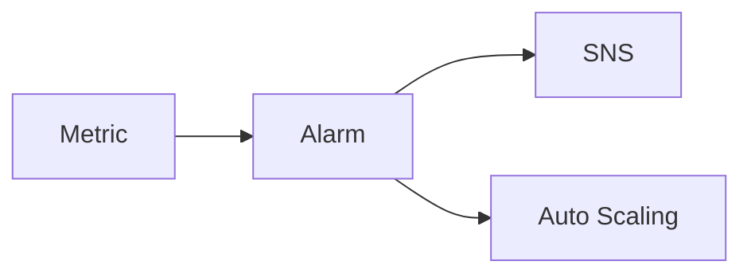

---

## Key Components

- Threshold
- Period
- Evaluation
- Action

---

## Types (if applicable)

Alarm states:

- OK
- ALARM
- INSUFFICIENT_DATA

---

## Lifecycle / Workflow

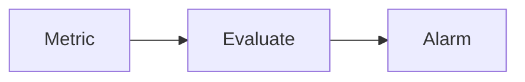

---

## Configuration / Syntax (if applicable)

Example:

CPU > 80%

---

## Important Commands (if applicable)

```bash
aws cloudwatch describe-alarms
```

---

## Important Files (if applicable)

None.

---

## Real-World Use Cases

- CPU alerts
- Disk alerts
- Billing alerts

---

## Advantages

- Automatic notifications

---

## Limitations

- Incorrect thresholds cause false alarms

---

## Common Interview Questions (Concept Only)

- What are CloudWatch Alarms?
- What actions can alarms trigger?

---

## Common Mistakes

- Too many unnecessary alarms

---

## Troubleshooting

Verify evaluation period.

---

## Summary

CloudWatch Alarms notify administrators when monitored resources exceed defined thresholds.

---

# Dashboards

## Overview

CloudWatch Dashboards provide a centralized visual interface for monitoring AWS resources.

---

## Why It Is Used

- Operations monitoring
- Executive reporting
- NOC dashboards

---

## Architecture / Working

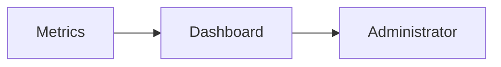

---

## Key Components

- Widgets
- Graphs
- Text
- Metrics

---

## Types (if applicable)

- Custom Dashboard

---

## Lifecycle / Workflow

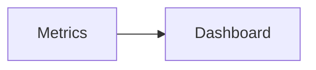

---

## Configuration / Syntax (if applicable)

Customizable using widgets.

---

## Important Commands (if applicable)

```bash
aws cloudwatch list-dashboards
```

---

## Important Files (if applicable)

None.

---

## Real-World Use Cases

- NOC
- DevOps monitoring
- Executive reporting

---

## Advantages

- Easy visualization

---

## Limitations

- Manual dashboard design

---

## Common Interview Questions (Concept Only)

- What are CloudWatch Dashboards?

---

## Common Mistakes

- Displaying unnecessary metrics

---

## Troubleshooting

Verify widget configuration.

---

## Summary

Dashboards provide a visual representation of AWS infrastructure health.

---

# Amazon CloudTrail

## Overview

AWS CloudTrail records **AWS API calls and account activity**.

It tracks:

- Console logins
- CLI commands
- SDK requests
- IAM changes
- Resource modifications

CloudTrail is primarily used for:

- Auditing
- Security
- Compliance
- Forensics

> **Interview Tip**
>
> CloudTrail records **who performed what action, when, and from where**.

---

## Why It Is Used

- Security auditing
- Compliance
- Change tracking
- Investigation
- Governance

---

## Architecture / Working

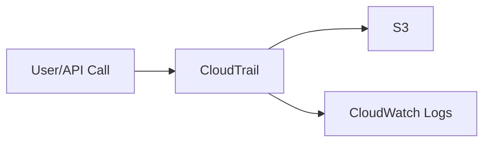

---

## Key Components

- Event History
- Trails
- Management Events
- Data Events
- Insights Events

---

## Types (if applicable)

| Event Type | Description |
|------------|-------------|
| Management Events | AWS resource management operations |
| Data Events | Object-level operations (e.g., S3 objects, Lambda invocations) |
| Insights Events | Detect unusual API activity |

---

## Lifecycle / Workflow

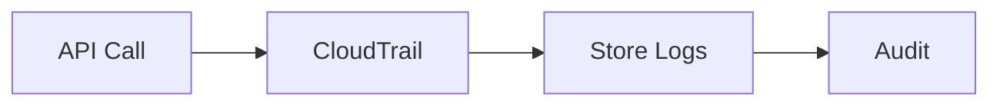

---

## Configuration / Syntax (if applicable)

Typical configuration:

1. Create Trail
2. Choose S3 bucket
3. Enable logging
4. Optional CloudWatch integration

---

## Important Commands (if applicable)

```bash
aws cloudtrail describe-trails

aws cloudtrail lookup-events
```

---

## Important Files (if applicable)

CloudTrail logs are stored as JSON files in Amazon S3.

---

## Real-World Use Cases

- Security investigations
- Compliance reporting
- User activity tracking
- IAM auditing
- Change management

---

## Advantages

- Complete API audit history
- Compliance support
- Security monitoring
- Easy integration with CloudWatch

---

## Limitations

- Does not monitor application performance
- Data events may increase cost

---

## Common Interview Questions (Concept Only)

- What is CloudTrail?
- What events does CloudTrail record?
- Difference between CloudTrail and CloudWatch?
- Where are CloudTrail logs stored?
- What are Management Events?
- What are Data Events?

---

## Common Mistakes

- Assuming CloudTrail monitors CPU utilization
- Not enabling trails for all regions
- Forgetting S3 lifecycle management for logs

---

## Troubleshooting

- Verify Trail is enabled.
- Check S3 bucket permissions.
- Confirm logging is enabled for all regions.
- Verify CloudTrail event history.

---

## Summary

CloudTrail records AWS API activity for auditing, compliance, governance, and security investigations.

---

# Interview Quick Revision

## Monitoring Architecture

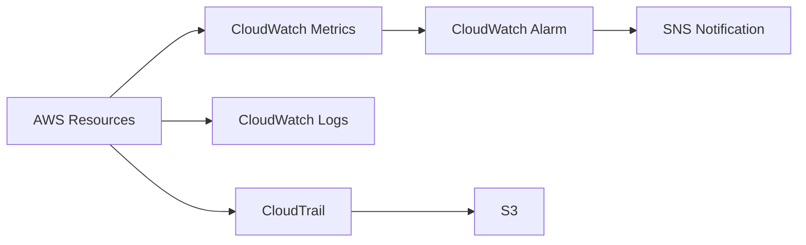

---

## CloudWatch vs CloudTrail

| CloudWatch | CloudTrail |
|------------|------------|
| Performance Monitoring | API Activity Auditing |
| Metrics | API Logs |
| Logs | User Actions |
| Alarms | Compliance |
| Dashboards | Security Auditing |
| Operational Monitoring | Governance & Forensics |

---

## Metrics vs Logs

| Metrics | Logs |
|----------|------|
| Numerical values | Text records |
| CPU Usage | Application Logs |
| Memory Usage (Custom) | Web Server Logs |
| Network Traffic | Error Messages |
| Used for Alarms | Used for Debugging |

---

## CloudWatch Alarm States

| State | Description |
|--------|-------------|
| OK | Metric is within threshold |
| ALARM | Threshold exceeded |
| INSUFFICIENT_DATA | Not enough data to evaluate |

---

## CloudTrail Event Types

| Event | Purpose |
|--------|----------|
| Management Events | Resource management API calls |
| Data Events | Object-level resource access |
| Insights Events | Detect unusual API activity |

---

## AWS Monitoring Best Practices

- Enable **CloudWatch Detailed Monitoring** for production EC2 instances.
- Configure **CloudWatch Alarms** for critical metrics such as CPU, memory (custom), and disk usage.
- Send alarm notifications through **Amazon SNS**.
- Use **CloudWatch Dashboards** for centralized operational monitoring.
- Configure **log retention policies** to control storage costs.
- Install the **CloudWatch Agent** on EC2 instances for memory and disk metrics.
- Enable **CloudTrail** in all AWS regions.
- Store CloudTrail logs securely in **Amazon S3** with lifecycle policies.
- Integrate CloudTrail with CloudWatch for real-time security monitoring.
- Regularly review CloudTrail logs for unauthorized activity.

---

## One-line Interview Answer

**Amazon CloudWatch monitors AWS resources using metrics, logs, alarms, and dashboards to provide operational visibility, while AWS CloudTrail records API activity for auditing, security, compliance, and governance.**
