# CI/CD Services

## Overview

AWS provides a suite of fully managed CI/CD services that automate the software delivery lifecycle, from source code management to deployment.

The core AWS CI/CD services are:

- **AWS CodeCommit** – Source Code Repository
- **AWS CodeBuild** – Continuous Integration (Build & Test)
- **AWS CodeDeploy** – Automated Application Deployment
- **AWS CodePipeline** – CI/CD Pipeline Orchestration

Together, these services enable automated, repeatable, and reliable software deployments.

> **Interview Tip**
>
> Frequently asked topics:
>
> - AWS CI/CD workflow
> - CodeCommit vs GitHub
> - CodeBuild vs Jenkins
> - CodeDeploy deployment strategies
> - CodePipeline stages
> - Blue/Green Deployment

---

# Why It Is Used

AWS CI/CD services help organizations:

- Automate software delivery
- Reduce deployment errors
- Accelerate releases
- Standardize deployments
- Improve software quality
- Support DevOps practices
- Enable Continuous Integration and Continuous Delivery

---

# Architecture / Working

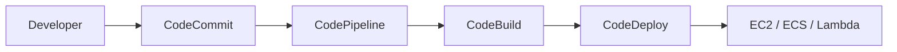

---

# Key Components

| Component | Purpose |
|-----------|----------|
| CodeCommit | Source Code Repository |
| CodeBuild | Build & Test Code |
| CodeDeploy | Deploy Applications |
| CodePipeline | Automate CI/CD Workflow |
| IAM | Permissions |
| CloudWatch | Monitoring |

---

# Types (if applicable)

AWS CI/CD Services:

| Service | Purpose |
|----------|----------|
| CodeCommit | Source Control |
| CodeBuild | Continuous Integration |
| CodeDeploy | Deployment |
| CodePipeline | Pipeline Automation |

---

# Lifecycle / Workflow

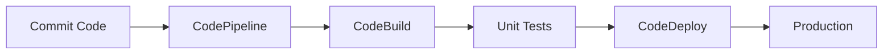

---

# Configuration / Syntax (if applicable)

Typical workflow:

1. Push code to CodeCommit
2. Pipeline starts automatically
3. CodeBuild compiles and tests
4. CodeDeploy deploys application
5. Pipeline reports status

---

# Important Commands (if applicable)

```bash
aws codecommit

aws codebuild

aws codedeploy

aws codepipeline
```

---

# Important Files (if applicable)

| File | Purpose |
|------|----------|
| buildspec.yml | CodeBuild build instructions |
| appspec.yml | CodeDeploy deployment instructions |
| pipeline.json | CodePipeline definition |

---

# Real-World Use Cases

- Automated deployments
- CI/CD pipelines
- Blue/Green deployment
- Microservices deployment
- Infrastructure automation
- Application testing

---

# Advantages

- Fully managed
- Native AWS integration
- Automated deployments
- Easy monitoring
- Scalable
- Secure

---

# Limitations

- AWS-centric ecosystem
- Less flexible than Jenkins for complex workflows
- Learning curve for configuration

---

# Common Interview Questions (Concept Only)

- What are AWS CI/CD services?
- What is CodePipeline?
- Difference between CodeBuild and Jenkins?
- Difference between CodeCommit and GitHub?
- What is CodeDeploy?
- What is buildspec.yml?
- What is appspec.yml?

---

# Common Mistakes

- Missing IAM permissions
- Incorrect buildspec.yml syntax
- Forgetting deployment hooks
- Hardcoding environment variables
- Ignoring pipeline failures

---

# Troubleshooting

| Problem | Solution |
|----------|----------|
| Pipeline failed | Check failed stage logs |
| Build failed | Verify buildspec.yml |
| Deployment failed | Review CodeDeploy logs |
| Repository access denied | Verify IAM permissions |
| Build timeout | Increase build timeout |

---

# Summary

AWS CI/CD services automate source code management, application builds, testing, deployment, and release management using CodeCommit, CodeBuild, CodeDeploy, and CodePipeline.

---

# AWS CodeCommit

## Overview

AWS CodeCommit is a fully managed Git-based source code repository service.

It allows teams to securely store source code, configuration files, scripts, and infrastructure code.

It supports standard Git operations such as:

- Clone
- Push
- Pull
- Branch
- Merge

---

## Why It Is Used

- Source code version control
- Git repository hosting
- Secure code storage
- Team collaboration
- CI/CD integration

---

## Architecture / Working

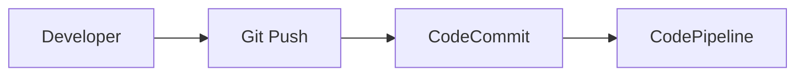

---

## Key Components

| Component | Purpose |
|-----------|----------|
| Repository | Stores code |
| Branch | Separate development line |
| Commit | Version snapshot |
| Pull Request | Code review |

---

## Types (if applicable)

Repository types:

- Private Git Repository

---

## Lifecycle / Workflow

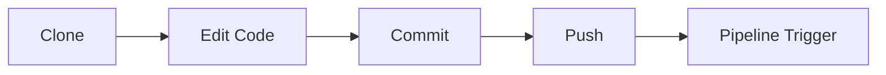

---

## Configuration / Syntax (if applicable)

Typical Git workflow:

1. Clone repository
2. Modify code
3. Commit changes
4. Push changes

---

## Important Commands (if applicable)

```bash
git clone

git add

git commit

git push

git pull
```

---

## Important Files (if applicable)

| File | Purpose |
|------|----------|
| .gitignore | Ignore files |
| README.md | Project documentation |

---

## Real-World Use Cases

- Infrastructure as Code
- Application development
- CI/CD source repository
- Team collaboration

---

## Advantages

- Fully managed Git repository
- AWS IAM integration
- High availability
- Secure

---

## Limitations

- AWS only
- Fewer collaboration features than GitHub or GitLab

---

## Common Interview Questions (Concept Only)

- What is CodeCommit?
- Is CodeCommit Git compatible?
- Difference between CodeCommit and GitHub?

---

## Common Mistakes

- Not configuring Git credentials
- Missing IAM permissions
- Committing secrets

---

## Troubleshooting

- Verify Git credentials.
- Check IAM access.
- Validate repository permissions.

---

## Summary

AWS CodeCommit is a secure, managed Git repository service integrated with AWS IAM and CI/CD services.

---

# AWS CodeBuild

## Overview

AWS CodeBuild is a fully managed Continuous Integration service that compiles source code, runs tests, and produces deployment artifacts.

No build servers need to be managed.

---

## Why It Is Used

- Compile applications
- Run automated tests
- Build Docker images
- Generate deployment artifacts
- Integrate with CI/CD pipelines

---

## Architecture / Working

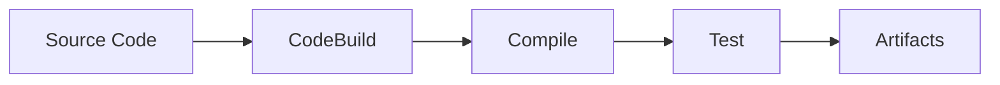

---

## Key Components

| Component | Purpose |
|-----------|----------|
| Project | Build configuration |
| Environment | Build container |
| Buildspec | Build instructions |
| Artifact | Build output |

---

## Types (if applicable)

Build environments:

- Linux
- Windows

---

## Lifecycle / Workflow

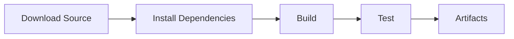

---

## Configuration / Syntax (if applicable)

Build process is defined in:

```yaml
buildspec.yml
```

Common phases:

- install
- pre_build
- build
- post_build

---

## Important Commands (if applicable)

AWS Console or CLI manages builds.

---

## Important Files (if applicable)

| File | Purpose |
|------|----------|
| buildspec.yml | Build instructions |

---

## Real-World Use Cases

- Java builds
- Python builds
- Docker image creation
- Unit testing
- CI pipelines

---

## Advantages

- Fully managed
- Auto scaling
- Supports Docker
- Native AWS integration

---

## Limitations

- Limited compared to highly customized Jenkins setups
- Build time charges

---

## Common Interview Questions (Concept Only)

- What is CodeBuild?
- What is buildspec.yml?
- What are build phases?

---

## Common Mistakes

- Incorrect YAML syntax
- Missing dependencies
- Hardcoded credentials

---

## Troubleshooting

- Review build logs.
- Validate buildspec.yml.
- Verify IAM permissions.

---

## Summary

CodeBuild automates compilation, testing, and artifact generation without requiring dedicated build servers.

---

# AWS CodeDeploy

## Overview

AWS CodeDeploy automates application deployments to AWS compute services.

Supported deployment targets include:

- Amazon EC2
- Amazon ECS
- AWS Lambda
- On-premises servers

---

## Why It Is Used

- Automated deployments
- Zero-downtime deployment
- Rollback support
- Blue/Green deployments

---

## Architecture / Working

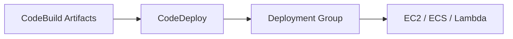

---

## Key Components

| Component | Purpose |
|-----------|----------|
| Application | Deployment target |
| Deployment Group | Collection of instances |
| Deployment | Deployment process |
| AppSpec File | Deployment instructions |

---

## Types (if applicable)

Deployment strategies:

- In-place Deployment
- Blue/Green Deployment

> **Interview Tip**
>
> Blue/Green deployment is commonly asked in DevOps interviews.

---

## Lifecycle / Workflow

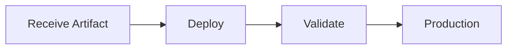

---

## Configuration / Syntax (if applicable)

Deployment configuration is defined in:

```yaml
appspec.yml
```

---

## Important Commands (if applicable)

Managed through AWS Console, CLI, or CodePipeline.

---

## Important Files (if applicable)

| File | Purpose |
|------|----------|
| appspec.yml | Deployment instructions |

---

## Real-World Use Cases

- Web applications
- Microservices
- Rolling deployments
- Blue/Green deployments

---

## Advantages

- Automated deployment
- Rollback support
- Supports multiple compute platforms

---

## Limitations

- AWS specific
- Configuration complexity

---

## Common Interview Questions (Concept Only)

- What is CodeDeploy?
- What is Blue/Green deployment?
- What is appspec.yml?

---

## Common Mistakes

- Missing lifecycle hooks
- Incorrect deployment group
- IAM permission issues

---

## Troubleshooting

- Review deployment logs.
- Verify AppSpec file.
- Check deployment events.

---

## Summary

CodeDeploy automates reliable deployments with rollback and multiple deployment strategies.

---

# AWS CodePipeline

## Overview

AWS CodePipeline is a fully managed Continuous Delivery service that automates software release pipelines.

It orchestrates all stages of CI/CD.

---

## Why It Is Used

- Pipeline automation
- Continuous Delivery
- Automated testing
- Release management

---

## Architecture / Working

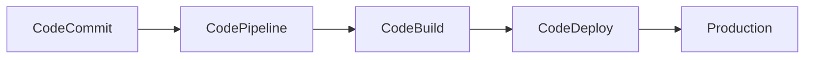

---

## Key Components

| Component | Purpose |
|-----------|----------|
| Source Stage | Fetch source code |
| Build Stage | Compile & Test |
| Deploy Stage | Deploy application |
| Approval Stage | Manual approval |

---

## Types (if applicable)

Typical stages:

- Source
- Build
- Test
- Approval
- Deploy

---

## Lifecycle / Workflow

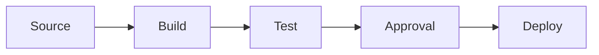

---

## Configuration / Syntax (if applicable)

Pipeline contains multiple stages connected sequentially.

---

## Important Commands (if applicable)

Managed primarily through AWS Console or CLI.

---

## Important Files (if applicable)

| File | Purpose |
|------|----------|
| pipeline.json | Pipeline configuration |

---

## Real-World Use Cases

- Continuous Delivery
- DevOps automation
- Multi-stage deployments
- Infrastructure deployment

---

## Advantages

- Fully managed
- AWS integration
- Event-driven
- Easy automation

---

## Limitations

- AWS specific
- Limited compared to highly customized Jenkins pipelines

---

## Common Interview Questions (Concept Only)

- What is CodePipeline?
- What are pipeline stages?
- Can CodePipeline integrate with GitHub?
- Can CodePipeline trigger CodeBuild?

---

## Common Mistakes

- Incorrect stage ordering
- Missing IAM roles
- Ignoring failed stages

---

## Troubleshooting

- Check pipeline execution history.
- Review stage logs.
- Validate IAM permissions.

---

## Summary

AWS CodePipeline automates the entire CI/CD workflow by connecting source control, build, testing, approvals, and deployment services.

---

# Interview Quick Revision

## AWS CI/CD Workflow

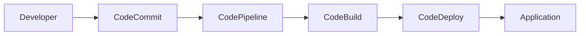

---

## CodeBuild Workflow

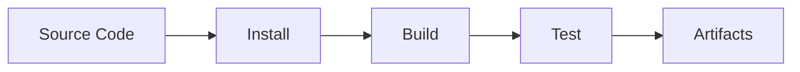

---

## CodeDeploy Workflow

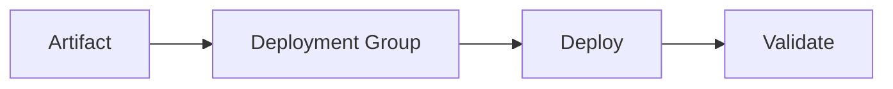

---

## CodePipeline Stages


---

## AWS CI/CD Services Comparison

| Service | Purpose |
|----------|----------|
| CodeCommit | Git Repository |
| CodeBuild | Build & Test |
| CodeDeploy | Deployment |
| CodePipeline | CI/CD Orchestration |

---

## CodeCommit vs GitHub

| CodeCommit | GitHub |
|-------------|--------|
| AWS Managed Git | Git Hosting Platform |
| IAM Integration | GitHub Authentication |
| AWS Native | Rich Collaboration Features |
| Private by Default | Public & Private Repositories |

---

## CodeBuild vs Jenkins

| CodeBuild | Jenkins |
|------------|----------|
| Fully Managed | Self-managed |
| No Server Maintenance | Requires Server Administration |
| AWS Integration | Plugin-Based |
| Auto Scaling | Manual Scaling |

---

## CodeDeploy Deployment Types

| Type | Description |
|------|-------------|
| In-place | Updates existing instances |
| Blue/Green | Deploys to new environment before switching traffic |

---

## Common CI/CD Files

| File | Purpose |
|------|----------|
| buildspec.yml | Build Instructions |
| appspec.yml | Deployment Instructions |
| pipeline.json | Pipeline Configuration |

---

## AWS CI/CD Best Practices

- Store application code in version control.
- Use **CodePipeline** to automate the release process.
- Keep `buildspec.yml` and `appspec.yml` under version control.
- Enable automated testing in the build stage.
- Use **Blue/Green deployments** for production releases.
- Apply least-privilege IAM permissions to CI/CD services.
- Store sensitive data in **AWS Secrets Manager** or **Systems Manager Parameter Store**.
- Monitor pipeline executions using **Amazon CloudWatch**.
- Configure rollback mechanisms for failed deployments.
- Separate CI/CD pipelines for Development, Testing, and Production environments.

---

## One-line Interview Answer

**AWS CI/CD services automate software delivery using CodeCommit for source control, CodeBuild for compiling and testing applications, CodeDeploy for automated deployments, and CodePipeline to orchestrate the complete Continuous Integration and Continuous Delivery workflow.**
