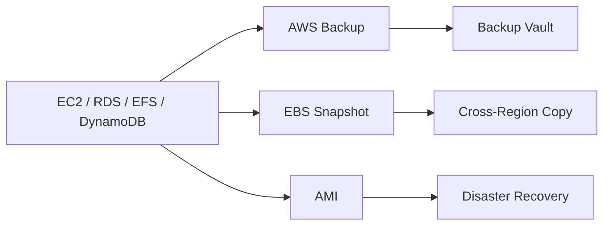
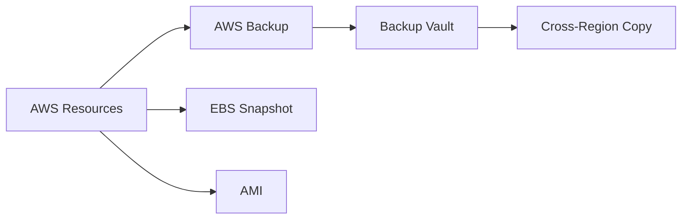

# Backup & Disaster Recovery

## Overview

Backup and Disaster Recovery (BDR) are essential strategies for protecting applications and data against accidental deletion, hardware failures, cyberattacks, and regional outages.

AWS provides multiple services and features for backup and disaster recovery:

- **AWS Backup** – Centralized backup management
- **Amazon EBS Snapshots** – Volume-level backups
- **Amazon Machine Images (AMIs)** – EC2 instance backups
- **Cross-Region Backup** – Disaster recovery across AWS Regions

> **Interview Tip**
>
> Frequently asked topics:
>
> - AWS Backup vs EBS Snapshot
> - Snapshot vs AMI
> - Disaster Recovery strategies
> - Cross-Region Backup
> - Backup retention policies
> - Recovery Point Objective (RPO) and Recovery Time Objective (RTO)

---

# Why It Is Used

Backup and Disaster Recovery help organizations:

- Protect critical business data
- Recover from accidental deletion
- Restore infrastructure quickly
- Meet compliance requirements
- Minimize downtime
- Protect against regional failures
- Improve business continuity

---

# Architecture / Working



---

# Key Components

| Component | Purpose |
|-----------|----------|
| AWS Backup | Centralized backup management |
| Backup Vault | Secure backup storage |
| Backup Plan | Defines backup schedule |
| Recovery Point | Available backup version |
| Snapshot | Block-level volume backup |
| AMI | EC2 machine image |
| Cross-Region Copy | Backup replication |

---

# Types (if applicable)

AWS Disaster Recovery options:

| Strategy | Recovery Speed | Cost |
|----------|----------------|------|
| Backup & Restore | Slow | Low |
| Pilot Light | Medium | Medium |
| Warm Standby | Fast | High |
| Multi-Site Active/Active | Very Fast | Very High |

> **Interview Tip**
>
> Backup & Restore is the most common strategy for small and medium workloads, while Pilot Light and Warm Standby are frequently discussed in interviews.

---

# Lifecycle / Workflow


---

# Configuration / Syntax (if applicable)

Typical workflow:

1. Create Backup Vault
2. Create Backup Plan
3. Assign AWS resources
4. Configure retention policy
5. Schedule backups
6. Test restore process

---

# Important Commands (if applicable)

```bash
aws backup

aws ec2 create-snapshot

aws ec2 create-image

aws backup start-backup-job
```

---

# Important Files (if applicable)

No mandatory configuration files.

---

# Real-World Use Cases

- Daily EC2 backups
- Database recovery
- Cross-region disaster recovery
- Long-term backup retention
- Compliance backups
- Infrastructure recovery
- Ransomware protection

---

# Advantages

- Centralized backup management
- Automated scheduling
- Cross-region replication
- Encryption support
- Policy-based backups
- Compliance reporting

---

# Limitations

- Backup storage incurs additional cost
- Restore operations may take time
- Cross-region copies increase storage costs
- Backups do not replace high availability

---

# Common Interview Questions (Concept Only)

- What is AWS Backup?
- Difference between Snapshot and AMI?
- What is Cross-Region Backup?
- What is RPO?
- What is RTO?
- What is Backup Vault?
- Can AWS Backup manage multiple AWS services?

---

# Common Mistakes

- Not testing backups
- No backup retention policy
- Forgetting cross-region backups
- Confusing snapshots with full instance backups
- Deleting snapshots accidentally
- No encryption enabled

---

# Troubleshooting

| Problem | Solution |
|----------|----------|
| Backup job failed | Check IAM permissions and backup plan |
| Snapshot creation failed | Verify EBS volume state |
| Restore failed | Ensure target resources exist |
| Cross-region copy failed | Verify destination region permissions |
| Backup missing | Check backup schedule and resource assignment |

---

# Summary

AWS Backup and Disaster Recovery services help organizations automate backups, restore infrastructure quickly, and protect workloads from failures using centralized backup policies, snapshots, AMIs, and cross-region replication.

---

# AWS Backup

## Overview

AWS Backup is a fully managed service that centralizes and automates backups across multiple AWS services.

Supported services include:

- Amazon EC2 (EBS)
- Amazon RDS
- Amazon EFS
- Amazon DynamoDB
- Amazon FSx
- Amazon Storage Gateway

---

## Why It Is Used

- Centralized backup management
- Automated scheduling
- Policy-based backups
- Compliance
- Multi-account backup management

---

## Architecture / Working


---

## Key Components

| Component | Purpose |
|-----------|----------|
| Backup Plan | Defines schedule and retention |
| Backup Vault | Stores backups |
| Backup Rule | Specifies backup frequency |
| Recovery Point | Backup version |
| Resource Assignment | Resources to protect |

---

## Types (if applicable)

Backup schedules:

- Daily
- Weekly
- Monthly
- On-demand

---

## Lifecycle / Workflow


---

## Configuration / Syntax (if applicable)

Typical steps:

1. Create Backup Vault
2. Create Backup Plan
3. Define schedule
4. Assign resources
5. Monitor jobs

---

## Important Commands (if applicable)

```bash
aws backup list-backup-vaults

aws backup list-backup-plans

aws backup start-backup-job

aws backup start-restore-job
```

---

## Important Files (if applicable)

None.

---

## Real-World Use Cases

- Enterprise backup automation
- Regulatory compliance
- Multi-account backup management
- Daily database backups

---

## Advantages

- Centralized management
- Automated backups
- Policy-driven
- Cross-account support

---

## Limitations

- Additional storage costs
- Restore time depends on resource size

---

## Common Interview Questions (Concept Only)

- What is AWS Backup?
- What resources does AWS Backup support?
- What is a Backup Vault?

---

## Common Mistakes

- No retention policy
- Not assigning resources
- Ignoring restore testing

---

## Troubleshooting

- Check backup jobs.
- Verify IAM permissions.
- Review Backup Vault configuration.

---

## Summary

AWS Backup provides centralized, automated backup management for multiple AWS services using backup plans and backup vaults.

---

# Amazon EBS Snapshots

## Overview

An EBS Snapshot is a point-in-time backup of an Amazon EBS volume.

Snapshots are stored in Amazon S3 (managed internally by AWS) and can be used to create new EBS volumes.

---

## Why It Is Used

- Backup EBS volumes
- Volume recovery
- Disaster recovery
- Volume migration
- Clone storage

---

## Architecture / Working


---

## Key Components

| Component | Purpose |
|-----------|----------|
| EBS Volume | Source storage |
| Snapshot | Point-in-time backup |
| Incremental Backup | Stores changed blocks only |

---

## Types (if applicable)

- Manual Snapshot
- Automated Snapshot

---

## Lifecycle / Workflow


---

## Configuration / Syntax (if applicable)

```bash
aws ec2 create-snapshot
```

---

## Important Commands (if applicable)

```bash
aws ec2 create-snapshot

aws ec2 describe-snapshots

aws ec2 delete-snapshot
```

---

## Important Files (if applicable)

None.

---

## Real-World Use Cases

- Daily disk backups
- Before patching servers
- Disaster recovery
- Volume migration

---

## Advantages

- Incremental backups
- Durable
- Fast restore
- Easy cloning

---

## Limitations

- Only protects EBS volumes
- Storage charges apply

---

## Common Interview Questions (Concept Only)

- What is an EBS Snapshot?
- Are snapshots incremental?
- Where are snapshots stored?

---

## Common Mistakes

- Deleting snapshots too early
- No retention policy
- Forgetting cross-region copies

---

## Troubleshooting

- Verify volume state.
- Check snapshot status.
- Ensure sufficient permissions.

---

## Summary

EBS Snapshots provide incremental backups of EBS volumes for recovery and migration.

---

# Amazon Machine Images (AMIs)

## Overview

An Amazon Machine Image (AMI) is a complete template used to launch EC2 instances.

An AMI contains:

- Operating System
- Installed Software
- Configuration
- EBS Snapshots
- Boot Configuration

Unlike an EBS snapshot, an AMI represents the entire server.

---

## Why It Is Used

- Server backup
- Rapid provisioning
- Auto Scaling
- Disaster recovery
- Golden images

---

## Architecture / Working


---

## Key Components

| Component | Purpose |
|-----------|----------|
| OS | Operating system |
| EBS Snapshot | Disk image |
| Launch Permissions | Access control |
| Block Device Mapping | Storage configuration |

---

## Types (if applicable)

- AWS AMIs
- Marketplace AMIs
- Custom AMIs

---

## Lifecycle / Workflow


---

## Configuration / Syntax (if applicable)

```bash
aws ec2 create-image
```

---

## Important Commands (if applicable)

```bash
aws ec2 create-image

aws ec2 describe-images

aws ec2 deregister-image
```

---

## Important Files (if applicable)

None.

---

## Real-World Use Cases

- Golden images
- Disaster recovery
- Auto Scaling templates
- Standardized server deployments

---

## Advantages

- Complete server backup
- Fast provisioning
- Reusable
- Consistent deployments

---

## Limitations

- Larger storage requirement than snapshots
- Needs updates after OS changes

---

## Common Interview Questions (Concept Only)

- What is an AMI?
- Difference between Snapshot and AMI?
- What does an AMI contain?

---

## Common Mistakes

- Using outdated AMIs
- Forgetting to update golden images
- Deleting associated snapshots

---

## Troubleshooting

- Verify AMI permissions.
- Check snapshot availability.
- Validate launch permissions.

---

## Summary

AMIs are reusable templates containing operating systems, software, and storage snapshots used to launch identical EC2 instances.

---

# Cross-Region Backup

## Overview

Cross-Region Backup copies backups from one AWS Region to another to protect against regional outages.

It is an important Disaster Recovery capability.

---

## Why It Is Used

- Regional disaster recovery
- Business continuity
- Compliance
- Geographic redundancy

---

## Architecture / Working


---

## Key Components

| Component | Purpose |
|-----------|----------|
| Source Region | Original backup |
| Destination Region | Disaster recovery copy |
| Backup Vault | Backup storage |
| Recovery Point | Restorable backup |

---

## Types (if applicable)

Replication:

- Same Account
- Cross Account
- Cross Region

---

## Lifecycle / Workflow


---

## Configuration / Syntax (if applicable)

Typical workflow:

1. Enable cross-region copy
2. Select destination region
3. Configure retention
4. Verify copy jobs

---

## Important Commands (if applicable)

Managed through AWS Backup or AWS Console.

---

## Important Files (if applicable)

None.

---

## Real-World Use Cases

- Regional disaster recovery
- Compliance
- Multi-region business continuity
- Critical workload protection

---

## Advantages

- Protects against regional failures
- Improves resiliency
- Supports disaster recovery planning

---

## Limitations

- Increased storage cost
- Copy operations take time
- Additional management overhead

---

## Common Interview Questions (Concept Only)

- What is Cross-Region Backup?
- Why use Cross-Region Backup?
- Difference between Multi-AZ and Cross-Region Backup?

---

## Common Mistakes

- Backing up only within one region
- No restore testing
- No retention policy

---

## Troubleshooting

- Verify destination permissions.
- Check copy job status.
- Confirm backup vault configuration.

---

## Summary

Cross-Region Backup enhances disaster recovery by replicating backups to another AWS Region, ensuring business continuity during regional failures.

---

# Interview Quick Revision

## Backup Architecture



---

## Snapshot Workflow


---

## AMI Workflow


---

## Cross-Region Disaster Recovery


---

## AWS Backup vs Snapshot vs AMI

| Feature | AWS Backup | EBS Snapshot | AMI |
|----------|------------|--------------|-----|
| Scope | Multiple AWS Services | EBS Volume Only | Entire EC2 Instance |
| Automation | Yes | Manual or Automated | Manual |
| Incremental | Depends on Service | Yes | Uses EBS Snapshots |
| Disaster Recovery | Yes | Partial | Yes |
| Centralized Management | Yes | No | No |

---

## Snapshot vs AMI

| Snapshot | AMI |
|----------|-----|
| Backup of an EBS volume | Complete EC2 template |
| Stores disk blocks | Includes OS, configuration, and EBS snapshots |
| Used to restore storage | Used to launch EC2 instances |
| Incremental | References snapshots |

---

## Disaster Recovery Strategies

| Strategy | Recovery Time | Cost |
|----------|---------------|------|
| Backup & Restore | Slow | Low |
| Pilot Light | Medium | Medium |
| Warm Standby | Fast | High |
| Multi-Site Active/Active | Very Fast | Very High |

---

## AWS Backup Best Practices

- Automate backups using **AWS Backup Plans**.
- Define retention policies based on business and compliance requirements.
- Use **Backup Vaults** with encryption enabled.
- Regularly test backup restoration procedures.
- Copy critical backups to another AWS Region.
- Use **AMIs** before performing major operating system upgrades.
- Schedule periodic **EBS Snapshots** for production volumes.
- Apply least-privilege IAM permissions to backup operations.
- Monitor backup jobs using **Amazon CloudWatch**.
- Enable lifecycle policies to optimize long-term backup costs.

---

## One-line Interview Answer

**AWS Backup centralizes automated backups across AWS services, EBS Snapshots provide incremental block-level backups of EBS volumes, AMIs create reusable images of EC2 instances, and Cross-Region Backup improves disaster recovery by replicating backups to another AWS Region for business continuity.**
