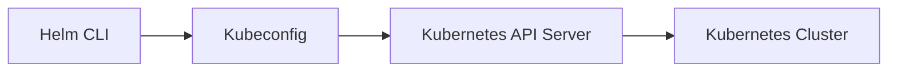
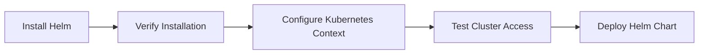
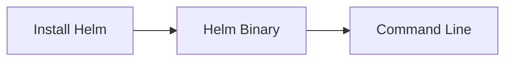
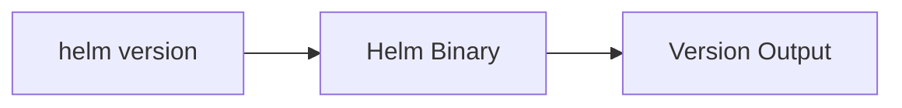
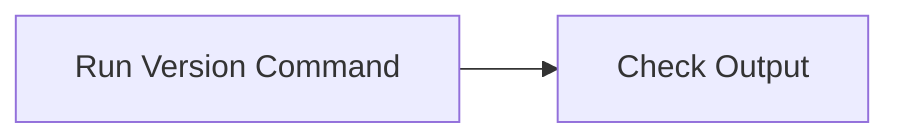
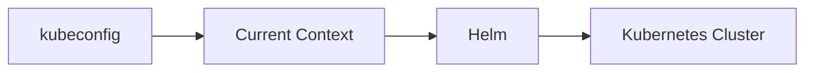
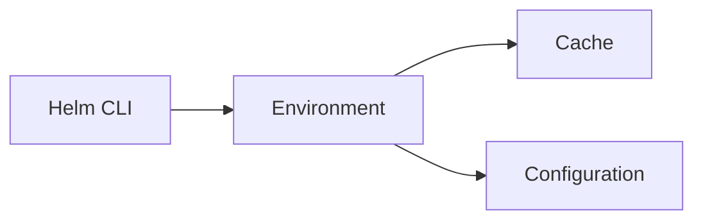
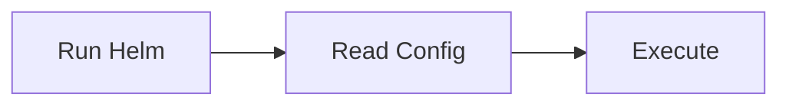
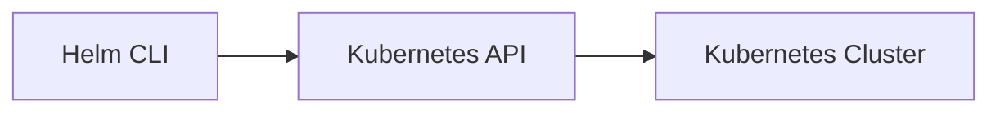

# Installation & Setup

## Overview

Before using Helm to deploy applications to Kubernetes, you must install the Helm CLI, verify the installation, ensure your Kubernetes cluster is accessible, and configure the Kubernetes context.

Helm itself does **not** require a server component (Helm v3). It communicates directly with the Kubernetes API Server using the Kubernetes configuration (`kubeconfig`).

> **Interview Tip**
>
> Helm v3 only requires:
>
> - Helm CLI
> - Access to a Kubernetes cluster
> - A valid kubeconfig file

---

## Why It Is Used

Installation and setup are required to:

- Deploy Kubernetes applications
- Manage Helm charts
- Upgrade and rollback releases
- Connect to Kubernetes clusters
- Automate deployments in CI/CD pipelines

---

## Architecture / Working



### Working Steps

1. Install Helm CLI.
2. Configure Kubernetes access using `kubectl`.
3. Verify the current Kubernetes context.
4. Execute Helm commands.
5. Helm communicates with the Kubernetes API Server.
6. Kubernetes creates or updates resources.

---

## Key Components

| Component | Purpose |
|-----------|----------|
| Helm CLI | Executes Helm commands |
| kubeconfig | Stores Kubernetes cluster credentials |
| kubectl | Verifies cluster connectivity |
| Kubernetes API Server | Receives deployment requests |
| Helm Environment | Stores Helm configuration and cache |

---

## Types (if applicable)

Helm installation methods:

| Method | Usage |
|---------|------|
| Package Manager | Linux distributions |
| Homebrew | macOS |
| Chocolatey | Windows |
| Official Install Script | Linux/macOS |
| Manual Binary | Any platform |

---

## Lifecycle / Workflow



---

## Configuration / Syntax

Typical setup workflow

```text
Install Helm
      │
      ▼
Verify Installation
      │
      ▼
Configure kubeconfig
      │
      ▼
Verify Cluster Access
      │
      ▼
Run Helm Commands
```

---

## Important Commands

```bash
helm version

helm env

helm list

helm repo list

kubectl config current-context

kubectl cluster-info

kubectl get nodes
```

---

## Important Files

```
~/.kube/config

~/.config/helm/

~/.cache/helm/

~/.local/share/helm/
```

---

## Real-World Use Cases

- Installing Helm on developer workstations
- CI/CD pipeline setup
- Connecting to AKS, EKS, or GKE clusters
- Managing multiple Kubernetes clusters
- Deploying production applications

---

## Advantages

- Simple installation
- Client-only architecture
- Easy Kubernetes integration
- Cross-platform support
- No server-side components

---

## Limitations

- Requires Kubernetes cluster access
- Depends on valid kubeconfig
- Helm CLI version should match supported Kubernetes versions

---

## Common Interview Questions (Concept Only)

- How do you install Helm?
- How do you verify Helm installation?
- Where does Helm get Kubernetes credentials?
- Does Helm require Tiller?
- What is kubeconfig?
- How does Helm connect to Kubernetes?
- What is the purpose of `helm env`?

---

## Common Mistakes

- Forgetting to configure Kubernetes context
- Using the wrong Kubernetes context
- Installing an outdated Helm version
- Assuming Helm v3 requires Tiller
- Running Helm commands without cluster access

---

## Troubleshooting

| Problem | Cause | Solution |
|----------|-------|----------|
| `helm: command not found` | Helm not installed | Install Helm and update PATH |
| Kubernetes cluster unreachable | Invalid kubeconfig | Verify `~/.kube/config` |
| Unauthorized access | Missing credentials | Configure Kubernetes authentication |
| No resources found | Wrong Kubernetes context | Switch to the correct context |
| Helm command fails | Cluster not accessible | Verify `kubectl cluster-info` |

---

## Summary

Helm setup consists of installing the Helm CLI, verifying the installation, configuring Kubernetes access, and ensuring communication with the Kubernetes API Server. Since Helm v3 is client-only, setup is simpler and more secure than previous versions.

> **Interview Tip**
>
> Helm does **not** maintain its own Kubernetes credentials—it uses the same kubeconfig file as `kubectl`.

---

# Install Helm

## Overview

Helm can be installed using package managers, installation scripts, or manually downloading the binary.

---

## Why It Is Used

Installing the Helm CLI enables you to:

- Install charts
- Upgrade applications
- Roll back releases
- Manage Kubernetes packages

---

## Architecture / Working



---

## Key Components

| Component | Purpose |
|-----------|----------|
| Helm Binary | Main executable |
| PATH | Makes Helm available system-wide |

---

## Types (if applicable)

### Linux

```bash
curl https://raw.githubusercontent.com/helm/helm/main/scripts/get-helm-3 | bash
```

### macOS

```bash
brew install helm
```

### Windows (Chocolatey)

```powershell
choco install kubernetes-helm
```

---

## Lifecycle / Workflow


---

## Configuration / Syntax

```bash
helm version
```

---

## Important Commands

```bash
helm version
```

---

## Important Files

```
helm
```

---

## Real-World Use Cases

- Developer workstation setup
- CI/CD build agents
- Kubernetes administration

---

## Advantages

- Easy installation
- Lightweight

---

## Limitations

- Requires supported operating system

---

## Common Interview Questions (Concept Only)

- How do you install Helm?
- Which package managers support Helm?

---

## Common Mistakes

- Installing outdated versions

---

## Troubleshooting

- Verify installation path

---

## Summary

Helm installation is straightforward and supports all major operating systems.

---

# Verify Installation

## Overview

After installation, verify that Helm is installed correctly and can execute commands.

---

## Why It Is Used

Verification ensures:

- Helm is installed
- PATH is configured
- Correct version is installed

---

## Architecture / Working



---

## Key Components

- Helm executable
- Version information

---

## Types (if applicable)

Not applicable.

---

## Lifecycle / Workflow



---

## Configuration / Syntax

```bash
helm version
```

---

## Important Commands

```bash
helm version

helm env
```

---

## Important Files

None

---

## Real-World Use Cases

- Validate build agents
- Verify CI/CD runners

---

## Advantages

- Quick validation

---

## Limitations

- Does not verify Kubernetes connectivity

---

## Common Interview Questions (Concept Only)

- How do you verify Helm installation?

---

## Common Mistakes

- Assuming installation succeeded without verification

---

## Troubleshooting

- Check PATH variable

---

## Summary

Always verify Helm installation before using it with Kubernetes.

---

# Configure Kubernetes Context

## Overview

Helm uses the current Kubernetes context configured in the kubeconfig file.

It automatically connects to the active Kubernetes cluster.

---

## Why It Is Used

Required to:

- Deploy applications
- Manage releases
- Access Kubernetes clusters

---

## Architecture / Working



---

## Key Components

| Component | Purpose |
|-----------|----------|
| kubeconfig | Cluster credentials |
| Context | Active cluster selection |
| Namespace | Deployment target |

---

## Types (if applicable)

- Single Cluster
- Multi-Cluster

---

## Lifecycle / Workflow


---

## Configuration / Syntax

View current context

```bash
kubectl config current-context
```

List contexts

```bash
kubectl config get-contexts
```

Switch context

```bash
kubectl config use-context <context-name>
```

---

## Important Commands

```bash
kubectl config current-context

kubectl config get-contexts

kubectl config use-context
```

---

## Important Files

```
~/.kube/config
```

---

## Real-World Use Cases

- Deploying to AKS
- Deploying to EKS
- Switching production clusters

---

## Advantages

- Supports multiple clusters
- Easy cluster switching

---

## Limitations

- Incorrect context can deploy to the wrong cluster

---

## Common Interview Questions (Concept Only)

- How does Helm know which Kubernetes cluster to use?
- What is kubeconfig?
- What is a Kubernetes context?

---

## Common Mistakes

- Deploying to the wrong cluster

---

## Troubleshooting

- Verify current context before deployment

---

## Summary

Helm always uses the active Kubernetes context from the kubeconfig file.

---

# Helm Environment

## Overview

The Helm environment stores configuration, cache, plugins, and downloaded chart information.

---

## Why It Is Used

Provides:

- Configuration storage
- Chart cache
- Plugin management

---

## Architecture / Working



---

## Key Components

| Component | Purpose |
|-----------|----------|
| Cache | Stores downloaded charts |
| Config | Repository settings |
| Data | Helm metadata |

---

## Types (if applicable)

Default directories

- Cache
- Config
- Data

---

## Lifecycle / Workflow



---

## Configuration / Syntax

Display Helm environment

```bash
helm env
```

---

## Important Commands

```bash
helm env
```

---

## Important Files

```
~/.cache/helm/

~/.config/helm/

~/.local/share/helm/
```

---

## Real-World Use Cases

- Repository configuration
- Plugin management

---

## Advantages

- Organized configuration

---

## Limitations

- User-specific configuration

---

## Common Interview Questions (Concept Only)

- What does `helm env` display?

---

## Common Mistakes

- Manually modifying Helm cache

---

## Troubleshooting

- Clear corrupted cache if necessary

---

## Summary

The Helm environment stores all local configuration, cache, and metadata used by the Helm CLI.

---

# Helm CLI

## Overview

The Helm CLI is the primary interface for interacting with Helm. It allows users to install, upgrade, rollback, uninstall, and manage Kubernetes applications packaged as Helm charts.

---

## Why It Is Used

Used to:

- Install charts
- Upgrade applications
- Roll back releases
- Search repositories
- Manage releases

---

## Architecture / Working



---

## Key Components

| Command | Purpose |
|----------|----------|
| install | Install chart |
| upgrade | Upgrade release |
| rollback | Rollback release |
| uninstall | Remove release |
| list | Show releases |
| repo | Manage repositories |

---

## Types (if applicable)

Common command categories:

- Repository Commands
- Release Commands
- Chart Commands
- Environment Commands

---

## Lifecycle / Workflow


---

## Configuration / Syntax

General syntax

```bash
helm <command> [options]
```

---

## Important Commands

```bash
helm version

helm install

helm upgrade

helm rollback

helm uninstall

helm list

helm repo add

helm repo update

helm search repo

helm lint

helm template

helm show values
```

---

## Important Files

```
Chart.yaml

values.yaml
```

---

## Real-World Use Cases

- Kubernetes deployments
- CI/CD automation
- Production upgrades
- Rollback during incidents

---

## Advantages

- Powerful command set
- Easy lifecycle management
- Integrates with CI/CD

---

## Limitations

- Requires Kubernetes access

---

## Common Interview Questions (Concept Only)

- What are the most common Helm CLI commands?
- What is the purpose of `helm install`?
- What is the difference between `helm install` and `helm upgrade`?
- What does `helm template` do?

---

## Common Mistakes

- Forgetting to update repositories
- Running commands against the wrong Kubernetes context
- Ignoring chart validation before installation

---

## Troubleshooting

- Run `helm lint` before deployment.
- Verify Kubernetes connectivity with `kubectl`.
- Check release status using `helm list`.

---

## Summary

The Helm CLI is the central tool for managing Helm charts and releases, providing commands for the complete lifecycle of Kubernetes applications.

---

# Interview Quick Revision

## Installation & Setup Commands

| Command | Purpose |
|----------|----------|
| `helm version` | Verify Helm installation |
| `helm env` | Display Helm environment |
| `kubectl cluster-info` | Verify cluster connectivity |
| `kubectl config current-context` | Show active Kubernetes context |
| `kubectl config get-contexts` | List available contexts |
| `kubectl config use-context` | Switch Kubernetes context |
| `helm list` | List installed releases |

---

## Production Best Practices

- Always use **Helm v3**.
- Verify Kubernetes connectivity before running Helm commands.
- Check the active Kubernetes context before deployments.
- Validate charts using `helm lint`.
- Keep Helm updated to a supported version.
- Use separate kubeconfig contexts for development, staging, and production.
- Avoid running deployments against the default context without verification.

---

## One-line Interview Answer

**Helm installation involves installing the Helm CLI, verifying the installation, configuring Kubernetes access through kubeconfig, and using the Helm CLI to manage the complete lifecycle of Kubernetes applications without requiring any server-side components in Helm v3.**
