# Values Management

## Overview

Values Management in Helm is the process of providing configuration data to Helm Charts. Instead of modifying Kubernetes manifests directly, Helm uses **values** to customize deployments for different environments such as Development, Testing, Staging, and Production.

Values are primarily stored in `values.yaml` and can also be overridden using additional values files or command-line options.

> **Interview Tip**
>
> Helm Templates contain the deployment logic, while **Values** provide the configuration used by those templates.

---

## Why It Is Used

Values Management helps to:

- Customize deployments without changing templates
- Deploy the same chart across multiple environments
- Avoid duplicate Kubernetes YAML files
- Separate configuration from application logic
- Simplify CI/CD deployments
- Improve maintainability

---

## Architecture / Working

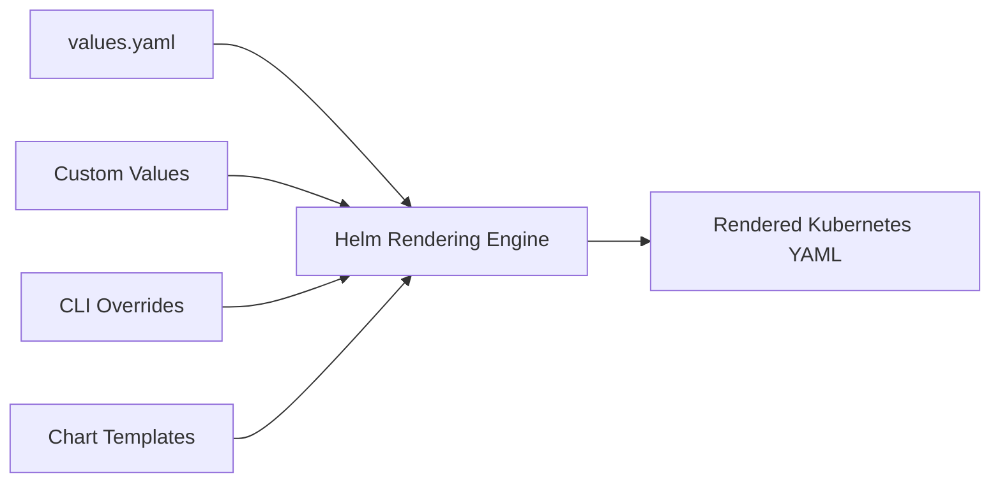

### Working Process

1. Helm loads the chart.
2. Reads the default `values.yaml`.
3. Applies additional values files (if specified).
4. Applies command-line overrides.
5. Renders templates using the final merged values.
6. Deploys Kubernetes resources.

---

## Key Components

| Component | Purpose |
|-----------|----------|
| values.yaml | Default configuration |
| Custom Values File | Environment-specific configuration |
| CLI Overrides | Temporary value overrides |
| Global Values | Shared values across subcharts |
| Templates | Consume values during rendering |

---

## Types (if applicable)

| Type | Description |
|------|-------------|
| Default Values | Stored in `values.yaml` |
| Custom Values | Separate values files |
| Command-Line Values | Passed using `--set` |
| Global Values | Shared across charts |
| Environment Values | Dev, QA, Production |

---

## Lifecycle / Workflow

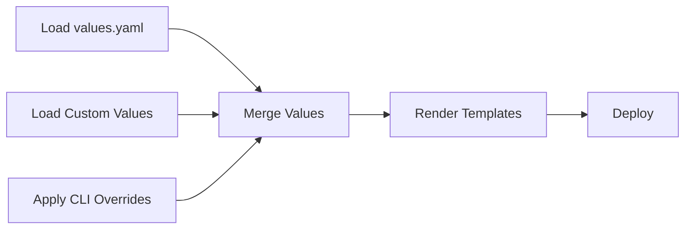

---

## Configuration / Syntax

Default value

```yaml
replicaCount: 2
```

Access value

```yaml
{{ .Values.replicaCount }}
```

Nested value

```yaml
image:
  repository: nginx
```

Access nested value

```yaml
{{ .Values.image.repository }}
```

---

## Important Commands

```bash
helm install

helm upgrade

helm template

helm show values
```

---

## Important Files

```
values.yaml

templates/

Chart.yaml
```

---

## Real-World Use Cases

- Different replica counts per environment
- Different Docker image tags
- Environment-specific database configuration
- Resource limits
- Service types
- Ingress configuration
- Feature flags

---

## Advantages

- Highly configurable
- Reusable charts
- Easy environment management
- Reduces duplicate YAML
- Supports CI/CD automation

---

## Limitations

- Large values files become difficult to manage
- Incorrect values may cause deployment failures
- Value precedence can be confusing

---

## Common Interview Questions (Concept Only)

- What is values.yaml?
- How does Helm use values?
- How do you override values?
- What is value precedence?
- What are global values?
- Can multiple values files be used?
- Difference between `--set` and `-f`?

---

## Common Mistakes

- Editing templates instead of values
- Hardcoding configuration
- Incorrect YAML indentation
- Using incorrect value paths
- Ignoring value precedence

---

## Troubleshooting

| Problem | Cause | Solution |
|----------|-------|----------|
| Value not updated | Incorrect override | Verify precedence |
| Missing value | Wrong key | Check `.Values` path |
| YAML parsing error | Bad indentation | Validate YAML |
| Unexpected deployment | Wrong values file | Verify file order |
| CLI value ignored | Incorrect syntax | Verify `--set` usage |

---

## Summary

Values Management separates configuration from templates, making Helm Charts reusable and easy to customize across multiple environments.

> **Interview Tip**
>
> Templates define **how** resources are created, while Values define **what configuration** those resources receive.

---

# Default Values

## Overview

Default Values are the configuration values stored in the chart's `values.yaml` file.

These values are automatically used unless overridden.

---

## Why It Is Used

- Provide default application settings
- Simplify deployments
- Reduce required user input

---

## Architecture / Working

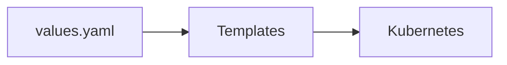

---

## Key Components

- Replica count
- Image
- Service
- Resources

---

## Types (if applicable)

Default configuration

---

## Lifecycle / Workflow

```mermaid
flowchart LR

Read values.yaml --> Render Templates
```

---

## Configuration / Syntax

```yaml
replicaCount: 2

image:
  repository: nginx
```

---

## Important Commands

```bash
helm show values
```

---

## Important Files

```
values.yaml
```

---

## Real-World Use Cases

- Default image
- Default replicas

---

## Advantages

- Easy deployment
- Sensible defaults

---

## Limitations

- May not fit every environment

---

## Common Interview Questions (Concept Only)

- What are default values?

---

## Common Mistakes

- Editing templates instead of values

---

## Troubleshooting

Check `values.yaml`.

---

## Summary

Default values provide the base configuration for every chart installation.

---

# Custom Values

## Overview

Custom Values are stored in separate YAML files and override the default values.

Example:

```
dev-values.yaml

prod-values.yaml
```

---

## Why It Is Used

Supports environment-specific deployments.

---

## Architecture / Working

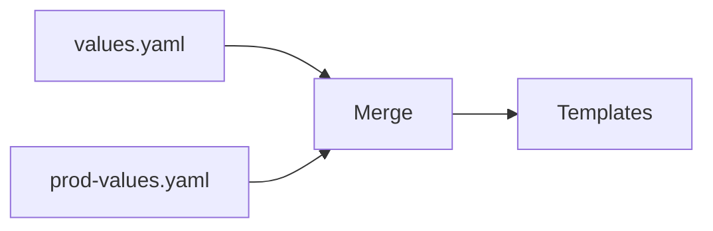

---

## Key Components

- Environment files

---

## Types (if applicable)

- Development
- Testing
- Production

---

## Lifecycle / Workflow

```mermaid
flowchart LR

Load Files --> Merge --> Render
```

---

## Configuration / Syntax

```bash
helm install myapp . -f prod-values.yaml
```

---

## Important Commands

```bash
helm install -f
```

---

## Important Files

```
dev-values.yaml

prod-values.yaml
```

---

## Real-World Use Cases

- Production configuration

---

## Advantages

- Environment separation

---

## Limitations

- Multiple files require maintenance

---

## Common Interview Questions (Concept Only)

- Why use custom values?

---

## Common Mistakes

- Wrong values file

---

## Troubleshooting

Verify file path.

---

## Summary

Custom values override default settings for specific environments.

---

# Override Values

## Overview

Override Values replace existing values during chart installation or upgrade.

Overrides can come from:

- Values files
- Command-line options

---

## Why It Is Used

Customize deployments without modifying the chart.

---

## Architecture / Working

```mermaid
flowchart LR

Default --> Override --> Final Values
```

---

## Key Components

- Merge process

---

## Types (if applicable)

- File override
- CLI override

---

## Lifecycle / Workflow

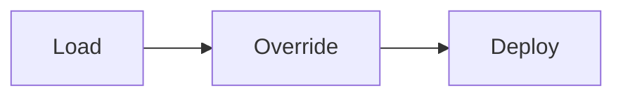

---

## Configuration / Syntax

```bash
helm install -f values-prod.yaml
```

---

## Important Commands

```bash
helm install

helm upgrade
```

---

## Important Files

```
values.yaml
```

---

## Real-World Use Cases

- Change image version
- Scale replicas

---

## Advantages

- Flexible deployment

---

## Limitations

- Precedence confusion

---

## Common Interview Questions (Concept Only)

- How are values overridden?

---

## Common Mistakes

- Wrong override order

---

## Troubleshooting

Review merged values.

---

## Summary

Overrides allow deployment customization without changing chart files.

---

# Multiple Values Files

## Overview

Helm supports multiple values files that are merged in the specified order.

---

## Why It Is Used

Allows layered configuration.

---

## Architecture / Working

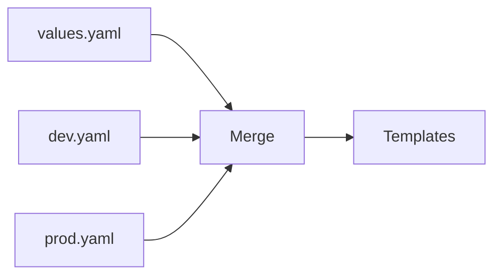

---

## Key Components

- Multiple YAML files

---

## Types (if applicable)

Environment-based

---

## Lifecycle / Workflow

```mermaid
flowchart LR

Load Files --> Merge --> Deploy
```

---

## Configuration / Syntax

```bash
helm install \
-f common.yaml \
-f production.yaml
```

---

## Important Commands

```bash
helm install -f
```

---

## Important Files

```
common.yaml

production.yaml
```

---

## Real-World Use Cases

- Shared configuration
- Production overrides

---

## Advantages

- Reusable configuration

---

## Limitations

- File order matters

---

## Common Interview Questions (Concept Only)

- Can Helm use multiple values files?

---

## Common Mistakes

- Wrong merge order

---

## Troubleshooting

Check file order.

---

## Summary

Multiple values files support layered configuration management.

---

# Command-Line Overrides

## Overview

Command-line overrides allow values to be changed during installation or upgrade using CLI flags.

---

## Why It Is Used

Quick configuration changes.

---

## Architecture / Working

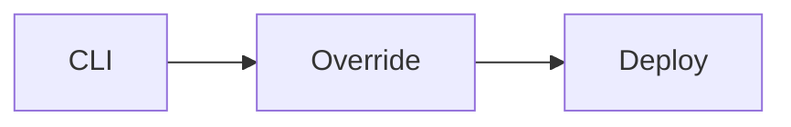

---

## Key Components

- `--set`
- `--set-string`
- `--set-file`

---

## Types (if applicable)

CLI overrides

---

## Lifecycle / Workflow

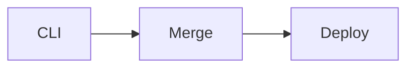

---

## Configuration / Syntax

```bash
helm install myapp . \
--set replicaCount=3
```

---

## Important Commands

```bash
helm install --set

helm upgrade --set
```

---

## Important Files

Not applicable.

---

## Real-World Use Cases

- CI/CD pipelines
- Temporary configuration

---

## Advantages

- Fast overrides

---

## Limitations

- Long commands become difficult to manage

---

## Common Interview Questions (Concept Only)

- What is `--set`?

---

## Common Mistakes

- Wrong data type

---

## Troubleshooting

Check final rendered values.

---

## Summary

CLI overrides are ideal for quick, temporary configuration changes.

---

# Global Values

## Overview

Global Values are values available to the parent chart and all dependent subcharts.

They are defined under the `global` section in `values.yaml`.

---

## Why It Is Used

Share common configuration across multiple charts.

---

## Architecture / Working

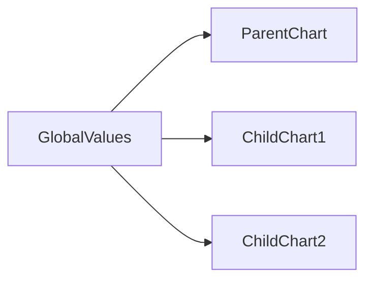

---

## Key Components

- Shared configuration

---

## Types (if applicable)

Global values

---

## Lifecycle / Workflow

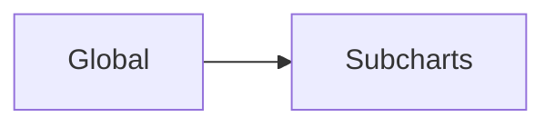

---

## Configuration / Syntax

```yaml
global:
  imageRegistry: docker.io
```

---

## Important Commands

Not applicable.

---

## Important Files

```
values.yaml
```

---

## Real-World Use Cases

- Shared registry
- Shared namespace

---

## Advantages

- Centralized configuration

---

## Limitations

- Excessive use reduces chart independence

---

## Common Interview Questions (Concept Only)

- What are global values?

---

## Common Mistakes

- Overusing global configuration

---

## Troubleshooting

Verify `.Values.global`.

---

## Summary

Global values provide shared configuration for parent and child charts.

---

# Value Precedence

## Overview

Value Precedence determines which value is used when the same key exists in multiple sources.

The highest-precedence value overrides lower-precedence values.

---

## Why It Is Used

Ensures predictable configuration merging.

---

## Architecture / Working

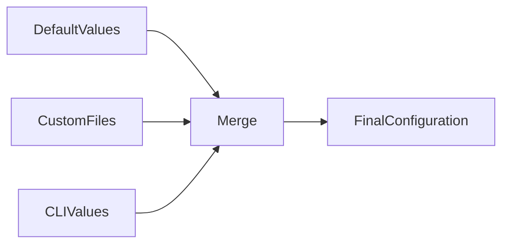

---

## Key Components

- Merge order

---

## Types (if applicable)

Not applicable.

---

## Lifecycle / Workflow

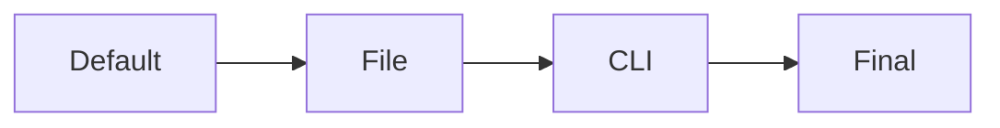

---

## Configuration / Syntax

Precedence order:

1. Chart `values.yaml`
2. Parent chart values
3. User-supplied values files (`-f`)
4. Command-line overrides (`--set`, `--set-string`, `--set-file`)

---

## Important Commands

```bash
helm install

helm upgrade
```

---

## Important Files

```
values.yaml
```

---

## Real-World Use Cases

- Production deployments
- CI/CD overrides

---

## Advantages

- Predictable configuration

---

## Limitations

- Easy to misunderstand merge order

---

## Common Interview Questions (Concept Only)

- Explain Helm value precedence.
- Which has higher priority: `values.yaml` or `--set`?

---

## Common Mistakes

- Assuming `values.yaml` always wins
- Incorrect file ordering

---

## Troubleshooting

Render templates with:

```bash
helm template
```

to verify the final values.

---

## Summary

Helm merges configuration from multiple sources, with **command-line overrides having the highest precedence**.

> **Interview Tip**
>
> Highest precedence:
>
> **`--set` > `-f values.yaml` > Parent Values > Chart values.yaml**

---

# Interview Quick Revision

## Types of Values

| Type | Purpose |
|------|---------|
| Default Values | Base chart configuration |
| Custom Values | Environment-specific configuration |
| Override Values | Replace existing values |
| Multiple Values Files | Layered configuration |
| Command-Line Values | Temporary overrides |
| Global Values | Shared across subcharts |

---

## Value Precedence (Highest to Lowest)

| Priority | Source |
|----------|--------|
| 1 | `--set`, `--set-string`, `--set-file` |
| 2 | User-supplied values files (`-f`) |
| 3 | Parent chart values |
| 4 | Chart `values.yaml` |

---

## Production Best Practices

- Keep default values generic and environment-independent.
- Use separate values files for Development, Testing, Staging, and Production.
- Reserve `--set` for temporary overrides or CI/CD pipelines.
- Use multiple values files to layer common and environment-specific settings.
- Keep shared configuration under `global` only when truly common across subcharts.
- Avoid hardcoding configuration in templates; always reference `.Values`.
- Validate merged output with `helm template` before deploying.
- Store sensitive information in Kubernetes Secrets or external secret managers instead of plain-text values files.

---

## One-line Interview Answer

**Helm Values Management allows configuration to be supplied from default values, custom values files, and command-line overrides, with Helm merging them according to a defined precedence order to produce the final configuration used for deployment.**
