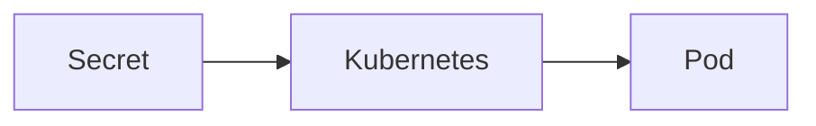
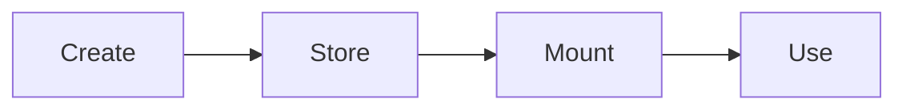
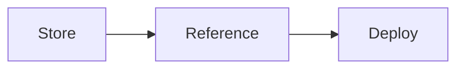
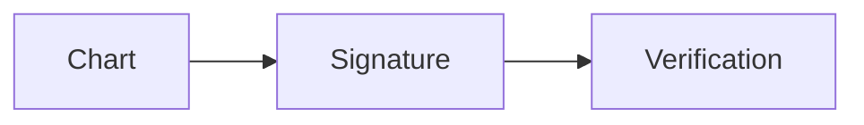
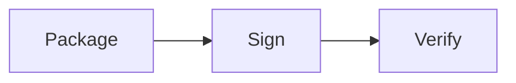
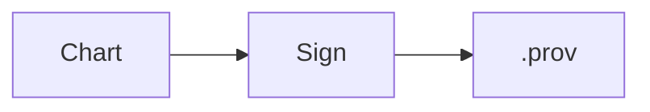
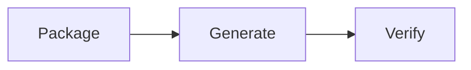
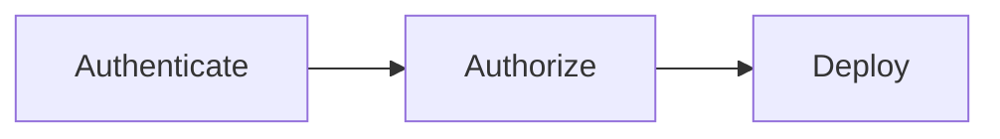

# Security

## Overview

Helm Security focuses on protecting Helm Charts, sensitive configuration, Kubernetes resources, and deployment processes. Since Helm manages Kubernetes applications, improper handling of secrets or permissions can expose applications and infrastructure.

Helm itself does **not** encrypt secrets or enforce Kubernetes security. Instead, it integrates with Kubernetes security features such as Secrets, RBAC, and admission controllers.

> **Interview Tip**
>
> Helm is **not a security tool**. It relies on Kubernetes security mechanisms like RBAC, Secrets, Network Policies, and external secret management solutions.

---

## Why It Is Used

Helm Security helps to:

- Protect sensitive application data
- Secure deployment pipelines
- Verify chart authenticity
- Prevent unauthorized deployments
- Control user permissions
- Improve supply chain security
- Reduce security risks in Kubernetes

---

## Architecture / Working

```mermaid
flowchart LR

Developer
      │
      ▼
Helm Chart
      │
      ▼
Chart Verification
      │
      ▼
Helm
      │
      ▼
Kubernetes API
      │
      ▼
RBAC
      │
      ▼
Cluster Resources

Secrets --> Helm
Values --> Helm
```

### Working Process

1. Sensitive values are stored securely.
2. Helm renders templates.
3. Charts are optionally verified.
4. Kubernetes RBAC authorizes deployment.
5. Resources are created.
6. Kubernetes Secrets store sensitive information.

---

## Key Components

| Component | Purpose |
|-----------|----------|
| Kubernetes Secrets | Store confidential data |
| Values Files | Store configuration |
| Provenance Files | Verify chart integrity |
| RBAC | Authorization |
| OCI Registry | Secure chart storage |
| TLS | Secure repository communication |

---

## Types (if applicable)

| Security Area | Purpose |
|---------------|----------|
| Secrets Management | Protect sensitive data |
| Chart Verification | Verify chart authenticity |
| RBAC | Access control |
| Secure Repositories | Protect chart distribution |
| Image Security | Deploy trusted images |

---

## Lifecycle / Workflow

```mermaid
flowchart LR

Create Chart
      │
      ▼
Store Secrets
      │
      ▼
Package Chart
      │
      ▼
Verify Chart
      │
      ▼
Deploy
      │
      ▼
RBAC Authorization
```

---

## Configuration / Syntax (if applicable)

Use Kubernetes Secret

```yaml
kind: Secret
```

Verify chart

```bash
helm verify chart.tgz
```

---

## Important Commands (if applicable)

```bash
helm verify

helm package --sign

helm install

helm upgrade

kubectl get secrets
```

---

## Important Files (if applicable)

```
Chart.yaml

values.yaml

values-prod.yaml

templates/secret.yaml

chart.tgz.prov
```

---

## Real-World Use Cases

- Secure production deployments
- Store database passwords
- Verify downloaded charts
- Restrict deployment permissions
- Secure CI/CD pipelines

---

## Advantages

- Improves deployment security
- Prevents unauthorized changes
- Supports secure software supply chain
- Integrates with Kubernetes security

---

## Limitations

- Secrets are Base64 encoded by default
- Helm does not encrypt values
- Security depends on Kubernetes configuration
- Requires external secret management for higher security

---

## Common Interview Questions (Concept Only)

- Does Helm encrypt Secrets?
- What is a Provenance File?
- How does Helm verify charts?
- Why shouldn't passwords be stored in values.yaml?
- How does RBAC affect Helm?
- Can Helm manage Kubernetes Secrets?
- Difference between Helm values and Kubernetes Secrets?
- What is chart signing?
- Why use external secret managers?
- Does Helm provide authentication?

---

## Common Mistakes

- Storing passwords in Git
- Hardcoding secrets
- Using default RBAC permissions
- Skipping chart verification
- Using admin credentials unnecessarily
- Sharing private values files

---

## Troubleshooting

| Problem | Cause | Solution |
|----------|-------|----------|
| Secret exposed | Stored in Git | Use Kubernetes Secrets or external secret manager |
| Verification failed | Invalid signature | Verify public key and chart |
| Deployment denied | RBAC restriction | Check Kubernetes permissions |
| Secret missing | Incorrect manifest | Verify Secret template |
| Unauthorized repository | Authentication issue | Configure credentials |
| Wrong values deployed | Incorrect values file | Validate environment-specific values |

---

## Summary

Helm Security combines Kubernetes Secrets, RBAC, chart verification, and secure repositories to protect application deployments. Sensitive information should never be hardcoded into charts or committed to version control.

> **Interview Tip**
>
> Helm manages security resources but relies on Kubernetes and external tools for encryption, authentication, and authorization.

---

# Secrets Management

## Overview

Secrets Management is the process of securely storing and accessing confidential information such as passwords, API keys, certificates, and tokens.

Helm typically references Kubernetes Secrets rather than embedding sensitive values directly into templates.

---

## Why It Is Used

- Protect credentials
- Secure API keys
- Store certificates
- Prevent information leakage

---

## Architecture / Working



---

## Key Components

- Kubernetes Secret
- Secret Manifest
- Mounted Volume
- Environment Variable

---

## Types (if applicable)

- Opaque
- TLS
- Docker Registry
- Service Account Token

---

## Lifecycle / Workflow



---

## Configuration / Syntax (if applicable)

```yaml
kind: Secret
```

---

## Important Commands (if applicable)

```bash
kubectl get secrets

kubectl describe secret
```

---

## Important Files (if applicable)

```
templates/secret.yaml
```

---

## Real-World Use Cases

- Database passwords
- API tokens
- TLS certificates

---

## Advantages

- Secure credential storage

---

## Limitations

- Base64 encoding is not encryption

---

## Common Interview Questions (Concept Only)

- Why use Kubernetes Secrets?

---

## Common Mistakes

- Hardcoding credentials

---

## Troubleshooting

Verify Secret references.

---

## Summary

Secrets Management protects sensitive application data.

---

# Sensitive Values

## Overview

Sensitive Values are confidential configuration values such as passwords, access tokens, certificates, and API keys used by applications.

These values should never be stored directly in `values.yaml` within version control.

---

## Why It Is Used

- Secure application configuration
- Protect confidential information

---

## Architecture / Working

```mermaid
flowchart LR

External Secret --> Kubernetes Secret --> Helm Template
```

---

## Key Components

- Passwords
- Tokens
- Keys

---

## Types (if applicable)

Sensitive configuration

---

## Lifecycle / Workflow



---

## Configuration / Syntax (if applicable)

Reference existing Secret instead of embedding values.

---

## Important Commands (if applicable)

```bash
kubectl create secret
```

---

## Important Files (if applicable)

```
values.yaml
```

---

## Real-World Use Cases

- Production credentials

---

## Advantages

- Improved security

---

## Limitations

- Requires secret management

---

## Common Interview Questions (Concept Only)

- Should passwords be stored in values.yaml?

---

## Common Mistakes

- Committing credentials to Git

---

## Troubleshooting

Review values files.

---

## Summary

Sensitive values should be stored outside Helm values whenever possible.

---

# Chart Verification

## Overview

Chart Verification ensures a downloaded Helm Chart has not been modified and comes from a trusted publisher.

Helm uses chart signatures and provenance files for verification.

---

## Why It Is Used

- Prevent tampering
- Verify authenticity
- Secure software supply chain

---

## Architecture / Working



---

## Key Components

- Signature
- Public Key
- Provenance File

---

## Types (if applicable)

Digital signature verification

---

## Lifecycle / Workflow



---

## Configuration / Syntax (if applicable)

```bash
helm verify chart.tgz
```

---

## Important Commands (if applicable)

```bash
helm verify
```

---

## Important Files (if applicable)

```
chart.tgz

chart.tgz.prov
```

---

## Real-World Use Cases

- Production deployments
- Third-party charts

---

## Advantages

- Detects tampering

---

## Limitations

- Requires signed charts

---

## Common Interview Questions (Concept Only)

- What is Chart Verification?

---

## Common Mistakes

- Ignoring verification

---

## Troubleshooting

Verify public keys.

---

## Summary

Chart Verification validates chart integrity.

---

# Provenance Files

## Overview

A Provenance File (`.prov`) contains metadata and a cryptographic signature used to verify a Helm Chart.

It is generated when a chart is signed during packaging.

---

## Why It Is Used

- Verify chart authenticity
- Prevent tampering

---

## Architecture / Working



---

## Key Components

- Signature
- Metadata

---

## Types (if applicable)

Digital signature

---

## Lifecycle / Workflow



---

## Configuration / Syntax (if applicable)

```bash
helm package --sign
```

---

## Important Commands (if applicable)

```bash
helm verify
```

---

## Important Files (if applicable)

```
chart.tgz.prov
```

---

## Real-World Use Cases

- Enterprise deployments

---

## Advantages

- Trust verification

---

## Limitations

- Requires key management

---

## Common Interview Questions (Concept Only)

- What is a `.prov` file?

---

## Common Mistakes

- Losing signing keys

---

## Troubleshooting

Check keyring.

---

## Summary

Provenance files provide chart authenticity verification.

---

# RBAC Considerations

## Overview

RBAC (Role-Based Access Control) determines which Kubernetes resources Helm can create, update, or delete.

Helm performs operations using the Kubernetes credentials of the executing user or ServiceAccount.

---

## Why It Is Used

- Restrict permissions
- Secure deployments
- Least privilege access

---

## Architecture / Working

```mermaid
flowchart LR

User --> RBAC --> Kubernetes API --> Resources
```

---

## Key Components

- Role
- ClusterRole
- RoleBinding
- ServiceAccount

---

## Types (if applicable)

- Role
- ClusterRole

---

## Lifecycle / Workflow



---

## Configuration / Syntax (if applicable)

RBAC resources are managed as Kubernetes manifests within Helm charts.

---

## Important Commands (if applicable)

```bash
kubectl auth can-i

kubectl get roles

kubectl get rolebindings
```

---

## Important Files (if applicable)

```
templates/rbac.yaml
```

---

## Real-World Use Cases

- Namespace isolation
- Developer access
- CI/CD Service Accounts

---

## Advantages

- Fine-grained permissions
- Improved cluster security

---

## Limitations

- Misconfigured RBAC blocks deployments

---

## Common Interview Questions (Concept Only)

- Does Helm bypass RBAC?
- How does Helm authenticate?
- Why use ServiceAccounts?

---

## Common Mistakes

- Running Helm as cluster-admin
- Overly permissive roles

---

## Troubleshooting

Use `kubectl auth can-i` to verify permissions.

---

## Summary

Helm follows Kubernetes RBAC and cannot perform actions beyond the permissions granted to the authenticated user or ServiceAccount.

---

# Interview Quick Revision

## Security Components

| Component | Purpose |
|-----------|---------|
| Kubernetes Secrets | Store sensitive data |
| Values Files | Store configuration |
| Chart Verification | Validate chart authenticity |
| Provenance File | Store chart signature |
| RBAC | Control deployment permissions |

---

## Sensitive Values vs Kubernetes Secrets

| Sensitive Values | Kubernetes Secrets |
|------------------|--------------------|
| Configuration data | Kubernetes resource |
| May be stored in values files | Stored in cluster |
| Can expose secrets if committed | Better for runtime secret storage |
| Should not contain production credentials in Git | Recommended for confidential data |

---

## Chart Verification Workflow

```text
Create Chart
      ↓
Sign Chart
      ↓
Generate .prov File
      ↓
Publish Chart
      ↓
Download Chart
      ↓
helm verify
```

---

## Frequently Used Commands

| Command | Purpose |
|----------|---------|
| `helm package --sign` | Package and sign chart |
| `helm verify` | Verify chart signature |
| `kubectl get secrets` | View Secrets |
| `kubectl describe secret` | Inspect Secret |
| `kubectl auth can-i` | Check RBAC permissions |
| `helm install` | Deploy chart |

---

## Production Best Practices

- Never store production passwords, tokens, or certificates in Git-managed `values.yaml` files.
- Use Kubernetes Secrets or external secret management solutions (such as Azure Key Vault, AWS Secrets Manager, or HashiCorp Vault) for sensitive data.
- Sign charts before publishing and verify third-party charts before deployment.
- Grant Helm only the minimum RBAC permissions required (principle of least privilege).
- Use dedicated ServiceAccounts for CI/CD deployments instead of cluster-admin credentials.
- Secure OCI registries and chart repositories with authentication and TLS.
- Rotate secrets and signing keys regularly.

---

## One-line Interview Answer

**Helm Security combines Kubernetes Secrets, RBAC, chart signing, provenance files, and chart verification to protect application deployments, while relying on Kubernetes and external secret management solutions for authentication, authorization, and secure handling of sensitive information.**
