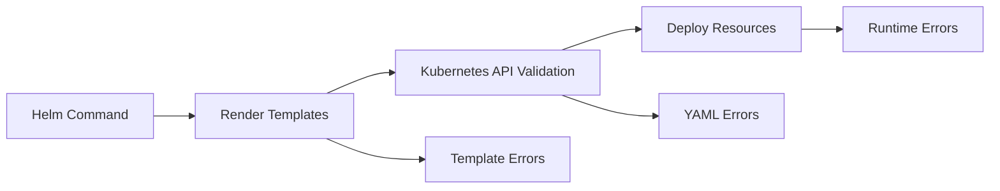
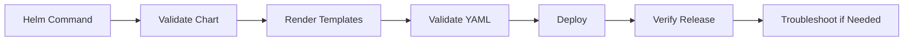
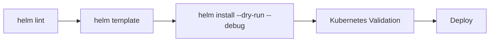
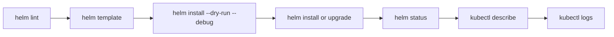

# Troubleshooting

## Overview

Troubleshooting Helm involves identifying and resolving issues that occur during chart development, installation, upgrades, rollbacks, and Kubernetes deployments.

Most Helm issues fall into one of these categories:

- Template errors
- YAML syntax errors
- Chart dependency issues
- Release failures
- Upgrade failures
- Rollback failures
- Kubernetes resource conflicts
- Configuration errors

> **Interview Tip**
>
> Most Helm problems can be diagnosed using:
>
> - `helm lint`
> - `helm template`
> - `helm install --dry-run --debug`
> - `helm status`
> - `helm history`
> - `kubectl describe`
> - `kubectl logs`

---

## Why It Is Used

Troubleshooting helps to:

- Identify deployment failures
- Validate Helm charts
- Debug template rendering
- Recover failed releases
- Resolve Kubernetes resource issues
- Minimize production downtime

---

## Architecture / Working



---

## Key Components

| Component | Purpose |
|-----------|----------|
| Helm CLI | Executes Helm commands |
| Chart | Application package |
| Templates | Generate Kubernetes manifests |
| Values Files | Configuration |
| Kubernetes API | Validates resources |
| Kubernetes Cluster | Runs workloads |
| Release History | Tracks deployments |

---

## Types (if applicable)

| Issue Type | Description |
|------------|-------------|
| Template Error | Invalid Go template syntax |
| YAML Error | Invalid generated YAML |
| Release Failure | Installation failed |
| Upgrade Failure | Upgrade unsuccessful |
| Rollback Issue | Previous release restoration failed |
| Dependency Issue | Missing or outdated chart dependencies |
| Resource Conflict | Kubernetes object already exists |
| Runtime Issue | Application or Pod failures |

---

## Lifecycle / Workflow



---

## Configuration / Syntax (if applicable)

Validate chart:

```bash
helm lint ./chart
```

Render manifests:

```bash
helm template myapp ./chart
```

Dry run deployment:

```bash
helm install myapp ./chart --dry-run --debug
```

---

## Important Commands (if applicable)

```bash
helm lint

helm template

helm install --dry-run --debug

helm upgrade --dry-run

helm status

helm history

helm rollback

helm dependency update

helm get values

helm get manifest

kubectl get pods

kubectl describe pod

kubectl logs
```

---

## Important Files (if applicable)

```
Chart.yaml

values.yaml

Chart.lock

templates/

charts/

templates/_helpers.tpl
```

---

## Real-World Use Cases

- Failed production deployments
- Kubernetes validation failures
- Debugging Helm templates
- Chart development
- Release recovery
- CI/CD deployment failures

---

## Advantages

- Built-in validation tools
- Easy rollback
- Release history tracking
- Template debugging
- Kubernetes integration

---

## Limitations

- Helm cannot detect application logic errors
- Some runtime issues require Kubernetes troubleshooting
- Template debugging may become complex for large charts

---

## Common Interview Questions (Concept Only)

- How do you troubleshoot Helm deployments?
- What is the difference between `helm lint` and `helm template`?
- How do you debug Helm charts?
- How do you recover from a failed deployment?
- What causes Helm upgrade failures?
- Why use `--dry-run`?
- How do you troubleshoot Kubernetes resource conflicts?
- How does Helm rollback work?
- How do you inspect rendered manifests?
- How do you validate chart dependencies?

---

## Common Mistakes

- Skipping `helm lint`
- Deploying directly to production
- Ignoring YAML validation
- Using incorrect values files
- Forgetting dependency updates
- Using mutable image tags (`latest`)
- Not checking Kubernetes events
- Ignoring release history

---

## Troubleshooting

# Template Errors

## Overview

Template errors occur when Helm cannot render Go templates into valid Kubernetes manifests.

---

## Common Causes

- Missing variables
- Incorrect template syntax
- Invalid function usage
- Wrong indentation
- Missing values

---

## Symptoms

- Template parsing failed
- Unexpected EOF
- Undefined variable
- Invalid function call

---

## Troubleshooting Steps

1. Validate chart

```bash
helm lint
```

2. Render templates

```bash
helm template myapp ./chart
```

3. Preview deployment

```bash
helm install myapp ./chart --dry-run --debug
```

---

# Release Failures

## Overview

Release failures occur when Helm cannot successfully install an application.

---

## Common Causes

- Invalid Kubernetes manifests
- Namespace does not exist
- Permission issues
- Missing CRDs
- Invalid values

---

## Troubleshooting Steps

Check release status

```bash
helm status myapp
```

View release history

```bash
helm history myapp
```

Describe Kubernetes resources

```bash
kubectl describe pod <pod-name>
```

---

# Upgrade Failures

## Overview

Upgrade failures happen when an existing release cannot be updated successfully.

---

## Common Causes

- Invalid configuration
- Immutable Kubernetes fields
- API version mismatch
- Failed template rendering

---

## Troubleshooting Steps

Preview upgrade

```bash
helm upgrade myapp ./chart --dry-run --debug
```

Compare rendered templates

```bash
helm template myapp ./chart
```

Verify deployment

```bash
kubectl rollout status deployment/<deployment-name>
```

---

# Rollback Issues

## Overview

Rollback restores a previous release when an upgrade fails.

---

## Common Causes

- Missing release history
- Invalid previous release
- Kubernetes API changes

---

## Troubleshooting Steps

View release history

```bash
helm history myapp
```

Rollback

```bash
helm rollback myapp 2
```

Verify status

```bash
helm status myapp
```

---

# Chart Dependency Issues

## Overview

Dependency issues occur when required subcharts are missing or outdated.

---

## Common Causes

- Missing dependency
- Incorrect repository
- Version mismatch
- Outdated Chart.lock

---

## Troubleshooting Steps

Update dependencies

```bash
helm dependency update
```

Build dependencies

```bash
helm dependency build
```

Verify chart

```bash
helm lint
```

---

# Kubernetes Resource Conflicts

## Overview

Resource conflicts occur when Kubernetes resources already exist or ownership conflicts prevent deployment.

---

## Common Causes

- Existing resource
- Duplicate resource names
- Namespace mismatch
- Manual resource creation

---

## Troubleshooting Steps

Check resources

```bash
kubectl get all
```

Describe resources

```bash
kubectl describe deployment <deployment-name>
```

Verify namespace

```bash
kubectl get namespaces
```

---

# Debugging Helm Charts

## Overview

Helm provides multiple commands for validating templates before deployment.

---

## Debug Workflow



---

## Recommended Debugging Commands

Validate chart

```bash
helm lint
```

Render manifests

```bash
helm template myapp ./chart
```

Preview installation

```bash
helm install myapp ./chart --dry-run --debug
```

Inspect manifests

```bash
helm get manifest myapp
```

Inspect values

```bash
helm get values myapp
```

View release status

```bash
helm status myapp
```

---

# Common Helm Errors

| Error | Cause | Solution |
|--------|-------|----------|
| YAML parse error | Invalid YAML | Verify indentation |
| Template parse error | Invalid Go template | Check template syntax |
| Release already exists | Existing release | Upgrade or uninstall |
| Chart not found | Missing repository | Add/update repository |
| Dependency missing | Subchart unavailable | Run `helm dependency update` |
| Namespace not found | Missing namespace | Create namespace |
| Forbidden | RBAC issue | Verify permissions |
| ImagePullBackOff | Invalid image | Verify image repository |
| CrashLoopBackOff | Application failure | Check container logs |
| Resource already exists | Existing object | Delete or rename resource |

---

## Summary

Helm troubleshooting involves validating charts, rendering templates, verifying Kubernetes resources, inspecting release history, and using built-in debugging commands before deploying to production.

> **Interview Tip**
>
> A recommended troubleshooting sequence is:
>
> 1. `helm lint`
> 2. `helm template`
> 3. `helm install --dry-run --debug`
> 4. `helm status`
> 5. `helm history`
> 6. `kubectl describe`
> 7. `kubectl logs`

---

# Interview Quick Revision

## Helm Troubleshooting Workflow



---

## Common Debug Commands

| Command | Purpose |
|----------|---------|
| `helm lint` | Validate chart |
| `helm template` | Render templates |
| `helm install --dry-run --debug` | Preview installation |
| `helm status` | Check release status |
| `helm history` | View release history |
| `helm rollback` | Restore previous release |
| `helm get values` | View deployed values |
| `helm get manifest` | View rendered manifests |
| `kubectl describe` | Inspect Kubernetes resources |
| `kubectl logs` | View application logs |

---

## Production Troubleshooting Best Practices

- Validate every chart with `helm lint`.
- Preview manifests using `helm template`.
- Use `--dry-run --debug` before production deployments.
- Maintain chart dependencies with `helm dependency update`.
- Monitor release history for rollback.
- Check Kubernetes events after failed deployments.
- Keep Helm charts under version control.
- Test rollback procedures before production releases.
- Avoid manual changes to Helm-managed resources.
- Monitor application health after deployments.

---

## One-line Interview Answer

**Helm troubleshooting involves validating charts, rendering templates, previewing deployments, inspecting release history, checking Kubernetes resources, and using rollback capabilities to quickly diagnose and recover from deployment failures.**
